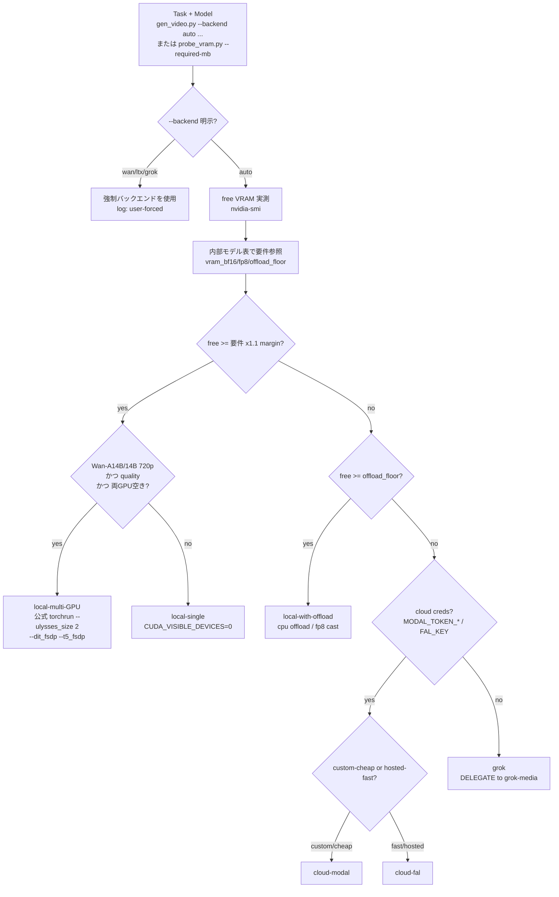

# video-media-studio

動画生成（t2v / i2v）・ローカル画像生成・ffmpeg による動画編集を一括で担うスキル。

**Core principle: LOCAL-GPU-FIRST, graceful fallback.** まずローカルの 2x RTX A6000（各48GB）で動かす。VRAM が足りない・GPU が塞がっている・認証が無い等で初めて、`local-single → local-offload → local-multi-GPU(Wan) → cloud(Modal/fal) → Grok` の順に降りる。**どのバックエンドを選んだか・なぜかは毎回ログに残す**。この 96GB リグでは実質ほぼ全モデルが local-single に収まるので、cloud/Grok は本当の最終手段。

> **★画像・動画内の文字はデフォルトで入れない（恒久ルール）。** ユーザーが明示的に指示した場合を除き、生成・編集する画像や動画に、字幕、キャプション、タイトル、ロゴ、ウォーターマーク、ラベル、看板、衣服の文字、画面/UI 上の文字など、読める文字要素を含めない。元素材に文字がある編集では、ユーザーが保持を求めていない限り、新たな文字を追加しない。生成プロンプトでは文字要素を正の指示に書かず、対応モデルでは `text, letters, words, watermark, caption, subtitle, logo, signage, gibberish text` を negative に入れる。

> **★字幕は「生成時に入れず、必ず後付け（post）」する（恒久ルール・ユーザー確定 2026-07-26）。** セリフ動画等で字幕が要る場合でも、**動画生成モデルには字幕を焼かせない**（プロンプトに `Absolutely NO on-screen text/captions/subtitles` を明示）。字幕は生成後に **ffmpeg（ass/libass）で焼き込む**。理由: 生成モデルは字幕を勝手に・かつデタラメ（意味不明な偽文字）で焼くことがある（実測 2026-07-26: Veo 3.1 の `veo-3-1-preview` 変種が「ふあっに」等の偽日本語字幕を焼き込んだ）。**Veo 3.1 は `veo-3-1-fast` 変種を使えば焼き込み字幕が出ない**（preview は出る）。後付け字幕は発話に同期させる（faster-whisper の word_timestamps で文の境目を取る）。日本語セリフの発話内容も whisper で一致検証してから納品する。

> **★Higgsfield Veo 3.1 の解像度＝コスト（実測 2026-07-26）。** `quality=ultra`（変種問わず）は **4K（2160×3840）＝高コスト**。`quality=high`（+`veo-3-1-fast`）は **1080p（1080×1920）** で安い。**1080pで十分なら high+fast を使う**（4K が要る納品のときだけ ultra）。9:16 指定＋4:5画像は上下に黒帯が付くので、後処理で黒帯を crop（非黒行を PIL で検出）してから字幕を焼く。
>
> **★例外（2026-07-17 ユーザー確定）: 演出ボード（StoryBoard＝鉛筆ラフ＋矢印）は「設計図」なので文字を入れる**——カット番号・秒数ラベル・緑のフレーミング注記・黒のショット注記は**必須**。ボードに上の negative を入れない。ただし**凡例（各矢印の説明）はボードに書かない＝字コンテ側で定義する**。この恒久ルールが効くのは**納品する映像・写真**（キーフレーム画像を含む）であって、承認用の設計図ではない。同様にキーフレームのシートには秒数ラベルだけ入れてよい。

> **REQUIRED SUB-SKILL: `grok-media`** — Grok 経路（最終フォールバック）は **すべて grok-media スキルに従う**。CLI 起動・auth gate・clean-dir・NL ツール命名・出力回収を本スキルで再実装しない。`scripts/grok_delegate.sh` は grok-media への 1 本のシームでしかない。

## 前提・環境（verified facts）

- GPU: 2x NVIDIA RTX A6000, **各48GB（実測 free ~48.6GB x2）**, ともにアイドル。Ampere（fp8 matmul は限定的、FA3 不可 → SDPA/xformers）。
- `uv` at `/home/kita/.local/bin/uv`（Python 環境はすべて uv。PEP723 インラインスクリプト）。`ffmpeg 6.1.1`。Disk 217GB free / RAM 251GB。
- **anaconda libtinfo.so.6 が LD を汚染している（既知。soffice を壊した実績あり）。** 必ず各呼び出しの前に `source scripts/env.sh` し、`"$UV" run ...` で実行する。**conda の python を絶対に使わない**。env.sh が `LD_LIBRARY_PATH` を掃除し `HF_HOME` / `PYTORCH_CUDA_ALLOC_CONF=expandable_segments:True` を設定する。

## 3つのタスク（どれをやるか先に判定）

| タスク | use when | 入口 |
|---|---|---|
| (1) 動画生成 t2v/i2v | テキスト/静止画から動画を作る、b-roll、静止画を動かす、連続クリップ | `gen_video.py`（probe 内蔵・Wan/LTX-Video）or `gen_video_ltx2.py`（LTX-2.3）|
| (2) 画像生成 | テキストから静止画、frame 素材、画中テキスト | `gen_image.py`（probe 内蔵）|
| (2K) **キービジュアル生成** | **広告/Web/スライド/SNS 等の掲示・配信面に載せる非人物静止画**（Xサムネイル・LPファーストビュー・スライド表紙・Web背景・バナー・アイキャッチ・OGP・記事ヘッダー等 — **呼称でなく機能で判定**）。掲載先・人物有無が曖昧な依頼は着手前に1問で確定してからルーティング（迷ったら (2K)。動画合成用の背景プレートは合成フロー） | **`reference/key-visual-director.md` が既定フロー・必読**（K0 ブリーフ2項目ゲート → K1 3方向A/B/C生成・比較・選択 → K2 改善版＋プロ級監査。2026-07-21 ユーザー確定）。読まずに着手した時点で工程未実施扱い |
| (3) 動画編集 | 既存動画のトリム/連結/速度/字幕/音声/リサイズ/GIF 等 | `reference/ffmpeg-recipes.md` + `edit_video.py`（GPU/バックエンド判定不要・完全ローカル）|
| (4) 動画スタイル変換 v2v | **既存動画**を別スタイルに変換（リアル↔アニメ等）し、**同じ人物を固定**したまま動きを保つ。NSFW 可 | **★NSFW リアル動画→アニメ動画は `gen_v2v_qwen.py`（Qwen-Image-Edit + アニメ LoRA・実機実証の本命）が第一選択**。汎用スタイル変換や動きの強い拘束が要る場合のみ `gen_v2v_style.py`（SDXL img2img + ControlNet + IP-Adapter）。下の「動画スタイル変換フロー」参照 |
| (5) r2v（参照→任意シーン動画） | **参照人物 1 枚 + テキスト**で、その人物を**全く別のシチュ**（例: 浴室でシャワー）の動画にする。**モーション元動画は不要**。NSFW 可 | **`gen_hunyuan_custom.py`（HunyuanCustom・headless ComfyUI）**。VACE r2v（`gen_wan_vace.py`）は別人モーション動画を骨格転写する方式で任意シーンは作れない＝**テキストだけで任意シーンにするなら HunyuanCustom**。下の「r2v フロー」参照 |
| (6) モーションデザイン動画（コード駆動・導入 2026-07-25） | **AIモデル生成でなくコードで決定論的に作る動画**: 製品/アプリ/Web のプロモ・UIデモ・機能紹介・データビズ動画・タイトルモーション・ビート同期カット編集・実ページスクショの 2.5D カメラワーク。**ピクセル精度の文字・UI 表示が主役の動画はこちら**（AI 生成は文字が崩れる） | **video-shotcraft スキルへ委譲**（Remotion ベース・106 ショットレシピカード＋動くプレビューギャラリー・検収済み Ink Press テンプレ 36s/1080p・ビート同期/SFX 設計の方法論込み。実体 `~/tools/video-shotcraft`、`~/.claude/skills/` と `~/.agents/skills/`（Codex）に symlink 済み）。レンダ: template で `npm install && npx remotion render`（Remotion が自前 headless shell を取得）。**ハイブリッド可**: 本スキルで生成した AI 実写クリップ・画像・BGM を Remotion コンポジションの素材として組み込める（AI 素材 × コード駆動テロップ/トランジション/カット） |

## ★既定モデル（何も指定が無いとき）＋ 生成前のモデル宣言・承認（必須）

> **★生成は一度に1本だけ（恒久ルール・2026-07-18 ユーザー確定）。** 画像・動画とも、**seed 違いの並列量産・複数本同時生成をしない**。設定・プロンプトに誤りがあれば seed を変えても同じ失敗を量産するだけでコストが倍増する。必ず **1本生成 → 検品（設定・構図・制約充足を確認）→ 問題なければ次の1本**の順で回す。「選別用に2〜3本」をやってよいのは、**1本目が合格してプロンプトが確定した後に、ユーザーが本数を明示指定したときだけ**。この違反は繰り返し指摘されている（2026-07-18: 浴衣POVテストで seed 違い2本を並列生成し、同一のプロンプト欠陥を2本とも踏んだ）。
>
> **★適用範囲の分離（2026-07-21 ユーザー確定）: この1本ルールは「リアル人物画像・動画生成」の規律。** 広告/Web/スライド用の**非人物キービジュアル**（(2K)・`reference/key-visual-director.md`）は明確に分離し、**3方向 A/B/C 各1枚＋改善版1枚＝計4枚が既定**（ただし並列量産はせず1枚ずつ順次生成・各軽検品。計4枚を超えるのはユーザーの本数明示時のみ）。**人物境界（統一基準）: 実写調で個人が識別できるリアル人物が識別可能な形で写る画像・動画には、主役か否かを問わず従来どおり1本ルールが効く**（シルエット・後ろ姿・豆粒スケール人物は個人性が立たなければ KV 扱い。曖昧なら着手前に1問確認）。

**画像・動画を生成する前に、必ず「使うモデル」を宣言し、ユーザーの承認を得てから本番生成する。**「**〇〇（モデル名）で作ります。よいですか？**」と一言添え、**承認前に本番生成しない**（試作用の静止画キーフレーム生成は続けてよい）。動画は**字コンテ承認**と併せてモデルも宣言する。例外＝無人の自律パイプライン（`phase1_generate.mjs`・sheet-factory 等）は既定モデルが固定・承認済みなので都度宣言は不要。

**何も指定が無いときの既定モデル（2026-07-12 ユーザー確定）:**

| 種別 | 既定モデル | 入口 |
|---|---|---|
| **SFW 画像** | **★Higgsfield CLI（サブスク有効中の最優先・2026-07-23 ユーザー確定）** | `higgsfield generate create <image_job_type> --prompt ... [--image-references <path>] --wait`（下の「Higgsfield CLI」節が正）。**Higgsfield がエラーのとき（未認証/サブスク切れ/クレジット不足）→従来既定へフォールバック**: Codex（GPT Image / image_gen・`codex exec --skip-git-repo-check`・参照は `-i`・プロンプト stdin）→ さらに拒否/障害時 AtlasCloud Seedream（`cloud_atlascloud.py image`・参照あり=`bytedance/seedream-*/edit`・`--image` 複数可・`--size W*H`） |
| **SFW 動画** | **★Higgsfield CLI（同上）** | `higgsfield generate create <video_job_type> --prompt ... --start-image <path> --wait --wait-timeout 20m`。**エラー時→従来既定へフォールバック**: AtlasCloud Seedance（`cloud_atlascloud.py video`・`--image`+`--last-image` でキーフレーム連鎖） |
| **NSFW 画像・参照なし (t2i)** | **z-image**（ローカル `z-image-turbo`・無検閲・無料） | `gen_image.py --backend z-image-turbo` |
| **NSFW 画像・参照あり (i2i)** | **Qwen-Image-Edit-2511**（ローカル最新・無検閲・同一人物保持） | `gen_qwen_edit.py --repo Qwen/Qwen-Image-Edit-2511` |
| **NSFW 動画** | **AtlasCloud wan-2.7**（NSFW は `wan-2.7-spicy`） | `cloud_atlascloud.py video --model atlascloud/wan-2.7-spicy/image-to-video` |

- 上表は**無指定時の出発点**。ユーザーが具体モデルを指定したらそれに従う。
- **★クラウド動画の解像度既定（2026-07-17 ユーザー確定）: テスト生成＝`480p`、本番生成＝`1080p`（`bitrate_mode:"high"` 推奨・Instagram の配信上限 1080×1920 に一致）。** Seedance 2.0 の resolution は 480p/720p/1080p/4k の4ティア（既定は 720p なので明示指定する）。`4k`（2160×3840・10-bit HEVC）は YouTube 等 4K を配信できる媒体向けのマスターが明示的に要る場合のみ使う — IG は Graph API の「横幅 ≤1920px」制約で 4K 縦動画をそのまま投稿できない。この既定は品質優先ルールと矛盾しない（テストの目的は構図・動き・制約の検証であり、解像度を上げても検証精度は変わらない。本番を 1080p 超にするかは配信先で判断）。
- **★動画アスペクト比の既定＝9:16縦（2026-07-21 ユーザー確定）**: ユーザーが比率を指定しない動画生成は **`ratio: "9:16"`（縦）で作る**。`adaptive`（参照/開始画像の比率追従）や 3:4 を勝手に選ばない。理由: 主用途が IG Reels 等の縦型SNS配信で、**75Gravity の投稿前チェッカは 9:16 を厳密検査**（`width*16==height*9`）するため、3:4 で本番を作ると投稿段階でパッド/クロップ/再生成が必要になる（実機 2026-07-21: 3:4 の1080p本番がチェッカ不通過→9:16で再生成）。横型・スクエア・参照比率追従はユーザーが明示したときだけ。
- **正確なモデルID**は版が変わるので直書きせず、`cloud_atlascloud.py models --type Image|Video` で解決する（例: `bytedance/seedream-v5.0-pro/edit` / `bytedance/seedance-2.0/image-to-video` / `atlascloud/wan-2.7-spicy/image-to-video`）。モデル固有フィールドは `cloud_atlascloud.py schema --model <id>` が正本。SFW 動画 Seedance は i2v なので入力キーフレーム画像が要る（承認前に試作キーフレームを作ってよい）。
- **非リアル系（アニメ/漫画/絵画調）NSFW** は上表でなく **Chroma(manga,paint)＋Pony(anime,manga)** が既定（下の「NSFW 画像のモデル使い分け」表）。上表の z-image/Qwen-Edit はフォトリアル NSFW 用。
- 別モデルが明らかに適する用途（画中テキスト→`qwen-image`、r2v＝参照人物→任意シーン→HunyuanCustom/VACE 等）は、宣言時に「既定は〇〇ですが本件は△△が適します。どちらにしますか？」と提案してよい。

## Higgsfield CLI（SFW 生成の最優先クラウド・実測 2026-07-23・サブスク約1ヶ月）

**ユーザー確定 2026-07-23: Higgsfield サブスク有効中は SFW 画像・動画の生成を Higgsfield CLI で最優先する。エラーになったら（サブスク終了後を含む）従来の既定（画像=Codex→Seedream / 動画=AtlasCloud Seedance）へフォールバックし、切り替えた旨をユーザーに一言報告する。NSFW はこれまでどおりローカル既定（z-image / Qwen-Edit / wan2.7 系）— Higgsfield に送らない。**

- install: `npm install -g @higgsfield/cli`（導入済み 2026-07-23・v1.1.19）。alias: `higgs` / `hf`
- 認証: `higgsfield auth login`（ブラウザ OAuth PKCE・API キー不要）。**★認証後にワークスペース選択が必須**（実測 2026-07-23: 未選択だと `Error: No workspace selected.` を exit 0 で返し cost/status/生成が全部止まる）→ `higgsfield workspace list` → `higgsfield workspace set <id>`。残クレジットは `higgsfield account status` / `workspace list` に表示
- **モデル ID を直書きしない**: `higgsfield model list --image` / `--video` で列挙し、**`higgsfield model get <job_type>` が受理パラメータの正本**（ヘルプ例に出る job_type: `nano_banana_2`, `seedance_2_0`）。preset / workflow は `preset list` / `workflow list`（`generate workflow reframe --video ./src.mp4 --aspect-ratio 9:16` 等）
- 生成: `higgsfield generate create <job_type> --prompt "..." [--param value]...`
  - 参照/開始終了画像: `--image-references <path|uuid>` / `--start-image` / `--end-image`（短縮 `--image` / `--video` / `--audio`。**ローカルパスは自動アップロード**。事前アップは `higgsfield upload create <file>` → uuid）
  - 同期待ち: `--wait --wait-timeout 20m --wait-interval 5s` → 結果 URL を print（DL は curl）。`--json` で生 JSON
  - 事前コスト見積: `higgsfield generate cost <job_type> --prompt ...`／ジョブ再取得: `generate get <job_id>`・`generate wait <job_id>`
- **★エラー検知の罠（実測 2026-07-23）: 失敗でも exit code 0 のことがある**（未認証時に `Error: Not authenticated.` + `Hint: Run: hf auth login` を出しつつ exit 0）。**成否は exit code でなく、出力中の `Error:` の有無と結果 URL の有無で判定**する
- **フォールバック発火条件**: `Not authenticated` / サブスク・支払い・クレジット不足系エラー / 5xx・タイムアウトの連発 / 必要モデルが `model list` に無い —— いずれかで従来既定へ切り替える（同じ失敗のリトライループで粘らない）
- 生成規律は従来どおり全部効く: **モデル宣言→承認 / 1本→検品→次の1本 / テスト=480p相当→本番=1080p相当 / 縦9:16既定 / リアリズム自然化句**（Higgsfield でも解像度・比率パラメータは `model get` で確認して明示する）

## バックエンド自動選択（THE core decision）

**判定をモデル（LLM）の頭の中でやらない。** バックエンド選択は 2 経路で機械的に行う:
- `gen_video.py` / `gen_image.py` は **probe を内蔵**する。`--backend auto`（既定）で nvidia-smi の実 free VRAM と内部テーブルを突き合わせ、固定優先順位を降りて選ぶ。実行せず判定だけ見たいときは `--print-decision`（gen_video.py）。
- 単体で VRAM を測りたい / 任意の必要量に対する tier を知りたいときは `probe_vram.py --required-mb <MB> [--task ...]`（stdlib のみ・JSON 出力）。各モデルの `--required-mb` 目安は `reference/models.md`。

どちらも「選んだバックエンドと理由」を stderr ログに残す。



優先順位: **local-single > local-with-offload > local-multi-GPU(Wan only) > cloud-modal > cloud-fal > grok**。
要点:
- **96GB リグでは大半が local-single に収まる**（FLUX.1/SD3.5/Z-Image/Qwen-Image/Wan-1.3B/5B/Wan-A14B fp8/LTX-Video/LTX-2.3 bf16）。
- **1.1x の安全マージン**は text-encoder の VRAM スパイク（T5-XXL/Mistral-24B/Qwen2.5-VL/Gemma-3）が「収まる」モデルを OOM に倒すのを防ぐ。
- **multi-GPU は Wan の公式 torchrun（`--ulysses_size 2`）でのみ有効**。diffusers は単一クリップを 2 枚にシャードできない。スループットが目的なら「1GPU ジョブを 2 本並走」が既定。
- 詳細な根拠・degrade ポリシーは `reference/backend-selection.md`。

## Quick Reference（バックエンド × モデル）

| Backend | Model | Task | VRAM | A6000(48GB) | Fallback |
|---|---|---|---|---|---|
| local-single | wan2.1-t2v-1.3b | t2v | ~8-13GB bf16 | YES（高速反復） | offload |
| local-single | wan2.2-ti2v-5b | t2v/i2v 720p | ~24GB | YES | cloud-fal |
| local-single(fp8) | wan2.2-i2v/t2v-a14b | i2v/t2v | bf16~65-80 / fp8~40-50GB | YES（fp8 480p/720p） | local-multi → cloud |
| local-multi | wan2.2-*-a14b | t2v/i2v 720p full | bf16 across 2 GPU | YES（両空き=高速/高品質） | cloud |
| local-single | ltx-video-0.9.8 | t2v/i2v | ~24GB bf16 / ~10GB fp8+offload | YES（Apache-2.0, Gemma不要） | cloud-fal |
| local-single(fp8) | ltx-2.3（22B,+audio） | t2v/i2v/a2v | bf16~38-42 / fp8~18-20GB | YES（bf16 可・fp8 安全） | cloud-fal → grok |
| local-single | flux.1-dev | t2i | ~24-33GB bf16 | YES（品質既定・gated/非商用） | schnell / cloud |
| local-single | flux.1-schnell | t2i 1-4step | ~24GB/12GB fp8 | YES（Apache-2.0, guidance 0） | cloud-fal |
| local-single | z-image-turbo | t2i 8-9step | ~16GB/8GB fp8 | YES（高速・guidance 0・diffusers main） | flux.1-schnell |
| local-single | qwen-image | t2i 画中テキスト | ~40GB bf16 / 12-13GB 4bit | YES（bf16 tight or 4bit） | sd3.5-large |
| local-single | sd3.5-large | t2i | ~18-20GB bf16 | YES | cloud |
| local-single(fp8/4bit) | flux.2-dev | t2i 最新最高 | bf16>80 / fp8~32 / 4bit~20GB | YES（fp8/4bit） | flux.1-dev |
| cloud-modal | 上記いずれか | all | provider GPU | n/a | cloud-fal |
| cloud-fal | wan/ltx/flux hosted | all | hosted | n/a | grok |
| **higgsfield（CLI・SFW最優先）** | `model list` で解決（nano_banana_2 / seedance_2_0 等） | t2i,i2v,t2v,workflow | none（subscription） | n/a | Codex → AtlasCloud（画像）/ AtlasCloud Seedance（動画） |
| grok（delegate） | image_gen / image_to_video / reference_to_video | t2i,i2v,(t2v=2段) | none（subscription） | n/a | terminal |
| ffmpeg（local） | n/a | trim/concat/speed/subs/overlay/audio/resize/fps/frames/gif/thumb/reencode | CPU/GPU | YES | — |
| local-single(offload) | **Qwen-Image-Edit-2511 + アニメ LoRA** | **★NSFW リアル動画→アニメ v2v（本命・同一人物保持）** | bf16 ~40GB（`--offload model`） | YES（`gen_v2v_qwen.py`・`--gpu N`・両GPU並列で時短） | — |
| local-single(fp16) | SDXL base + xinsir ControlNet + IP-Adapter Plus-Face | v2v style transfer（汎用・動き強拘束。リアル→アニメは別人化するので非推奨） | ~12-16GB fp16 | YES（`gen_v2v_style.py`・`--gpu N`） | offload → cloud |

各モデルの frame/dim ルール・install・最小 python・license は `reference/models.md` と各スクリプトの `--help` を参照。

## 動画生成フロー（t2v / i2v / chaining）

### ★「動画を作りたい」と言われたら — ガイド付きステップ実行（2026-07-19 ユーザー確定）

ユーザーが動画作成を切り出したら、**全体地図を最初に1回見せ、以後は1ステップずつ**進める。**毎ステップの冒頭で**「いま: 〈ステップ名〉／このステップですること／次: 〈次ステップ名〉」を1〜2行で示す（最初の応答だけでなく、ステップが変わるたび。ユーザーが常に現在地と次の一手を把握できる状態を保つ）。

全体地図（7ステップ・☆=ユーザーの承認/許可が要る点）:
1. **要件ヒアリング** — 内容（6要素相当）・総尺・アスペクト比・SFW/NSFW・参照画像/ペルソナ・音の方向性
2. **字コンテ** — 下の必須構造＋**動作タイミングの物理検算**込みで作成 → ☆ゲート1承認（モデル宣言も併せて）
3. **演出ボード** — 鉛筆ラフ＋色矢印 → ☆ゲート2承認
4. **テスト生成** — 480p・☆許可制・**1本だけ** → チェックリスト検品
5. **修正ループ** — 指摘 → 字コンテ/ボード/プロンプトの正本を直す → 再テスト（1本ずつ）
6. **本番生成** — 1080p（`bitrate_mode:"high"`）・☆許可制・1本 → 検品
7. **（任意）納品/投稿** — 投稿はプロジェクトの publish 経路（投稿前チェッカ必須）

### ★動画生成は「字コンテ承認 → 演出ボード承認 → 生成」の3ゲート（例外なし）

> **用語は3層（2026-07-17 ユーザー確定でボード層を新設）**。混ぜると事故る:
>
> | 層 | 何か | 画風 | 承認ゲート | 生成入力か |
> |---|---|---|---|---|
> | **字コンテ** | テキストのショットリスト（英: shot list）。**矢印色の凡例をここで定義する** | — | **ゲート1** | プロンプトの母体 |
> | **演出ボード（StoryBoard）** | **鉛筆・モノクロのラフ画＋色矢印**。カット数＝字コンテのカット数（1カット＝1パネル） | **鉛筆ラフ固定** | **ゲート2** | **YES（参照として渡す）** |
> | **キーフレーム画像** | i2v の開始/終了に入れる実画像 | フォトリアル | — | YES |
>
> 「ストーリーボード／絵コンテ」＝**演出ボード**を指す（2026-07-17 以降）。テキスト版を「テキスト・ストーリーボード」と呼ばない＝**字コンテ**。ファイル命名（`storyboard_<shot>_NN.png` / `check_storyboards.py`）はキーフレーム側の従来どおり。演出ボードは `board_<project>.png`。

**動画生成でいちばん大事なのは、作る前に映像を"字コンテ"に落とし、それを"演出ボード"の絵にして承認を取ること。** 「素早い1本」「テスト」「参照が揃ってる」でも**どちらのゲートも省略しない**。テンプレは `reference/storyboard-template.md`（字コンテ）と `reference/directing-board.md`（演出ボード・実機検証済みプロンプト定型）。

**★経路選択（2026-07-14 確定 → 2026-07-17 改訂）: 演出ボードは常に作る。参照画像が揃っている場合に省略できるのは「キーフレーム画像」の工程だけで、「承認済み演出ボード＋参照画像＋字コンテ」を Seedance r2v に入れるのが既定。**
- 入口: `cloud_atlascloud.py video --model bytedance/seedance-2.0/reference-to-video --reference-image <board.png> --reference-image <ref1> ...`（最大9枚。プロンプト内で「image 1..N」と参照）。総尺≤15秒は1回生成（マルチショット・カット込み）。
- **★省略できるのは「キーフレーム画像」だけ。演出ボードは参照の有無に関わらず必須**（2026-07-17 ユーザー確定）。旧文言「参照が揃っていればストーリーボードを挟まない」は**キーフレーム画像を挟まない**の意味であって、演出ボードを飛ばす許可ではない。
- 字コンテ・演出ボードの**ユーザー承認ゲートは2つとも必須**。字コンテの承認は**ボードの承認を意味しない**（別ゲート）。
- 下記の「キーフレーム画像 → i2v」経路を使うのは、**参照画像が無い/作れない場合**、または**衣装・構図・マッチカットをキーフレームで厳密に固定したい場合**のみ。この場合も演出ボードは先に作る。
- 実測の注意（2026-07-14）: r2v は参照写真の服装・裸足等を**そのまま採用**し、写真ごとに服が違うと全編の衣装統一が崩れる。衣装を揃えたいときは「その衣装で写った参照だけ」を渡すか、衣装統一のキャラシート1枚を参照にする。

**★「キーフレーム画像」を作る前・作るときの3ルール（2026-07-13 ユーザー確定。キーフレーム経路を使う場合に適用。※演出ボードの規定は上の 2b を見る＝ここはフォトリアルのキーフレームの話）**:
1. **同一性の参照(ベース人物/キャラ)を、キーフレーム画像を作る前に必ず確認する**: キーフレーム画像を生成すると、そこに写る人物＝以後の動画の人物が確定し**後で変えられない**（動画はこれを土台にi2v化する）。候補参照が複数あるなら**どれをベースにするか着手前にユーザーに聞く**（勝手に1枚選んで作らない）。※演出ボードは同一性の正本ではないのでこの確認の対象外（人物はラフでよい）。
2. **キーフレームのシートは1枚の画像にまとめて生成する（2026-07-14 ユーザー確定・旧「パネル個別生成」から変更）**: 全パネル（各ショットの開始/終了キーフレーム・秒数ラベル s01|0s 等を各パネルに付ける）＋**人物リファレンスのキャラクターシート列（複数の参照写真から作る・シート列は文字なし＝キャラシート固定ルール準拠）**を**1枚の画像として生成する**（SFW 既定＝Codex GPT Image）。理由: 1枚生成はパネル間の背景・内装・人物・照明の一貫性が個別生成より明確に高い（実測 2026-07-14: 個別生成はショット間で荒野の地形や部屋の内装がドリフトした）。**i2v 用の実キーフレームは、このシートを構図・シーン・同一性の正本（参照画像）として、パネルごとに動画の最終アスペクト比・フル解像度で個別に再生成する**（シート内の低解像度パネルをそのまま i2v に入れない）。
3. **総尺は生成モデルの1回上限（Seedance=15秒）以内に収め、★総尺≤15秒なら本番生成は「1回の Seedance 生成」で作る（2026-07-14 ユーザー確定）**: Seedance はネイティブのマルチショット生成（1クリップ内のカット・場面転換）に対応しているので、**カットは ffmpeg concat で作らずプロンプトで指示して1回で生成する**（つぎはぎ感・ショット間の同一性ドリフトを避ける）。ffmpeg concat を使うのは**総尺>15秒**か、**ショット単位の再生成・差し替えが必要になった場合のみ**。字コンテの総尺は単一生成の上限≤15秒で設計する（AtlasCloud Seedance i2v/r2v は1回15秒が上限）。
- 手順の全体（不確かならCodex確認→字コンテ先行→承認→**演出ボード→承認**→キーフレーム画像）は記憶 [[storyboard-text-first-procedure]]（※記憶側は 2026-07-17 のボード工程新設が正本。旧記述と食い違ったら SKILL.md が優先）。**キーフレーム画像・本番動画**のリアルは[[realism-naturalization-default-on]]の通り「人間の肌のリアル感」を最優先——**演出ボードは対象外**（鉛筆ラフ固定）。

1. **動画全体を1つの字コンテにする（マルチショット可＝カット・場面転換を含んでよい）。** 1本の動画は複数ショットの連なり。各ショットに **番号 / タイムスタンプ（0–2.5s, 2.5–5s …）/ VISUAL:（何が映るか＝被写体・背景・構図）/ ACTION:（被写体・カメラの動き。カメラワークは `reference/camera-movements.md` の定型を使う）/ DIALOGUE・AUDIO:（セリフ・環境音・ASMR・BGM）** を書く。さらに**全ショット共通の STYLE ブロック**（画風・照明・被写界深度・カメラ・質感）と**メタ情報**（総尺 / 形式＝アスペクト比 9:16 等 / 想定視聴者 / 音の方向性）を頭に付ける。**テキストは矢印記号で省略せず、そのまま生成に使える具体記述**にする（＝下の凡例は"ボードに描く矢印の意味の定義"であって、字コンテ本文を矢印で代用してよいという意味ではない。両方書く）。

   **★音の既定＝自然で静かな環境音のみ（2026-07-21 ユーザー確定）**: ユーザーが音を指定しない場合、AUDIO は**「セリフなし・BGMなし・その場の自然で静かな環境音だけ」**にする。**特定の音を ASMR 的に強調する演出（「筆の音を立てる」等）を勝手に足さない**（実機 2026-07-21: 絵描き動画で筆ASMRを既定で足したら「合っていない、静かな環境音だけが良い」とユーザー指摘）。プロンプト側は `Audio: no dialogue, no music; only quiet natural room ambience` の形で書き、個別の効果音を列挙しない。ASMR・BGM・セリフはユーザーが明示的に求めたとき、またはプロジェクト既定（例: 75Gravity のシネマ動画の器楽BGM後付け）があるときだけ。

   **★字コンテの冒頭に「矢印の凡例」を必ず定義する（2026-07-17 ユーザー確定・演出ボードはこの凡例に従って描く）**:

   | 色 | 意味 |
   |---|---|
   | **RED = BODY MOVEMENT** | キャラクターの身体の動き・アクションの軌道 |
   | **BLUE = CAMERA MOVEMENT** | カメラの動き・カメラワーク |
   | **GREEN = FRAMING / COMPOSITION**（矢印＋テキスト） | 構図の決定・フレーミングの意図 |
   | **ORANGE = LIGHTING DIRECTION** | 光源の方向・ライティングの設計 |
   | **YELLOW = ELEMENTAL VFX / ENERGY** | エフェクト・エネルギーの流動 |
   | **BLACK TEXT = LENS / SHOT NOTE** | レンズの選定・カットに関する技術的メモ |

   各ショットの記述に、この6項目のうち**そのカットで指示したいものを明記**する（例: `RED: 右下から左上へ跳ね上がる / BLUE: 低い位置から右へオービット / ORANGE: 右奥からの逆光`）。ボードはこの記述を絵にするだけなので、**字コンテに書いていない矢印はボードに現れない**。

1b. **★動作タイミングの物理検算（字コンテの必須チェック・2026-07-19 ユーザー確定）**: 動作速度・タイミングの不自然さ（振り向きが速すぎる/走りが浮く等）は**全動画生成モデル共通の弱点**（物理プライアを持たず平滑な動きに逃げる。研究裏付け・経緯は 75Gravity `.claude-memory/motion-timing-naturalness.md`）。字コンテ段階で機構的に防ぐ（優先順位・裏付けの強い順）:
   1. **距離÷時間を検算する**: 歩き≈1.2m/s・小走り≈1.5〜2.5m/s・振り向き≈0.5〜1秒を目安に、各フェーズの移動距離と尺の整合を必ず確認。「4m を5秒で速い小走り」（=0.6m/s）のような矛盾は書いた時点で失格＝尺・距離・動作のどれかを直す。**物理・ペースの明示はプロンプト対策で唯一計測的裏付けがある**（物理スコア相対+44%）。冗長な詳細化は逆効果
   2. **マイクロ指示を削る**: 「顔→肩→腰の順」「着地の半拍遅れ」等の時刻精密指示はモデルが守れず競合制約になる。核ビートだけ残す
   3. **参照の役割分離**: 演出ボード=構図・カメラ・イベント順専用／写真=同一性専用とプロンプトで明記。静止画参照は時間キーフレームとして機能しない
   4. **モーション検証 A/B**: 速度感・タイミングだけを比較する検証は 720p・`generate_audio:false`・seed固定で行ってよい（**通常テストの既定は 480p のまま**。480p では足の接地や揺れの位相が潰れて誤判定しやすいときの限定昇格）
   5. **リタイミング後処理は±10〜20%の微修正のみ**: 生成された時間発展そのものは後処理の速度変更では直らない。タイミング崩れの本修正は再生成
   6. 参照動画からの**モーション転写は「モーションコピー フロー」参照**（深度ビデオ方式・ユーザー提供レシピ 2026-07-25。実生成は初回の安いテスト1本で検証してから本番）

2. **ゲート1: 字コンテをユーザーに提示して承認を得る。**

2b. **★ゲート2: 演出ボード（鉛筆ラフ＋矢印）を生成し、ユーザー承認を得る。承認前に本番動画を生成しない**（2026-07-17 ユーザー確定）。
   - **画風は鉛筆・モノクロのラフスケッチで固定**（下の「★スタイル既定＝リアル」の**対象外**。フォトリアルにしない・彩色しない・リアル化スターターを足さない）。**有彩色は凡例の矢印/注記だけ**。
   - **1カット＝1パネル。パネル数＝字コンテのカット数**（開始/終了2枚組はキーフレーム経路の話。ボードには適用しない）。i2v の最短尺制約はボードのカット数を縛らない（ボードは尺の割付設計物で、生成単位ではない）。
   - **1枚のシート画像として生成**（グリッド）。各パネルに**カット番号・秒数ラベル・凡例どおりの色矢印・緑のフレーミング注記・黒のショット注記**を焼き込む。
   - **★凡例（「RED = BODY MOVEMENT」等の各矢印の"説明"）はボードに描かない**（2026-07-17 ユーザー確定）。**凡例は字コンテ側で定義済みだから**、ボードに凡例ストリップを入れると重複。ボードに載るのは**矢印そのものと各パネルの注記だけ**。
   - **オレンジ（光）と黄色（VFX）は色が近いので「形と配置」で区別する**（オレンジ＝画面端から入る短い平行な2〜3本／黄色＝現象に沿う長いストローク）。**凡例を足して解決しようとしない**——凡例は色の"意味"を教えるだけで、目の前の矢印がどちらの色かは教えないので問題が解決しない（2026-07-17 に Claude と Codex が独立に同結論。経緯は `reference/directing-board.md`）。
   - 生成は **Codex（GPT Image）**。実機検証済みのプロンプト定型・罠は `reference/directing-board.md`。
   - **ボードは i2v/r2v の"人物同一性"の正本ではない**（同一性は参照写真が担う）。ボードが担うのは構図・動き・カメラ・光・VFX の設計。だから人物はラフでよい。

2c. **★承認済みボードは動画生成の参照として渡す（2026-07-17 ユーザー確定）。** r2v の `--reference-image` に**ボード＋人物参照を両方**入れ、プロンプトは字コンテ＋ボードの矢印を文章化したもの。
   - **★必ず初回出力で「画風・矢印の漏れ」を目視確認する**: r2v は参照を強くコピーするので、**鉛筆のモノクロ画風や矢印そのものが映像に出る**危険がある（既知の実測: 参照写真の服装・裸足をそのまま採用する挙動）。プロンプトに `photoreal live-action footage, NOT a pencil sketch, no drawn arrows or annotations in frame` を明示し、それでも漏れるなら**ボードを参照から外し、字コンテ＋ボードの文章化だけで生成する**（構図はプロンプトで担保）。この判定は目視で行い、漏れたまま納品しない。

2d. **★参照動画/参照スチルがあるときの補助ツール: Storyboard Reference Studio（実測 2026-07-23・Apache-2.0・`~/tools/storyboard-reference-studio` にビルド済み）**
   - 何者か: 参照映像→**シーン検出で1カット1フレーム自動抽出**（auto_board）→9:16等へリフレーム→カメラムーブ矢印・ショットメタデータ（size/angle/lens/movement/transition）→**生成器別プロンプト**を書き出すローカル Electron アプリ（オフライン・ffmpeg 同梱）。出力= board package（フレーム毎 still.png+prompt.txt・prompts.json・contact-sheet.png・board.md）／アニマティック MP4／PDF 絵コンテ／shot-list CSV。
   - **使いどころ**: 「この動画の構図・カット割りを再現したい」系、バズ動画解析→レシピ化、参照フレームへの矢印注釈ボード。**コンセプトから起こす鉛筆ラフボード（上の 2b）を置き換えない**——参照素材が無い企画は従来どおり 2b。
   - 起動（Linux 実測の罠）: `cd ~/tools/storyboard-reference-studio && env -u LD_LIBRARY_PATH -u LD_PRELOAD npm start`。**`env -u` は必須**（anaconda の LD_LIBRARY_PATH 汚染で glib シンボルエラー `g_once_init_leave_pointer` になり起動不能）。画面なし検証は `xvfb-run -a` を前置。
   - エージェント操作（実測）: アプリ起動中に `~/.config/storyboard-reference/control.json`（port+Bearer token）が生成される → `POST http://127.0.0.1:<port>/rpc` へ `{"action":"<name>","params":{...}}`（疎通確認は `GET /health`）。MCP 登録も可: `claude mcp add storyboard -- node ~/tools/storyboard-reference-studio/mcp/storyboard-mcp.mjs`。アクション: `get_state / add_frame / auto_board(scene|interval|count) / set_label / set_crop / describe_frame / extract_frame / set_shot_meta / set_frame_duration / add_annotation / clear_annotations / export_board / export_animatic / export_pdf / export_shotlist`（export/auto_board 系は長時間許容のタイムアウト内蔵）。
   - **★制約（実測）: メディアの取り込みだけは GUI 操作**（ドラッグ&ドロップ/ダイアログ。制御 API に import アクションが無い）。分担=**ユーザーがアプリを開いて参照動画を投入 → 以降の抽出・ボード化・注釈・プロンプト・エクスポートはエージェントが /rpc で実行**。describe_frame（Claude vision プロンプト生成）は資格情報が要るが、エージェント自身がスチルを見てプロンプトを書けば不要。

3. **承認後の生成: 総尺≤15秒は分解せず1回の Seedance 生成で作る（カット込みをプロンプトで指示・2026-07-14 ユーザー確定）。以下の"生成単位"への分解は、総尺>15秒 またはショット別の再生成・差し替えが必要な場合のみ。**
   - **1連続ショット（内部にカット無し）＝ i2v のキーフレーム連鎖**。隣接キーフレーム間＝ i2v 1クリップ。実測(AtlasCloud): Kling `image-to-video`=3〜15秒 / Seedance=4〜15秒。**隣接キーフレームの時間差は最短尺（Kling 3s / Seedance 4s）以上・15秒以下**（N枚＝N-1クリップ）。0.6s 等の細切れ・3秒未満間隔は i2v の境界にできない。生成単位ごとに `storyboard_<shot>_NN.png`（キーフレーム実画像）＋ `storyboard_<shot>_NN.txt`（各キーフレーム時刻・各クリップ尺・内容・カメラ）を作り、隣接コマを i2v の開始/終了画像に指定（Kling=`image`+`end_image` / Seedance=`image`+`last_image`）して生成。
   - **ショット間のカット（場面転換）＝ 各ショットを別々に生成して `ffmpeg concat` で繋ぐ**（カットは編集で作る）。

4. **★15秒は完成尺の上限ではない。** 複数クリップ/複数ショットを繋げばいくらでも伸ばせる。加えて**新しめのモデルはネイティブの長尺・延長(extend/last-frame継続)機能**を持つものがあり、1回のAPI/1クリップ＝15秒には縛られない（**具体的な video extend / 長尺化の2経路は下記『動画を15秒超に伸ばす』節**）。**「1字コンテ＝1生成API」ではない**——字コンテが土台で、生成は複数回・複数手段でよい。

5. **タイミングをフリーズフレームやスロー水増しで"それっぽく"作らない**（「途中で止まってるだけ」に見える）。動きは実生成クリップで作る。特殊時間演出(freeze/reverse)が要るなら VFX レイヤーで別途。

**用語の整理（重要）**: 「**字コンテ**」＝**動画全体**の設計図（テキストのショットリスト。マルチショット可・これが本命の成果物。旧称: テキスト・ストーリーボード）。「**1連続ショット**」＝その中の**生成単位**（カット無しで i2v 連鎖できる1区間）。`scripts/check_storyboards.py` と `reference/storyboard-shot-boundary.md` は、この**生成単位のキーフレームファイル**（1ファイル＝1連続ショット・cut_count=0）が i2v で無理なく作れるかを検証するもので、**字コンテ全体を1ショットに制限する意味ではない**（字コンテはカットを持ってよい）。どこでショットを割る/連鎖するかの判定基準は `reference/storyboard-shot-boundary.md`。提出前に `"$UV" run scripts/check_storyboards.py <project>/storyboards` でキーフレームファイルの不変条件を機械チェック。雰囲気確認は `moodboard_*.png` と命名。関連プロジェクトのゲート（例: 75Gravity `.claude-memory/ask-before-video-generation.md`）とも整合させる。

### ★合成用の人物プレートは「無地グレー背景」で生成する（マット信頼性・Codex second-opinion 2026-07-12）
人物を抜いて別背景/逆行世界に合成する（例: 「人物順行×世界逆行」）なら、**人物レイヤーは中明度チャコールグレーの無地背景**で生成する。**複雑な実背景だと手・指・細い四肢が背景色や看板光に溶け、SAM2 初期マスクから欠落する**（実際に手が消えた）。
- **背景色は"作る動画ごと"に選ぶ**（被写体の髪/衣装/肌のどの色とも近くなく、十分コントラストが付く無地面にする＝抜きやすさ最優先）。**中明度グレーは無難な既定であって固定値ではない**（暗い被写体＝黒はNGで髪/黒衣装/影が沈む、明るい被写体＝暗めの無地に、肌色近似は常にNG）。プレート背景は抜いて捨てるので**最終合成先とも別色**にする。
- **雨・波紋等の"動く世界要素は人物プレートに入れない"**（それらは別レイヤーで `ffmpeg reverse` させる。人物ごと reverse すると人物も逆再生される）。
- **ライティングだけ最終合成先に合わせる**（例: ネオン夜＝シアン後方右リム／マゼンタ後方左リム／柔らかいキーをカメラ左前）＝抜けやすさと合成の馴染みを両立。
- ポーズはマット優先: 手・指をはっきり見せ、**手を胴/腰に密着させない**、体幹を横切る腕を避ける。動きは小さく。
- **SAM2 初期マスクは全部位（頭/胴/上腕/前腕/手首/手の甲/指/脚）に点を打ち"合格制"**: 手・指・髪外周が入っていなければ MatAnyone2 に渡さず、人物生成からやり直す。MatAnyone2 は既存実証設定 `-e5 -d15 --max_size -1`。詳細は 75Gravity `.claude-memory/judge-left-right-by-subject-not-image.md` / `pivot-3dwater-to-ffmpeg-reverse-matte.md`。

```bash
source scripts/env.sh
# 1.（任意）判定だけ先に確認: gen_video.py が VRAM を実測しバックエンドを選ぶ
"$UV" run scripts/gen_video.py --backend auto --task i2v --model wan2.2-i2v-a14b \
  --image input.jpg --prompt "..." --print-decision
# 2. 生成（--backend auto が probe→local/offload/cloud/grok を自動選択。Wan/LTX-Video は gen_video.py）
#    frame ルール: Wan = 4k+1（81=5s）; LTX = 8k+1（121/193）; dims は /32 or /64
"$UV" run scripts/gen_video.py --backend auto --task i2v --model wan2.2-i2v-a14b \
  --image input.jpg --prompt "..." --num-frames 81 --fps 16 --out out.mp4   # offload は auto 判定。手動なら --offload
# LTX-2.3 t2v（公式 ltx_pipelines・専用 venv）:
"$UV" run scripts/gen_video_ltx2.py --prompt "..." --num-frames 121 --quantization fp8-cast --out out.mp4
# LTX-2.3 i2v（diffusers の LTX2ImageToVideoPipeline・bf16・sequential offload ~24GB。最高品質ローカル i2v）:
"$UV" run scripts/gen_ltx23.py --image in.jpg --prompt "..." --num-frames 121 --fps 24 --out out.mp4
# LTX-2.3 i2v + LoRA スタック（コミュニティ LoRA を公式 base に重ねる。strength は --lora-scale）:
"$UV" run scripts/gen_ltx23_lora.py --image in.jpg --prompt "..." --nsfw-motion --lora-scale 0.7 --out out.mp4
```

> **コミュニティ "LTX-2.x モデル" の多くは実は LoRA**（`diffusion_model.*.lora_A/B` キーの単一 safetensors。例: `lynaNSFW/LTX2.3_NSFW_motion`, `lynaNSFW/LTX2BFN`, `oumoumad/...SPROUT`）。唯一のフル base は `Lightricks/LTX-2`（= diffusers の `diffusers/LTX-2.3-Diffusers`）。**HF の `base_model:` タグが別 LoRA を指していても、それは「重ねる LoRA の一枚」**であり差し替えるフル base ではない。よって設定の正解は常に「公式 base + `--lora` でスタック」。`gen_ltx23_lora.py` は diffusers の `LTX2LoraLoaderMixin`（`_convert_non_diffusers_ltx2_lora_to_diffusers`, `non_diffusers_prefix='diffusion_model'`）が `diffusion_model.` プレフィックスを自動変換するので、ComfyUI/wan2gp を使わず `load_lora_weights()` で直接ロードできる（rank64・audio_attn 含む全テンソル変換を実測確認）。`--lora <hf-id|path>` 複数指定可、`--lora-scale` で個別 strength（作者推奨 0.7）、`--nsfw-motion` は `lynaNSFW/LTX2.3_NSFW_motion` のショートカット。

- 長尺ジョブは **`run_in_background` で実行**し、完了後 `SendUserFile`（status=proactive）で納品。
- **Chaining（連続クリップ）**: `chain_video.py` が前クリップの最終フレームを `ffmpeg -sseof -0.1 -i prev.mp4 -frames:v 1 last.png` で抜き、次クリップの `--image` に渡す。resume-safe（既存出力をスキップ）、シーン別プロンプト JSON、**固定の negative-prompt でスタイルドリフト（5-10 連結で訓練データ風に流れる）を抑制**。
  ```bash
  "$UV" run scripts/chain_video.py --scenes-dir ./shots --prompts-file scenes.json \
    --first-clip s0.mp4 --model wan2.2-i2v-a14b --start 1 --end 8
  ```
- **★動画を15秒超に伸ばす（video extend / 長尺化・クラウド／実機検証済み 2026-07-15）**: Seedance/wan の1回上限15秒は完成尺の上限ではない。**専用 video-extend エンドポイントに直前クリップ（動画）をそのまま渡すと続きを生成**し、反復すれば無制限。**ffmpegで最終フレームを抜く必要はない**（動画を渡すだけ）。フィールドは版で変わるので `cloud_atlascloud.py schema --model <id>` で確定する。
  - **使い方（`cloud_atlascloud.py video` に動画フラグ追加済み・ローカル動画は自動アップロード）**: `--video`(→`video`) / `--video-url`(→`video_url`) / `--reference-video`(→`reference_videos`)。**ローカルパスを渡すと `uploadMedia` で公開URL化して送る**（動画はbase64不可なので upload 必須。`_resolve_video_input`／`_upload_media` はレスポンス `data.download_url` を読む・2026-07-15修正＆検証）。✅**実測**: `cloud_atlascloud.py video --model alibaba/wan-2.5/video-extend --video in.mp4 --prompt "..." --extra-json '{"duration":5}'` で **5秒→10秒**に延長成功。
  - **15秒超にする**: 出力（入力＋延長が連結された1本）を次のextendの `--video` に戻して反復（wan-2.5は1回で+5〜10秒）。ドリフトが出たら経路B（下記）に切替。
  - **実在モデル（`models --type Video` で確認）**: `alibaba/wan-2.5/video-extend`(`video`/`duration` 5-10s/`audio`／✅実測OK・まずこれ)、`alibaba/wan-2.2-spicy/video-extend`(`video_url`/`duration` 5|8s)、`xai/grok-imagine-video/extend-video`(`video_url` 2-15s/`duration` 2-10s/≤720p)、`pixverse/v6/video-extend`、`ltx-2.3-quality/extend-video`(`video_url`/`extend_direction` forward|backward/`num_frames` 8n+1／★実測で `400 "No parameter 'image_size_obj'"` の課金式エラー→`resolution` 要確認。確実なのは wan-2.5)。Seedance r2v の `reference_videos`(≤3本・合計≤15s) も継続/編集用途。
  - **経路B（フォールバック・専用extendが無いi2vモデル用）**: クリップ生成 → `ffmpeg -sseof -0.1 -i prev.mp4 -frames:v 1 last.png` → 次の `--image`(i2v) → 反復 → `ffmpeg concat`（上記 `chain_video.py` と同理屈）。動きの向き・速度は境界でリセットされる（静止・カット・緩い動きの境目向き）。
  - **長尺化の実務(Codex 2026-07-15)**: ①各クリップで**人物・衣装・場所・照明・カメラ方向を同一に記述し「次の動作」だけ変える**（画風/人物記述をクリップ毎に変えない）②ドリフトは繰り返すほど累積 → 要所で同じ人物/背景の参照画像を再注入 or ショット切替③**音声は境界で変わる**ので長尺は各クリップ `generate_audio:false` で映像だけ連結 → BGM/環境音/台詞を後処理で一本化④継ぎ目は0.5秒ほどオーバーラップ+編集でクロスフェード/カット点（編集上の推奨・API機能ではない）。
  - 参考(一般API): Google Veo3.1=自生成動画のみ・7秒×最大20回・結合≤148秒／Luma Dream Machine も Extend Video あり。
- Grok での t2v が欲しい場合 → **grok-media**（image_gen → image_to_video の 2 段）。
- **★無指定時の既定動画モデル**: **SFW＝Seedance**（`cloud_atlascloud.py video`）/ **NSFW＝AtlasCloud wan-2.7（spicy）**（上の「既定モデル」表）。`gen_video.py` の Wan（t2v=1.3b/i2v=a14b）は**ローカルで作りたいとき**の選択肢。**生成前にどのモデルで作るか宣言し、承認を得てから生成する。**
- **1本の動画から別カメラアングル/マルチカメラ映像**（同じシーンを別視点で再撮影・novel-view。**v2v＝入力は動画1本まるごと。r2vではない**）→ **LTX-2.3 CrossView IC-LoRA**（`reference/ltx-crossview-multicam.md`・**✅ 実機動作確認済み 2026-07-13**）。ヘッドレスCLI **`scripts/gen_ltx_crossview.py --ref R.mp4 --azimuth "slightly to the left" --elevation higher --distance closer --out O.mp4 --gpu 0 --no-sage`**（方位/高さ/距離は crossview 固定語彙・全63通りは `reference/crossview_captions_all_63.txt`）。**★起動は `systemd-run --user` で**（この環境は fork/nohup/run_in_background の数分GPUプロセスを exit144 で殺すが、systemd 起動なら生き残る＝phase1と同じ）。実測 1024×1024/97f を ~186秒・ピーク~45GB(単一A6000)。基盤~42GB・custom node・ワークフロー実行用パッチは導入/適用済み（詳細はリファレンス）。
- **カメラワークを指定したい**（dolly / pan / tilt / zoom / orbit / crane / drone / tracking / whip pan / crash zoom / FPV 等）ときは `reference/camera-movements.md` を参照。46技法×7カテゴリの**再現プロンプト全文**（`Camera: … Movement: … Speed: … Framing: … End: …` の平叙文フル記述で Wan/LTX に効く。出典 aicameramovements.com 原文）＋適用の指針（1クリップ1動き・i2v の可否・NSFWパイプラインでは控えめな動き）。
- **★手ブレのスマホ撮影風（ホームビデオ/vlog/「スマホで撮ったみたいに」）を指示されたら、次のユーザー提供リファレンスプロンプトを土台にする（2026-07-21 ユーザー確定）**。被写体・場所だけ差し替え、**スタイル骨格の5要素は削らない**:
  > `Super casual real smartphone home video footage of a sunny beach day outing with friends. Natural mobile phone camera recording with slight authentic handheld shake, normal frame rate with smooth natural motion, rapid-fire montage with constant quick jump cuts every 1–2 seconds like scrolling through phone memories. Unpolished authentic phone recording of a mixed group laughing, playing in the sand, snacking and clicking pictures. Pure raw home video feel with no cinematic polish or heavy effects.`
  - **骨格5要素**（差し替え時も全部残す）: ①`super casual real smartphone home video footage`（スマホ実録感）②`slight authentic handheld shake`（控えめな本物の手ブレ）③`normal frame rate with smooth natural motion`（通常フレームレート・自然な動き）④`rapid-fire montage with constant quick jump cuts every 1–2 seconds`（1〜2秒ごとのジャンプカット・モンタージュ＝この様式の核）⑤`pure raw home video feel with no cinematic polish or heavy effects`（無加工ホームビデオ感）
  - **★`cinematic` という語を混ぜない**（ベースライン実測 2026-07-21: 指示なしだと "cinematic but unpolished" と書いてしまい様式が壊れる。この様式はシネマティック既定・camera-movements の「最もシネマティックな動きを選ぶ」ルールの**例外**で、1クリップ1動きも適用しない＝ジャンプカット群が様式そのもの）
  - 字コンテ承認→演出ボード承認の3ゲート、音の既定（自然な環境音のみ）は通常どおり適用。

## モーションコピー フロー（参照動画の「人物の動きだけ」転写・ユーザー提供レシピ 2026-07-25）

**参照動画のダンス・武術・歩きなどの動作・歩様・リズムだけをコピーし、人物とシーンは差し替えたいとき**の手順。**モデルは固定しない**（video reference と image reference を同時に受ける動画モデルならどれでも。対応表↓）。

1. **参照動画→深度（depth）ビデオに変換**（実装は Codex に委譲・ローカル処理）: 各フレームの深度マップを推定して動画化（例: Depth-Anything v2 をフレームワイズ適用→ffmpeg で mp4 化。fps・尺は元動画準拠）。深度化の目的＝**元人物の顔・服・見た目情報を消し、動き・歩き方・リズムだけを残す**（元人物の外見が転写先に漏れるのを防ぐ）。
2. **目標人物の画像＋新しいシーンの画像を準備**（既存の人物 ref／wardrobe 衣装 ref／シーン画像。無ければ画像生成フローで作成）。
3. **動画モデルに参照の役割を明示して生成**:
   - 深度ビデオ → **動作・歩き方・リズムをロック**
   - 人物画像 → **キャラクターの外見（顔・体型・衣装）をロック**
   - （任意）シーン画像 → 背景・環境をロック
   - プロンプト例: `The depth video defines ONLY the motion, gait and rhythm — follow its movement exactly, do not copy any appearance from it. The person image defines the character's appearance. The scene image defines the environment.`

**video ref の渡し方（モデル非固定・入口だけ列挙）**:
- **Higgsfield CLI**: `generate create <video_job_type> --video-references <depth.mp4> --image-references <person.png> [<scene.png>]`（job_type は `model list --video`、受理パラメータは `model get <job_type>` が正本）
- **AtlasCloud Seedance r2v**: `cloud_atlascloud.py video --model bytedance/seedance-2.0/reference-to-video --reference-video depth.mp4`＋人物/シーンは `reference_images[]`（`reference_videos` は ≤3本・合計≤15s。ローカル動画は自動アップロード）
- **Kling v3 系**: elements の `refer_videos`（kling-v3-omni は element 3つまで）
- **ローカル代替**: VACE r2v（`gen_wan_vace.py`）＝OpenPose **骨格**転写方式（深度でなく骨格。NSFW可・無検閲・実装済み。クラウドに出せない素材はこちら）

規律: 動画生成は許可制・1本→検品→次。**深度ビデオ方式は実証済み（2026-07-25・Seedance 2.0 r2v 480p 実測）**: 深度ビデオで動きのアーク・カメラ角・構図の追従を確認、元人物の見た目漏れなし。**実測で判った注意点**: (a) Seedance の reference_videos は**総ピクセル ≤2,086,876** 制限あり→超える深度ビデオは縮小（例 1148×1810）(b) 元動画がカット編集物なら**シーンカットを跨がない連続ショットに深度をトリム**してから渡す（scene detect で切れ目を特定）(c) 顔の同一性は image ref 1枚だと弱め→顔中心 ref の追加で強化 (d) 色っぽい動きのシーンは**露出がエスカレートしがち**→SFW 納品では negative に `nipple, exposed breast, wardrobe malfunction` 等を明示。初回テスト1本→検品（①動き転写 ②見た目漏れなし ③同一性）→本番の流れは維持。

## r2v フロー（参照人物 1 枚 + テキスト → 任意シーン動画）= `gen_hunyuan_custom.py`

**参照人物 1 枚と文章だけで、その人物を全く別のシチュ（例: 浴室でシャワー）の動画にする。モーション元動画は不要。** VACE r2v（`gen_wan_vace.py`）は別人のモーション動画を OpenPose 骨格化して転写する方式なので、**シャワー等の任意シーンはモーション元が無ければ作れない**。テキストだけで任意シーンを作るなら **HunyuanCustom（`gen_hunyuan_custom.py`）** を使う。NSFW（全裸）ローカル可・検閲なし。

```bash
source scripts/env.sh
# 参照 ref.png の人物を「浴室でシャワー」の動画に(512x896/129f=5s/steps30/cfg7.5)
"$UV" run scripts/gen_hunyuan_custom.py \
  --ref /path/to/person.png \
  --prompt "A nude Japanese woman taking a shower in a bathroom, wet tile walls, warm steam, water running down her body, soft window light, photorealistic, full body" \
  --out shower.mp4 \
  --width 512 --height 896 --num-frames 129 --steps 30 --guidance 7.5 --flow-shift 13.0 --seed 42 --fps 24 --offload 20 --gpu 1
# gen_video.py --task r2v からも同じ経路へ defer される(専用入口・VRAM階段には混ぜない)
```

**仕組み・実装（初回セットアップと詳細は `reference/models.md` の「r2v」節）**:
- **別ランタイム**: diffusers ではなく **headless ComfyUI サーバ**（Kijai HunyuanVideoWrapper）で動く。ComfyUI は `/data/kita/ComfyUI`（専用 uv venv・anaconda 非依存）。`gen_hunyuan_custom.py` は薄いラッパー（サーバを spawn/接続 → 参照画像 upload → API workflow POST → poll → mp4 回収）。torch は自プロセスに入れない（LTX-2.3 委譲型と同じ）。
- **identity の核**: 参照画像の顔・体型は **CLIP-Vision（`llava_llama3_vision`）** 経由で全フレームに注入。pose 骨格ではない。
- **★fp8_scaled は LoRA 非対応**（Kijai 明言）→ 初版は LoRA なし（無検閲ベース + プロンプトで全裸可）。モーション LoRA が要る時のみ bf16 経路（未実装）。
- **VRAM/速度**（A6000 1 枚実測）: fp8+block-swap 20+text-enc fp8 で 512×896/129f が通る。**~70 s/step → 129f/30step で ~36 分**。2 枚目は別ポート+`--gpu` で並列。
- **設定**: 512×896（低 VRAM）or 720×1280、`--num-frames` は 4k+1（129≈5s）、steps 30、cfg 7.5、flow_shift 13.0。frame ルールを外すとエラー。
- **顔忠実度の A/B**: `compare_face_sim.py`（ArcFace/insightface buffalo_l の Face-Sim）。★**両動画とも正面顔のときだけ数値が公平**（HunyuanCustom の動作ショット＝横向き/俯きは同一人物でも ArcFace が下がる）。必ずタイル+動画を目視で最終判断。
- **★左右は画像でなく被写体基準で判定する**: 「右手/左手」「右を向く」等を指摘・QC するとき、**画像の左右と人物（被写体）の左右は反転する**（正面向きの人物の"右手"は画像では左側）。必ず生成物の構図を実際に見て被写体基準で判断してから言う。鏡像（自撮り/カメラ目線）にも注意。マット/合成で欠損した四肢を指摘する際も同じ。
- **プロンプト規約**: 人物生成の 6 要素・入れ墨禁止（DEFAULT_NEG に tattoo 系込み）・スタイル既定リアルは他フローと同じ。シーン（背景・光・動作）は文章で明示。
- **★3ゲート（字コンテ承認 → 演出ボード承認 → 生成）はこの経路にも等しく効く**（2026-07-17）。NSFW/r2v だから、ローカルだから、という理由でボードを飛ばさない。

## ★NSFW リアル動画 → アニメ動画（本命・実機実証 2026-06-30）= `gen_v2v_qwen.py`

**リアルな人物動画をフレームごとにアニメ化し、同じ人物を保ったまま 1 本の動画にする用途は、これが第一選択。** `gen_v2v_qwen.py`（Qwen-Image-Edit + アニメ LoRA、フレーム別、ComfyUI 不要、完全ローカル＝NSFW 可）。

```bash
source scripts/env.sh
# 入力動画を 24fps でアニメ化（同一人物保持）。両GPU空きなら --gpu で分担並列。
"$UV" run scripts/gen_v2v_qwen.py \
  --in real.mp4 --out anime.mp4 \
  --repo "Qwen/Qwen-Image-Edit-2511" --lora "prithivMLmods/Qwen-Image-Edit-2511-Anime" --lora-scale 1.0 \
  --prompt "Transform into anime." --fps 24 \
  --steps 8 --guidance 1.0 --seed 12345 --max-side 1280 --offload model --gpu 1
# 長尺で時短: フレーム範囲を2分割し別GPUで並走（--work-dir を共有、--start/--end で分担）→ 最後に全フレームを手動で concat 結合
```

**なぜ Qwen-Edit でフレーム間の人物が統一できるのか（核心・実証済み）**:
- **Qwen-Image-Edit は「編集」モデル**＝入力画像そのものを条件に「この画像をアニメに」と*変換*する。各フレームが元の実写フレームを土台にするので、**顔・髪・体型が入力から直接受け継がれ、同一人物が保たれる**。
- 対照的に **SDXL+IP-Adapter（gen_v2v_style.py）は「新規生成＋顔を薄くヒント」**なので、毎フレーム別の顔を描いて**別人化・量産アニメ顔**になる（2026-06-30 に実機で確認：Pony+IP-Adapter は前髪が消え面長の別人になった）。**だから NSFW リアル→アニメは必ず Qwen 経路を使う。**
- 補強: ①元動画が連続（隣フレームがほぼ同じ→出力も連続）②全フレームで seed・prompt・model・LoRA を固定（ランダム揺れ排除）。

**設定（実証値・既定）**:
- **ベース `--repo Qwen/Qwen-Image-Edit-2511`**（2509 比で image drift 軽減・キャラ一貫性向上。`gen_qwen_edit.py`/`gen_v2v_qwen.py` 既定）。
- **アニメ LoRA `prithivMLmods/Qwen-Image-Edit-2511-Anime`**（トリガー `"Transform into anime."`、4-8 step の lightning、cfg≈1.0。**「元のポーズ・プロポーション・視点を保持」と設計**＝フレーム単位に最適）。NSFW 表現が要るショットは `ScottzillaSystems/qwen-image-edit-plus-nsfw-lora` を 2 枚目に重ねる（`--lora` 複数指定可）。
- **★アニメ LoRA は必須**: 入れないと（2509 単体）アニメにはなるが**入力の表情・ポーズを勝手に作り変える**（A/B で実証）。LoRA ありで入力に忠実になる。
- `--steps 8 --guidance 1.0`（lightning LoRA は低 step・低 cfg）。`--seed` は全フレーム固定。`--max-side 1280`（~1MP）。
- **`--offload model` 必須級**: Qwen 20B+LoRA は `--offload none`（フルロード）だと 1280px で 48GB OOM（実機確認）。offload で 1 枚 ~30-40 秒。
- **fps の決め方**: 元 60fps を全部変換は非現実的（554 枚で両 GPU 並列でも ~3h）。**24fps が画質・滑らかさ・時間のバランス良。8-12fps はリミテッドアニメ調で更に速い**。出力は元の尺に合わせて再結合（フレーム間引いても尺は縮まない）。
- **後処理ブレンドはしない**: `minterpolate=blend` 等の補間は輪郭が二重にボケて**画質が落ちる**（ユーザー確定 2026-06-30、raw>smoothed）。**生成フレームを無加工で結合（raw）が最高画質**。ちらつきは seed/prompt/model 固定で抑え、補間に頼らない。

**残る限界（正直に）**: フレーム別編集なので**わずかなちらつき**（髪・陰影の揺れ）は残る＝フレーム単位画像編集の宿命。fps を上げる（24fps）と目立ちにくい。**元動画に画面録画 UI 等のオーバーレイがあるとアニメ化されて写り込む**ので、必要なら該当フレームをトリム/クロップ。

**手順（実務）**: ①入力動画を確認（縦長スマホ動画等は `--max-side` で ~1MP に縮小される）②`gen_v2v_qwen.py` で 24fps 生成（長尺は 2 分割並列）③全フレーム揃ったら無加工で 24fps 結合 ④目視で全編の同一性を確認してから納品（フレーム数点の顔タイルで一貫性チェック）。NSFW は完全ローカルで外部送信しない。

> 関連スクリプト: `gen_qwen_edit.py`（1 枚の参照編集・`--repo`/`--lora` 対応済み、A/B 比較用）、`gen_v2v_qwen.py`（動画全フレーム・モデル 1 回ロードで連続処理）。**逆方向（アニメ→実写 NSFW）**も同じ枠組みで、アニメ LoRA を `Hyperccino/Qwen-Edit-2511-Anime-to-Photoreal-v1.1`（or `WarmBloodAban/Anything_to_Real_Characters_2511`）＋ NSFW LoRA に差し替えれば可（準実写まで・同一性 moderate・NSFW はローカル一択／編集 API は全て NSFW 拒否）。

## 動画スタイル変換フロー（SDXL 経路・汎用 / 動きの強拘束用）

> ⚠️ **NSFW リアル動画→アニメは上の Qwen 経路（`gen_v2v_qwen.py`）を使う。** この SDXL 経路は別人化しやすいので、汎用スタイル変換や ControlNet で動きを強く拘束したい用途に限る。

**既存動画を別スタイル（リアル↔アニメ等）に変換し、同じ人物を固定したまま動きを保つ。** ComfyUI ガイドの「アプローチA（フレーム別 img2img + 強力リファレンス制御）」を **ComfyUI 非依存の diffusers 直書き**に移植したもの。入口は `gen_v2v_style.py`。

**何が何に対応するか**（ComfyUI ノード → このスキル）:

| ガイド（ComfyUI） | このスキルの実装 | なぜ |
|---|---|---|
| アニメ側ベース（Pony / Illustrious） | `--style-model pony / noobai-xl / noobai-xl-vpred / manga-vision-il` | 既存の SDXL レジストリを再利用。SDXL ControlNet/IP-Adapter はアーキ共通でそのまま載る |
| リアル側ベース（AbsoluteReality 等） | `--style-model sdxl`（or `--style-repo <実写SDXLチェックポイント>`） | 実写寄り SDXL に差し替え可 |
| ControlNet OpenPose + Depth（動き保持） | `xinsir/controlnet-{openpose,depth}-sdxl-1.0` + `controlnet_aux`（OpenposeDetector/MidasDetector） | xinsir が現行最良の SDXL ControlNet。`--controlnet openpose,depth`（canny も可） |
| IP-Adapter FaceID + Reference Only（顔固定） | `ip-adapter-plus-face_sdxl_vit-h.bin`（CLIP ViT-H・`--face-ref`） | **insightface 不要**で `pipe.load_ip_adapter()` に直接載る。FaceID/InstantID は insightface(antelopev2) 必須でビルドが詰まるので**意図的に外した**（顔固定は Plus-Face + ControlNet で代替） |
| VHS 分解 / 再合成 | ffmpeg 抽出（ロスレス PNG）+ `export`/`libx264` 再合成 | 完全ローカル |
| 顔の破綻防止（ADetailer 相当） | `--max-side` 1024 以上 + `--face-ref-crop auto`（顔だけクロップ）+ `--face-refine auto`（顔 hires-fix 二段）| **顔崩壊の主因は解像度**。小顔は検出→高解像で顔だけ再生成→合成 |
| シームレス接続 / RIFE | seed/model/style/negative 固定 + ControlNet(pose+depth) | ちらつき抑制の中心策。`--blend-prev` は劣化累積するので既定 OFF |

**コマンド例**:
```bash
source scripts/env.sh
# 0.（任意）GPU/バックエンド判定だけ見る（torch ロードしない）
"$UV" run scripts/gen_v2v_style.py --in real.mp4 --out anime.mp4 --prompt "..." --print-decision

# 1. リアル動画 → アニメ（Pony）。pose+depth で動き拘束、顔参照で人物固定、GPU 1 に固定
"$UV" run scripts/gen_v2v_style.py --in real.mp4 --out anime.mp4 \
  --style-model pony --gpu 1 \
  --face-ref char_face.png --face-scale 0.7 \
  --controlnet openpose,depth --strength 0.72 \
  --prompt "score_9, score_8_up, score_7_up, source_anime, 1girl, anime style, detailed face, beautiful eyes, white t-shirt, jeans, bright room"
```

**重要な設定（ガイドの「重要な設定ポイント」に対応）**:
- **★顔崩壊の主因＝解像度（実機確認）**: フレーム別 img2img で**顔が「のっぺり溶けたお化け」になる最大の原因は出力解像度が低いこと**。SDXL の潜在はピクセルの 1/8 なので、顔が画面の 10% 程度（出力で 60〜80px）しか占めないと潜在上 8〜10px しか割けず目鼻口を符号化できない。**`--max-side` は 1024 以上を既定にし（768 だと顔が崩れる）**、それでも顔が小さい立ち構図では下記 ①顔参照クロップ ②顔 hires-fix で底上げする。**解像度 768→1024 にしただけで顔崩壊は解消した**（実証済み）。
- **①顔参照は自動で顔だけクロップ（`--face-ref-crop auto`・既定）**: IP-Adapter **Plus-Face は「クロップした顔画像」を条件にする設計**。全身画像をそのまま渡すと同一性が落ちる。`gen_v2v_style.py` は OpenCV/YuNet 系で `--face-ref` から顔を検出して正方形クロップし IP-Adapter に渡す（検出失敗時は上半身フォールバック）。`--face-ref-crop-pad`（既定 2.4）でクロップ余白。
- **②顔 hires-fix 二段処理（`--face-refine auto`・既定）**: ADetailer 相当。顔を検出→正方形 crop→`--face-refine-size`(既定 512) に拡大→**顔だけを ControlNet 無効（scale 0）で img2img 再生成**→フェザー合成で貼り戻す。`auto` は**小さい顔（`--min-face-px`×1.35 未満）でのみ発動**。`--face-refine-strength`(既定 0.5)。1024 出力で顔が十分大きければ発動せず素通りする（=主因は解像度という裏付け）。
- **③小顔保護リサイズ（`--min-face-px 96`・既定）**: 検出顔が 96px を下回るほど縮小されそうなとき、`--max-side` を無視して顔が 96px 以上残る倍率に引き上げる。`--no-face-safe-resize` で無効化。
- **`--strength`（denoise）= 既定 0.72**: 実写→アニメ顔は **0.65〜0.8 が安全**（低すぎると元の実写顔が半分残って崩れる）。元のテクスチャを残したいときは 0.35〜0.55。
- **`--face-scale`（IP-Adapter 重み）= 0.5〜0.9**: 高いほど顔の同一性が強い。既定 0.7。
- **`--cn-scale`（ControlNet 重み）**: 既定は pose=1.0 / depth・canny=0.6。`--controlnet` と同じ並び・同じ個数でカンマ列挙。OpenPose の**顔キーポイントは既定で無効**（`openpose_include_face: false`。顔再生成と干渉するため。同一性は IP-Adapter 側で担保）。
- **★`--blend-prev` は既定 0（OFF）＝触らないのが安全**: 前フレーム出力を次の init に混ぜる実験機能だが、**劣化が累積する**（各フレームが自分の少し劣化した出力を食い続け、クリップ後半で顔崩壊＋背景の虹ノイズが雪だるま式に増幅。実機で `0.25` にしたら後半 4 フレームが崩壊、`0` で全フレーム健全になった）。**ちらつき抑制は seed 固定＋同一 prompt/model/negative＋ControlNet で行い、`--blend-prev` には頼らない**。ごく短いクリップで試すなら ~0.1 まで、必ず末尾フレームを目視する。
- **scheduler**: Pony は EulerDiscrete 強制、NoobAI v-pred は v_prediction+zero-SNR（gen_image.py と同じ分岐を移植）。長プロンプト（Pony score タグ＋人物固定ブロック）は **compel==2.0.3** で 77 トークン超を全部使う。固定 negative は chain_video.py の `DEFAULT_NEGATIVE`（color drift / flicker / morphing / warping 禁止）。

**長尺・resume**: フレーム PNG は `<out>.frames/` に出力し、**既存 PNG と既存 `--out` をスキップ**（resume-safe）。`--start`/`--end` でフレーム範囲を区切れる。長尺は 5〜8 秒単位に `edit_video.py trim` で割ってから各セグメントを変換し `edit_video.py concat` で結合（ガイドの「長尺は分割→結合」に対応）。

**初回 DL（数 GB）**: xinsir ControlNet（openpose ~5GB + depth）、IP-Adapter Plus-Face + ViT-H エンコーダ、`madebyollin/sdxl-vae-fp16-fix`、`lllyasviel/Annotators`（OpenPose/MiDaS）、スタイルベース（Pony 等。多くは既存キャッシュにある）。2 回目以降はキャッシュ。

**バックエンド**: local-single（A6000 1 枚・fp16）。GPU 0 が学習等で塞がっているときは **`--gpu 1`** で空き GPU に固定する（`gen_v2v_style.py` は既定で nvidia-smi の最空き GPU を選ぶ）。VRAM が厳しければ `--offload`。

## セリフ動画（人物が喋る短尺・字幕付き）の作り方（実測確立 2026-07-26）

人物が特定の日本語セリフを喋る短尺（IG縦）を、**画面に文字を焼かず**に作る手順。裸バストで実証。

- **モデル選択（★裸/胸出しバストは Veo 一択）**: セリフ発話＝音声+口が要るのは **Higgsfield Veo 3.1 / Seedance 2.0**（`--generate-audio true` / Veoは既定で音声）。ただし **Seedance・Kling は「胸元が写る裸バスト」入力を moderation で拒否**（`nsfw`）。通るのは①顔アップに寄る②「着衣」ヒントで服を着せる、のどちらか＝裸バストにならない。**裸バスト＋セリフを受けるのは Veo だけ**。Seedanceは自然な全身モーション+正確発話+字幕なしだが裸バスト不可。
- **解像度=コスト**: Veoは `--quality high --variant veo-3-1-fast` = **1080p**。`ultra`/`preview` = **4K（高コスト）**。テスト含め 1080p で回す（4Kは納品要求時だけ）。
- **★字幕は生成時に焼かせず必ず後付け**: Veoは日本語セリフに**デタラメ日本語字幕を勝手に焼く**ことがある（`veo-3-1-preview`はほぼ確実、`high+fast`でも**不定期**）。プロンプトに `Absolutely NO on-screen text/captions/subtitles`。それでも出た take は捨てて**クリーンな take を選ぶ**（生成物の下部フレームを1枚抜き、文字が無いか目視/OCRで確認。クリーンtakeは帯で隠す必要なし）。**帯で隠すのはユーザーに嫌われる**ので最後の手段。
- **発話検証+字幕同期**: 音声を faster-whisper（`uv run --no-project --with faster-whisper`、cwdに.venvがあると誤検出するので `--no-project` か中立dir）で文字起こし→**セリフ一致を確認**（泊=止 等の同音誤字は可）。`word_timestamps=True` で文の境目を取り、**ffmpeg の ass/libass で英語字幕を発話同期**で焼く（DejaVu Sans は ♥ が出る）。
- **黒帯処理**: Veoは 16:9/9:16 のみ→4:5画像入力で**上下に黒帯**。生成物の非黒行を PIL で検出して crop→`scale=1080:1350`。
- **余韻（喋り終わりの間）**: Veoは尺いっぱい喋りで埋め**余韻≈0**（プロンプトで間を指示しても無視）。→**最終フレームから無音の「笑む微動」クリップを別生成**（Veo high+fast、口を閉じ瞬き）し、**0.25s クロスフェードで連結**。長さは **0.6〜1.2秒**（Codex/実測。静止フリーズは顔が止まり不自然＝避ける、実微動を残す、ループ用にフェードアウトしない）。
- **乳首安全（動画）**: 静止画で乳首が隠れていても**動きで乳輪が上がるフレーム**が出る。全フレームを NudeNet 解析し、乳輪が最も上がるフレームでも隠れる下ラインを求めて 4:5 クロップ（`crop_ig_portrait.py` 同型）。ユーザーが「もっと下げて」と言えば安全上限を超えて下げるのは可（乳輪露出は承知の上）。
- **moderation 回避の副作用**: 「フレーム外は着衣」ヒントは通りやすくなるが**被写体が服を着る**。裸が要るなら使わない。

## 画像生成フロー

> **★広告/Web/スライド用の非人物キービジュアル**（Xサムネ・LP FV・スライド表紙・Web背景等）は
> **`reference/key-visual-director.md` の K0〜K2 が既定フロー**（ブリーフ2項目ゲート→3方向A/B/C→比較選択→改善版＋監査）。
> 本節の既定モデル・承認ゲート・文字禁止・検品ルールはそのフロー内でも全て有効。

> ★**Seed は必ずランダム化する（恒久ルール・ローカルもAPIも）**。画像/動画生成で seed を設定できる場合は、**再現目的で明示的に固定したい時を除き、必ず毎回ランダムなseedにする**。固定 seed ＋ 似たプロンプトは「別ペルソナのはずが同じ顔・同じ動画」を生む（2026-07-10 に実際に発生：z-image の seed をパイプラインが `8` に固定していたため、名前・職業だけ違う別ペルソナが前回と同一人物・同一動画になった）。
> - **`gen_image.py` / `gen_qwen_edit.py` は `--seed` 未指定なら自動でランダム seed を引き、引いた値をログに残す**（＝毎回ランダム かつ 再現可能）。**呼び出し側でハードコードした seed を渡さない**（バッチ量産で同一人物にしたい等の明確な理由がある時だけ固定）。旧 `gen_qwen_edit.py` は default=0 固定だったのを修正済み。
> - **クラウド（`cloud_atlascloud.py` / `cloud_openrouter.py`）は `--seed` 未指定なら送信せずプロバイダ側でランダム**になる。特定 seed を記録したいならラン毎に乱数を生成して `--seed` で渡す。
> - **同一人物を意図的に量産する時**（キャラの別カット等）は、人物ブロック（プロンプト）を固定し、seed も固定 or 明示管理する——この時だけ固定でよい。「別人・別バリエーションが欲しい」局面での固定 seed は事故。

> **参照画像を iPhone で選ぶ（メール通知 + Tinder風スワイプ選択システム）**: 毎朝の nsfw-auto パイプラインが生成する参照候補18枚を、メールで届くリンクから iPhone で ○/✕ スワイプして選ぶ常駐 Web アプリ（Tailscale 限定・PIN不要・セッション非依存）。「アプリが空になる／DONE済みを選び直す（status を戻し `swipe_state.json` を削除）／到達できない」等の**操作・再アーム手順・設計判断（なぜTelegramでなくメール+Tailscaleか）**は `reference/tinder-swipe-selection.md` を参照。

> **人物・実写生成のモデル別補足（z-image-turbo / Qwen-Image-Edit）**: 上の「画像・動画内の文字はデフォルトで入れない」ルールを必ず適用する。実機では偶発的な文字（特に日本語・小さい/背景の文字）が崩れ、誤字・文字化けで実写感を壊す。`gen_qwen_edit.py` の DEFAULT_NEG とリアル化既定ネガから文字禁止語を外さない。z-image-turbo は guidance≈0 で negative が効きにくいため、positive に文字要素を書かないこと自体を主対策にする。
> - **ユーザーが画中の文字を明示的に求めた場合のみ例外**: 長く正確な文字は **`gen_image.py --backend qwen-image`（t2i の Qwen-Image 本体＝画中テキスト最強格）** を使う。z-image-turbo は短い英字ブランド語程度なら可（数枚出して綴りの正しい1枚を選ぶ）。**Qwen-Image-Edit は特に日本語の画中テキストが弱い**ため、必要なら後段で ffmpeg/画像編集でオーバーレイする。

**SFW 画像の無指定時の既定は Codex（GPT Image / image_gen）**（2026-07-14 ユーザー確定。サブスク内で追加課金が無いため、SFW は従量課金クラウドより Codex を先に使う。拒否・障害時のみ AtlasCloud Seedream）。**まずモデルを宣言して承認を得てから生成する。**
- ローカルで実機比較したいとき／Seedream が合わないときの候補（**実機評価**）: `z-image-turbo`（ローカル・人物の可愛さ/透明感が最良）/ Grok（生活感・シーンのリアルさが最良）/ Codex(GPT Image)（ナチュラル/構図忠実）。FLUX.1-dev は同用途では微妙（落ち着きすぎ）。「Seedream 既定です／ローカル3本で見比べますか？」と提案してよい。

```bash
source scripts/env.sh
# ① Z-Image-Turbo（ローカル・既定の主力。9step・guidance0・高速・高品質・Apache-2.0）
"$UV" run scripts/gen_image.py --backend z-image-turbo --prompt "..." --size 832x1216 --seed 7 --out z.png

# ② Codex(GPT Image / gpt-image-2)。出力は ~/.codex/generated_images/<sid>/ig_*.png（cwd には出ない）
codex exec --skip-git-repo-check --sandbox workspace-write \
  "Use your image_gen tool to generate one image from this Japanese prompt. Prompt: ..."
#   回収: ls -dt ~/.codex/generated_images/*/ | head -1 の中の ig_*.png をコピー
#   ⚠ ログが image_gen 発火前で途切れ exit 0 でも、画像は ~/.codex/generated_images/<sid>/ に出ていることがある。
#     成否はログでなく generated_images/<その session id>/ の中身で判定する。
#   体型リファレンス付き（男性）は `-i reference/assets/male-body-reference.jpg` + プロンプト stdin（後述「男性人物の体型・構図リファレンス」）。

# ③ Grok（grok-media に委譲。出力は ~/.grok/sessions/<enc-cwd>/<sid>/images/N.jpg）
"$HOME/.grok/bin/grok" -p 'Use your image_gen tool to create an image: ...'
```

`gen_image.py` のローカル実装（`--backend`）: **z-image-turbo（推奨主力）/ flux / sdxl / qwen-image（画中テキスト）/ flux.2-dev（4bit量子化）**。
- **turbo（z-image-turbo, flux --fast）は guidance≈0・少ステップ**（高 CFG は破綻）。
- 大型（qwen-image=offload強制 / flux.2-dev=4bit必須）は `gen_image.py` が自動処理。
- License: 商用可= Z-Image / FLUX.1-schnell / SDXL / Qwen-Image。gated+非商用= FLUX.1/2-dev。
- **ポリシー差（重要）**: Codex(OpenAI) は身体表現に厳格で「巨乳」「Fカップ+色っぽい+妖艶」等の複合を `sexualized content` で拒否することがある（婉曲表現で通る場合あり）。**そういう表現は Grok かローカル（Z-Image/FLUX）が確実**。Grok・ローカルは制限が緩い。
- さらに上の品質が要るとき → `reference/models.md` のモデル表（Qwen-Image 20B 等）。cloud は `cloud_modal.py` / `cloud_fal.py`。

### NSFW 画像のモデル使い分け（実機検証ベース・必読）

NSFW 人物のフォトリアル/絵画生成は**ローカル一択**（Codex/Grok とも盗撮+裸+実写偽装の複合 NSFW を明示拒否し、画像が出ない／無言空終了）。用途別の最適は実機で割れる:

| 用途 | 推奨モデル | コマンド | 備考 |
|---|---|---|---|
| **★非リアル系 NSFW（アニメ/漫画/絵画調・露骨な行為込み）の既定セット** | **Chroma(manga, paint) ＋ Pony V6XL(anime, manga) の4本** | `gen_image.py --backend chroma` / `--backend pony` | **2026-06-30 9枚グリッド実機比較でユーザー確定。非リアル系 NSFW を出すときはこの4組み合わせを既定で出す**（NoobAI は同条件で見劣りしたため不採用）。配分: 油彩＝Chroma paint（厚塗り写実・破綻なし）、白黒漫画＝Chroma manga（きれいなペン画＋トーン）と Pony manga（濃いトーン・俯瞰）、カラーアニメ＝Pony anime（厚塗りアニメ）。Pony は `score_9, score_8_up, score_7_up, score_6_up,` + **`source_anime`（`source_pony` は furry 化するので禁止）**＋ furry ネガ。詳細は記憶 [nonreal-nsfw-default-set] |
| **絵画/イラスト調 NSFW（露骨な行為込み）** | **★Chroma（油彩は現状これが最良）** | `gen_image.py --backend chroma` | 2026-06-30 実証。**絵画露骨 NSFW で破綻せず描けるのは現状 Chroma だけ**。Z-Image / Klein は同条件で破綻 or 行為を描かない（下記）。`painting/oil painting/visible brush strokes` をポジティブ、`photo/photorealistic` をネガティブに。フォトリアル指定だと逆に絵画調へ倒れる癖があるので、絵画用途に限定して使う |
| フォトリアル NSFW（盗撮構図・写実） | ★Klein True-V3 | `scripts/gen_klein.py` | 盗撮構図+写実を両立できる唯一格。ただし**露骨な性的動作には保守的**（着衣に留め行為を描かないことがある）。導入詳細は記憶 flux2-klein-truev3-setup |
| 白黒漫画 NSFW | **Chroma(manga) / Pony(manga)**（上の既定セット）/ NoobAI-XL(vpred) / Manga Vision IL | `gen_image.py --backend chroma / pony / noobai-xl-vpred / manga-vision-il` | モノクロ・トーン・コマ。**2026-06-30 比較で Chroma manga と Pony manga が NoobAI より良かった**ので白黒漫画も既定はこの2本。NoobAI/Manga Vision IL は予備 |

要点: **非リアル系（アニメ/漫画/絵画調）NSFW は Chroma(manga,paint)＋Pony(anime,manga) の4本を既定で出す**（NoobAI 不採用＝2026-06-30 ユーザー判定）。**絵画の露骨 NSFW は油彩なら現状 Chroma だけが実用**（Z-Image-Turbo は同じ絵画露骨プロンプトで手の構造等が破綻、Klein True-V3 は画力最良だが行為自体を描かず着衣に留める）。フォトリアルで構図重視のソフト NSFW は Klein。長い日本語プロンプトは英語主体に直すと人物が安定（chroma/klein とも日本語長文で人物消失・別シーン化の事故あり）。入れ墨除去は z-image/sdxl/chroma/pony はネガティブ `tattoo, tattoos, body ink, lettering on skin`、klein/FLUX 系はポジティブに明示（negative 非対応）。

> **SDXL系（Pony/NoobAI/Manga-Vision/SDXL）の長プロンプト（77トークン超）対応＝compel 自動適用（2026-06-30 実装）**: CLIP は 77 トークンで打ち切るため、Pony 流の「score タグ＋人物固定ブロック＋衣装＋ポーズ＋背景＋光」を並べると後半（衣装/ポーズ/背景）が**無言で切り捨てられ**、指定が効かない（実機事故: 白T＋デニム指定が着物風に化け、バストアップ指定が座り全身に化けた）。`gen_image.py` は SDXL 系のとき **compel==2.0.3** で `prompt_embeds`/`pooled_prompt_embeds`（負も同様）を作って 77 トークン超を全部使う（`compel long-prompt embeddings (no 77-token truncation)` とログ）。ログに出る `(160 > 77)` は内部 tokenizer の情報行で、compel が 77 窓に分割して結合するので**切り捨てではない**。**同一人物を狙う量産はこれが前提**: 人物記述ブロックを全枚で一字一句共通にし、seed と 構図/角度/衣装タグだけ振る（compel が無いと共通ブロックの末尾が消えて同一性も崩れる）。compel 未導入や失敗時は truncated prompt にフォールバック（ログ `compel unavailable`）。FLUX/Qwen/Z-Image/Chroma は native の prompt 経路のまま（長プロンプト対応の拡張は必要時に pipeline 別 builder で）。

> **絵画 NSFW モデルの deep research 結論（2026-06-30）**: Chroma を「明確に上回る」絵画 NSFW 新 base は確認できず。今後の方向は2軸 — ①**アニメ/イラスト調の露骨 = SDXL系（NoobAI-XL 手元 / Illustrious-XL / Pony V6XL）＋ 油彩/厚塗りスタイル LoRA** が業界主流（新 base を待つより手元 NoobAI に画風 LoRA を足すのが費用対効果最大）、②**油彩/写実寄りの絵画 = Chroma**。新アーキ実験枠に **Anima**(`circlestone-labs/Anima`, Cosmos-2B, painterly特化, 4タグNSFW)があるが推論10倍遅・手破綻・非商用で現状置き換え不可。詳細は記憶 nsfw-painterly-models-research。

### 人物画像のプロンプト構成テンプレート（必読・固定）

**人物画像を生成するときは、プロンプトを必ず次の6要素の順で構成する**（ユーザー要望）。1枚絵でも複数バリエーションでも同じ枠組みで書く。

【人物属性】+【衣装の具体】+【構図のバリエーション列挙】+【シーン固定】+【光】+【枚数指定】

- **人物属性**: 国籍・性別・年齢感・体型など（例: 日本人女性のナース）。男性が登場するときは「男性人物の体型・構図リファレンス」も併用する。
- **衣装の具体**: アスペクト比＋服の具体（例: 3:4 ミニ丈のナース服。白衣ワンピース）。
- **構図のバリエーション列挙**: 撮る角度・ズーム・ポーズを複数列挙（振り向き／見下ろし／見上げ／屈む、前から／後ろから、寄り／引き、上半身ズーム／下半身ズーム、カルテを持つ／聴診器を手にする 等）。
- **シーン固定**: 撮影場所を1つに固定（例: 病院の診察室や廊下）。
- **光**: 照明を指定（例: 明るい蛍光灯の光）。
- **枚数指定**: 何パターン作るか明示（例: スタイルを変えて8パターン作成）。

参考例:
> 日本人女性のナースの画像。3:4 ミニ丈のナース服。白衣ワンピース。白い脚。上半身や下半身のズーム。振り向き、見下ろし、見上げ、屈むなど、様々な構図。前からの構図や後ろからの構図。寄りや引きの構図。カルテを持つ、聴診器を手にする、点滴をチェックするなど、様々なポーズ。病院の診察室や廊下で撮影。明るい蛍光灯の光。スタイルを変えて8パターン作成

**6要素のどれかがユーザー指示に欠けている場合は、勝手に補完せず必ずユーザーに確認する**（特に「シーン固定」「光」「枚数」は抜けやすい）。確認なしに AI が設定を足さない。**「枚数指定」が N パターンの場合は、構図/ポーズ/角度を変えて N 枚生成する**（同じ構図の量産にしない）。

**★スタイル既定＝リアル（フォトリアル）**（2026-07-07 ユーザー指示・固定）: ユーザーがスタイル（実写／イラスト／アニメ等）を指定していない人物・シート画像は、**常にフォトリアル（実写風）で生成する**。**例外: 演出ボード（StoryBoard）は常に鉛筆・モノクロのラフスケッチ＝このリアル既定の対象外**（有彩色は凡例の矢印・注記のみ。2026-07-17 ユーザー確定。「ボードもリアル既定に従うべき」と読んで実写ボードを作らない）。イラスト調・アニメ調は明示指定があったときのみ。「キャラクターシート」「モデルシート」等の語からイラスト調を推測して勝手に決めない（実機事故 2026-07-07: シート＝イラスト調と解釈して手戻り。リアルのシートは**モデルコンポジット／キャスティングシート**形式＝全身3面＋バストアップ＋表情差分を実写グリッドで組む）。スタイルの認識が曖昧なら 6 要素と同様に着手前へユーザーへ確認する。フォトリアルで作るときは下の「リアル写真の自然化プロンプト」を仕上げ層に足す。

### リアル写真の自然化プロンプト（AIっぽさを消す・★実写は既定で自動適用）

**ユーザーがリアル/実写風/フォトリアル画像を求めたとき、または「AIっぽい」「肌がツルツルすぎ」「照明が作り物っぽい」「背景が浮く」「SNSでバレたくない」と言ったときは、`reference/realism-naturalization-prompts.md` の自然化プロンプト（全30個・6カテゴリ）から該当するものを選んで足す。** 人物の肌・手・表情、照明の整合性、全体のリアル感が大きく向上する実証済みの知見（出典は同ファイル）。

- **★既定で自動適用（2026-07-09 ユーザー確定）**: **スタイルを指定していない実写/フォトリアル画像は、提案を待たずスターター3個を既定で仕上げ層に足す**（＝「何も言われなければリアル画像を作るスキルを既定で使う」）。以前の『提案して OK をもらってから足す』は撤回。実機事故: Nano Banana 2 でリアル化を足さず素のプロンプトだけで出したら CG・3Dレンダー臭のツルツル肌になった（2026-07-09）。**外すのはユーザーが明示的にイラスト/アニメ等を指定した時、またはリアル化不要と言った時だけ**。
- **既定のスターター3個**: ①「SNSに実在しそうな自然な写真にしてください」②「過度な加工感・つるつるした肌をなくし、毛穴や肌の細かい質感を残してください」③「CG・3Dレンダーっぽさをなくし、実際のカメラで撮った写真にしてください」。症状が具体的なら同ファイルの「症状→カテゴリ対応表」で 2〜3 個追加。30個の一括投入はしない（薄まる）。
- **★年齢リアリズム（2026-07-21 ユーザー確定・画像/動画共通）**: **被写体の年齢が分かっている人物（ペルソナの age、ユーザー指定年齢等）は、スターター3個に加えて年齢相応の肌サインを明示的に列挙して足す**（目尻・口元の小皺／薄いシミ／ほくろ／不均一な肌トーン／年齢を肌で正直に見せる・陶器肌禁止）。理由（実測 2026-07-21 青木彩乃35歳 v5→v6 比較）: 生成モデルは放置すると若く滑らかに倒し、参照写真（多くはツル肌）も同方向に引っ張るため、`visible pores` レベルの汎用リアル化だけでは皺・シミは出ない。実機検証済みの英文定型（AGE-REALISTIC SKIN 段落）は `reference/realism-naturalization-prompts.md` の「年齢リアリズム」節。年齢不明の人物には適用しない（勝手に老けさせない）。
- **6要素・動画の無断追記禁止ルールとは別物**: リアル化は「品質層」なので自動適用の対象。一方、**衣装/シーン/光/構図/枚数の6要素、動画のシーン・動作は従来どおり勝手に足さず確認する**（内容＝ユーザーの領域、品質＝既定で底上げ、と切り分ける）。キャラシート等の資料形式では、肌質感・自然光・no-CG の naturalization は足すが、SNS 的な生活感背景など**レイアウトと矛盾する自然化項目は入れない**。
- **★演出ボードには自動適用しない**（2026-07-17）: 鉛筆ラフのボードに毛穴・実カメラ・no-CG のスターターを足すと画風指定と正面衝突する。**ボードはリアル化の対象外**（上の「レイアウトと矛盾する自然化項目は入れない」と同じ理由）。
- **渡し方はバックエンドで違う**: Codex/Grok/OpenRouter 画像/Qwen-Edit（指示追従系）は日本語自然文のまま追記（Grok は翻訳禁止）。**ローカル diffusion（z-image-turbo/FLUX/SDXL/Chroma/Klein）には自然文の命令形は効かない**ので、同ファイルのキーワード変換表でポジ/ネガに変換して渡す（既定のタトゥー禁止ネガとは併存）。

### 人物生成の固定ルール：入れ墨を入れない（必読・全モデル）

人物（特に肌の露出があるシーン）を生成すると、**頼んでいないのに入れ墨（タトゥー）が描かれることがある**（実機で発生：男性の脇腹に漢字タトゥー）。ユーザー要望により**入れ墨・タトゥーは常に入れない**。モデルにより効かせ方が違うので両面で抑える:
- **ネガティブで効くモデル（z-image-turbo / sdxl / qwen-image）**: `--negative-prompt` に **`tattoo, tattoos, body ink, lettering on skin`** を必ず含める（既存の `deformed hands, extra fingers, watermark, text, ...` に追記）。
- **ネガティブが効かないモデル（FLUX.1/.2-dev は negative_prompt を無視）/ Grok / Codex**: **ポジティブ側に明示**する。日本語なら「**入れ墨・タトゥーなし、肌に文字や模様なし、きれいな素肌**」、英語なら `no tattoos, clean bare skin, no ink or lettering on the body`。Grok は日本語のまま渡す（翻訳禁止＝言語ポリシー参照）。
- **i2v 動画（gen_ltx23_lora.py 等）**: 入力画像に入れ墨が無ければ動画にもまず出ないが、negative-prompt に `tattoo` を足しておくと安全。入力画像側に既にタトゥーがある場合は、画像段階で消す（再生成 or 編集）。

### 人物生成の固定ルール：ホクロ・シミ・イボの扱いはモデルで分ける（必読・ユーザー確定 2026-07-26）

裸・肌の露出があるシーンで、**頼んでいないのに胸・体・顔に隆起したホクロ／イボ／スキンタグ／吹き出物が描かれることがある**。実機 2026-07-26: 中島遥の裸生成で ①胸骨に赤い隆起ホクロが出て「気持ち悪い」、②口元のホクロも大きく汚く出た、とユーザー指摘。**Qwen-Image-Edit はホクロ・シミを大きく汚い斑点として描く**ため、リアル化目的の肌マークはモデルで扱いを分ける:

- **★ローカル Qwen-Image-Edit（および同様に斑点が汚く出るローカル diffusion）＝ホクロ・シミ・そばかすを一切入れない。** リアル化のための beauty mole / age spot / freckle を positive に書かない。ペルソナ定義のホクロ（例: 中島遥＝口元右）も**Qwen では省く**（大きく出て逆効果）。negative に **`mole, moles, beauty mark, mole on face, mole on chest, mole on body, freckles, age spots, dark spots, skin tag, wart, skin bump, cyst, blemish, acne`** を必ず入れ、素肌をきれいに保つ。肌のリアル感は「毛穴・質感・自然光」だけで出す（斑点で出さない）。
- **★Higgsfield / AtlasCloud の最新モデル（Seedream 5 Pro・Nano Banana Pro・GPT Image 等）＝細かいホクロ・シミ・そばかすを入れてよい（むしろリアル化に有効）。** これらは斑点を細かく自然に描くので、`natural skin with subtle faint freckles and a few small moles, realistic skin tone variation` や、ペルソナ定義のホクロ（`a small flat beauty mole beside the right corner of her mouth`）を positive に入れてリアル感を上げる。ただし「隆起した大きいイボ／スキンタグ／吹き出物」は不可なので negative に `raised wart, skin tag, large mole, cyst, acne` は残す。
- 判定の原則: **斑点系のリアル化マークは「細かく自然に描けるモデルでだけ入れる」。** 汚く出るモデル（Qwen-edit 等）では入れずに素肌クリーン。出てしまったら採用しない（再生成 or 編集除去）。
- 関連: 入れ墨は全モデルで常に入れない（上の入れ墨ルール）。年齢リアル化（[[realism-naturalization-default-on]]）の皺は残してよいが、**シミ・ホクロの追加は上のモデル分けに従う**。

### 衣装（ワードローブ）リファレンス（女性ペルソナの着せ替え用・導入 2026-07-25）

**`reference/assets/wardrobe/` は「人物に依存しない衣装だけの参照画像」置き場**（ゴーストマネキン風・人物/顔/肌なし・白系スタジオ背景）。任意の人物参照と組み合わせ、**役割分離プロンプト**で着せ替える: 「顔・体型 = 人物 ref のとおり／**衣装 = この wardrobe 画像のとおり（元画像の人物要素は無い。衣装だけを転写）**」。参照対応バックエンド（Higgsfield `--image-references` / Seedream edit / Nano Banana / Codex `-i`）で人物 ref と wardrobe ref を同時に渡す。
- ファイル命名: `outfit-<衣装内容をケバブケースで>.png`（中身が名前で分かるように）
- 新しい衣装の追加手順: 着衣写真（スクショ可）→ Seedream 5.0 Pro 等の参照編集で「Extract ONLY the clothing... ghost-mannequin, NO person/face/skin, no UI/text」抽出 → ここに保存（実測レシピ 2026-07-25。網タイツ等の透け素材は中が肌色トーンに見えることがある＝実用上は問題なし）
- 現在の収録:
  - `outfit-purple-satin-corset-tulle-tutu-fishnet-thighboots.png` — 紫サテンのストラップレスコルセットビスチェ＋紫オンブレのチュールチュチュ＋網タイツ＋紫サテンのサイハイヒールブーツ
  - `outfit-white-plunge-vneck-draped-jersey-mini-dress.png` — 白のディーププランジVネック・ドレープジャージーのミニワンピース（肩ギャザー・ラッシュドウエスト・フレアスカート）
  - `outfit-camo-cap-navy-denim-bib-overalls-black-bralette.png` — カモ柄ベースボールキャップ＋ダークネイビーのデニム・ビブオーバーオール（サロペット・胸ポケット/バックル肩紐/サイドボタン/ワイドレッグ）＋下に黒のブラレット
  - `outfit-sheer-blush-pink-ruffle-off-shoulder-maxi-robe.png` — 半透明ブラッシュピンク（シフォン）のオフショルダー・ロングローブ／ドレープドレス。フリル襟＋袖フリル＋肩の細い結び紐、透け感のある流れる素材

### 男性人物の体型・構図リファレンス（必読・固定）

**男性（man / male）を生成するときは、必ず `reference/assets/male-body-reference.jpg` を「この人物の体型・ポーズ・肌感」の参照として使う。** 正立済み（630×1639 縦長）の、上半身裸＋黒ショーツで**スマホを顔の前に構えて顔を隠した**ミラーセルフィ。30代前半・黒髪ショート・細マッチョ（適度な筋肉・引き締まった腹・健康的な小麦寄りの肌）の日本人男性。**この画像は顔がスマホで隠れているため顔リファレンスではない**——体型・身長感・自撮りポーズ・素肌の質感を寄せる用途。指定がなくても男性が登場するシーンはこの体型・ポーズに寄せる。

参照のかけ方はバックエンドごとに異なる（実機検証済み）:
- **Codex(GPT Image)** — 参照画像で体型・構図を最も忠実に再現。`codex exec --skip-git-repo-check -i reference/assets/male-body-reference.jpg < prompt.txt`（**`-i` で画像添付・プロンプトは stdin リダイレクトで渡す**。`-i` と位置引数プロンプトの併用は `No prompt provided via stdin` で落ちるので不可）。プロンプト本文で「the attached photo is the reference for the man's body type and pose — slim athletic build, same posture, smartphone held in front of the face」と明示する。
- **ローカル（z-image-turbo / flux / sdxl）** — `gen_image.py` は **text-to-image のみで参照画像入力に非対応**。よって体型・ポーズを**文章で記述**してプロンプトに織り込む（slim athletic build / lean toned abs / early 30s / short black hair / holding a smartphone in front of his face / healthy slightly tanned skin）。同一体型に寄せるレベル。
- **Grok** — 2つの別問題を区別する（実機検証 2026-06-23）。(a) **`image_gen` はプロンプトを日本語のまま渡せば NSFW 人物でも生成成功**。英訳すると `busty`/`shirtless` 等がフィルタに当たり**無言で空終了**（画像が出ない）→ 翻訳禁止、詳細は `grok-media` Step 1 の言語ポリシー。(b) **参照画像を使う `image_edit` はヘッドレス `-p` 実行では発火しない**（無害シーンでも無応答・実機で複数回再現）。よって Grok で「画像を参照して合成」はできない。Grok で人物を出すなら **image_gen + 体型・ポーズを日本語で記述**（同一画像にはならない）。参照画像を厳密に効かせたいなら Codex `-i`、上半身裸等の指定は日本語 image_gen かローカルが確実。

注意: スマホで撮った縦長写真は **EXIF で 90° 横倒し**で保存されていることがある。参照に使う前に `ffmpeg -noautorotate -i src.jpg -vf transpose=2 -map_metadata -1 up.jpg`（反時計回り）で正立を確認する（`reference/assets/male-body-reference.jpg` は補正済み）。

### キャラクターシート（リファレンスシート）作成（SFW新規 → NSFW派生の2段パイプライン）

**ユーザーが「キャラクターシート」「リファレンスシート」「キャラ設定画」「三面図」「表情集」を求めたら `reference/character-sheet-template.md`（正本）を読む。入口は3つ**（三面図＋顔アップ＋表情＋顔パーツ＋髪詳細＋別角度の 16:9 一枚絵・プロフィール文なし・日本語短ラベルのみ、は共通）:

- **(A) ペルソナ新規 SFW シート = 参照画像なし（t2i）**: 「新しいSFWのキャラシートを作って」はこれ。**ペルソナ固定ルール（年齢25〜35歳・顔75点・胸Gカップ）以外の特徴は自動設定してよい**（確認不要・6要素フローの明示的例外。2026-07-08ユーザー確定）。実写調既定・フル構成（表情込み）。**胸はプロンプト3箇所で反復強調＋体のラインが出る服＋ペルソナ細部は画像プロンプトに入れない**（希釈防止。詳細はテンプレート正本）。Codex text-only 第一（**カップ指定は拒否されうる→婉曲→Grok CLI 日本語**の順）。毎朝9時の無人生成は `~/media-out/sheet-factory/`（systemd --user タイマー）が担う。
- **(B) SFWシート→NSFWシート派生 = 参照あり**: (A) の完成シートを参照に**ローカル Qwen-Image-Edit のみ**（Codex/Grok は NSFW 拒否）。汎用テンプレートを**定型3改変**して使う: ①服装節を NSFW 指定に差し替え ②**ネガティブから「性的な衣装、下着、水着」を削除**（消し忘れると自己妨害）③ローカルNSFW構成調整（表情行削除・顔アップ/顔パーツ維持・全身各1）。SFWシートの顔と目視比較で同一性検証。
- **(C) 既存画像からのシート化 = 参照あり**: 任意の実写/イラスト画像1枚から。**絵柄ロックが最重要**（実写→実写調、アニメ→その絵柄。勝手に実写化/イラスト化しない）。Codex `-i` 第一→拒否時 Qwen-Edit。EXIF 正立確認→汎用テンプレート原文→検証。

共通ルール: テンプレートは原文（+規定の定型改変）で使い、それ以外の改変・パネル削減だけ事前確認。生成後は**全パネルの同一人物性・絵柄維持・日本語ラベル文字化け・顔重複を目視してから納品**。完成シートは以後の**マスターリファレンス**（Codex `-i` / Qwen-Edit / v2v `--face-ref` / i2v `--image` の参照元）として `~/media-out` に保存（image-cache は揮発）。入れ墨ルール・16:9 近似はテンプレート側の補足ルールに従う。

## 動画編集フロー（ffmpeg）

編集は完全ローカル（GPU/cloud 判定不要）。重いレシピは `reference/ffmpeg-recipes.md`（14 セクション・全コマンド付き）を参照し、SKILL.md には載せない。`edit_video.py` は安全既定（`-pix_fmt yuv420p` / 偶数寸法 `scale=-2` / `-movflags +faststart` / `-shortest` / `setsar=1`）でラップする。

14 操作の索引: trim / concat / speed / subtitle / overlay(watermark) / audio-replace / audio-mix / duck / resize-crop-pad / fps / frames / gif / thumb / reencode。

```bash
source scripts/env.sh
"$UV" run scripts/edit_video.py trim --in in.mp4 --ss 00:00:30 --to 00:01:45 --out cut.mp4
"$UV" run scripts/edit_video.py concat --inputs a.mp4 b.mp4 --out joined.mp4
"$UV" run scripts/edit_video.py gif --in in.mp4 --fps 15 --width 480 --out out.gif
```

**常に確認する gotcha**: 再エンコード時は `yuv420p` / 偶数寸法 / web は `+faststart` / 異尺ストリーム結合は `-shortest` / scale・pad の後は `setsar=1`。例外的操作は ffmpeg-recipes.md に委譲。

## クラウド / Grok フォールバックの使い分け

ローカルが不足したときの一行判断:
- **cloud-modal** — 自前 diffusers パイプライン・特定 revision・LoRA・最安 GPU/秒。コードは自分で保守。`MODAL_TOKEN_ID/SECRET`。
- **cloud-fal** — Wan/LTX/FLUX がホスト済みなら最速・ゼロインフラ・出力秒課金。`FAL_KEY`。
- **grok** — subscription quota・メータリング無し・t2v は 2 段。**最終手段**。

```bash
"$UV" run scripts/cloud_modal.py --model wan2.2-i2v-a14b --task i2v --image in.jpg --out out.mp4
"$UV" run scripts/cloud_fal.py   --model wan2.2-i2v-a14b --task i2v --image in.jpg --out out.mp4
bash scripts/grok_delegate.sh    # grok-media の契約を表示して委譲（再実装しない）
```

> **REQUIRED SUB-SKILL marker:** Grok 経路はすべて **grok-media** に従う（CLI 起動・auth gate `grok models`・`mktemp -d` clean-dir・NL ツール命名 image_gen/image_edit/image_to_video/reference_to_video・`~/.grok/sessions/.../{images,videos}/` からの出力回収・`grok -r` 復元）。本スキルでは binary path/flags/session paths を一切再定義しない。

## OpenRouter（★使用停止 — 2026-07-14 ユーザー指示。指名クラウドは AtlasCloud へ）

> **★2026-07-14 ユーザー指示: OpenRouter は今後使わない。** クラウドの指名経路はすべて **AtlasCloud（次節）** を使う。本節はユーザーが将来明示的に復帰させた場合の参照用に残す。（経緯: 残高 $0.29 で /images の与信が通らず、ユーザーが AtlasCloud への一本化を決定）

**（停止前の規約）ユーザーが「OpenRouter で」と言ったときだけ使う。** Grok と同じ「指名されたら使う経路」で、`--backend auto` の VRAM 階段（local→modal→fal→grok）には **意図的に混ぜていない**（`probe_backend.py` の auto 解決も変更しない）。OpenRouter は LLM・画像・動画を 1 つの API キー / 課金レイヤーで使える。

- **キー**: `~/.config/openrouter.key`（1 行・`chmod 600`）。無ければ `$OPENROUTER_API_KEY`。`~/.config/` は公開リポ `~/.claude` の外なので commit に載らない（`gmail-smtp.pass` と同じ流儀）。発行は https://openrouter.ai/keys（`sk-or-v1-...`）。
  ```bash
  umask 077 && printf '%s' 'sk-or-v1-...' > ~/.config/openrouter.key && chmod 600 ~/.config/openrouter.key
  ```
- **エントリ**: `scripts/cloud_openrouter.py`（`requests` のみ）。3 サブコマンド `llm` / `image` / `video` と `models`（id 探索）。
  ```bash
  "$UV" run scripts/cloud_openrouter.py llm   --model anthropic/claude-opus-4-8 --prompt "..."
  "$UV" run scripts/cloud_openrouter.py image --model google/gemini-2.5-flash-image-preview --prompt "..." --out a.png
  "$UV" run scripts/cloud_openrouter.py video --model google/veo-3.1 --task t2v --prompt "..." --out a.mp4
  "$UV" run scripts/cloud_openrouter.py models --modality video    # 利用可能 id を列挙
  ```
- **gen_image.py / gen_video.py 経由でも呼べる**（モデルは `--or-model` で指定。auto には影響しない）:
  ```bash
  "$UV" run scripts/gen_image.py --backend openrouter --or-model google/gemini-2.5-flash-image-preview --prompt "..." --out a.png
  "$UV" run scripts/gen_video.py --backend openrouter --or-model google/veo-3.1 --task t2v --prompt "..." --out a.mp4
  ```
- **要点**: 画像は `chat/completions` + `modalities:["image","text"]`（結果は base64 data-URL を自動デコード保存）。動画は**非同期**（`POST /videos` → polling → DL）で、ポーリングは wall-clock 期限と試行回数の二重ガードで必ず打ち切る。動画 model 例: `google/veo-3.1`, `alibaba/wan-2.7`, `kwaivgi/kling-v3.0-std`。画像 model 例: `google/gemini-2.5-flash-image-preview`, `black-forest-labs/flux.2-pro`。**id は変動するので確証が要るときは `models` サブコマンドで確認**。

## AtlasCloud（クラウドの指名経路・第一 — auto には入れない）

**★2026-07-14 ユーザー指示により、指名クラウド経路の第一（従来の「OpenRouter 402 時の二次」から昇格）。** Seedream（SFW画像既定）・Seedance（SFW動画既定）・wan-2.7（NSFW動画既定）はすべてここ。「指名されたら使う経路」であることは変わらず、`--backend auto` の VRAM 階段（local→modal→fal→grok）には **入れない**（`probe_backend.py` の auto 解決も変更しない）。キーは Linux（akitaken）と Windows 機の両方の `~/.config/atlascloud.key` に配置済み（2026-07-14）。LLM・画像・動画を 1 つのキー / 課金レイヤーで使える点は OpenRouter と同じだが、**API の形が違う**（下記）。

- **キー**: `~/.config/atlascloud.key`（1 行・末尾改行なし・`chmod 600`）。無ければ `$ATLASCLOUD_API_KEY`。読み出したら必ず `.strip()`。**キーの中身は出力・ログ・エラーに出さない**。
- **エントリ**: `scripts/cloud_atlascloud.py`（`requests` のみ）。5 サブコマンド `llm` / `image` / `video` / `models`（id 探索）/ `schema`（モデル固有フィールド確認）。
  ```bash
  "$UV" run scripts/cloud_atlascloud.py llm    --model deepseek-ai/DeepSeek-V3.1 --prompt "..."
  "$UV" run scripts/cloud_atlascloud.py image  --model z-image/turbo --prompt "..." --size 1024*1024 --out a.png
  "$UV" run scripts/cloud_atlascloud.py video  --model alibaba/wan-2.7/image-to-video --image URL --prompt "..." --out a.mp4
  "$UV" run scripts/cloud_atlascloud.py models --type Video --grep spicy   # id を type で絞って列挙
  "$UV" run scripts/cloud_atlascloud.py schema --model z-image/turbo        # そのモデルのリクエストフィールドを確認
  ```
- **★LLM とメディアで base が違う**: LLM は **`/v1`**（`chat/completions`・**同期**・OpenAI 互換で `choices[0].message.content`）。画像/動画は **`/api/v1`**（`generateImage` / `generateVideo` の**非同期** submit→poll→DL）。混同すると 404。
- **画像/動画は非同期**: submit の `data.urls.get` をそのままポーリング（自分で URL を組み立てない）。`data.status` の**終端は `completed` / `failed` のみ**、それ以外は全て処理中扱い → wall-clock 期限と試行回数の二重ガードで必ず打ち切る。完了時は `data.outputs[0]` が成果物の直 URL（認証不要 GET でDL）。
- **`size` は `"1024*1024"` 形式**（アスタリスク区切り、`"1024x1024"` ではない、512〜2048）。動画のタスクはパラメータでなく **model id** で選ぶ（`.../text-to-video` `.../image-to-video` `.../reference-to-video`）。i2v の入力画像は `--image`（単一 URL/Base64）、reference は `--images`（1〜3）。
- **★モデル毎にフィールドが違う → `schema` サブコマンドが正本**（内部で `/api/v1/models` の各要素の `schema` URL＝OpenAPI ドキュメントを引き、`components.schemas.Input.properties` を出す）。
- **★落とし穴（実測）**:
  - **エラー封筒は OpenAI 形式ではない** → `{"code":404,"msg":"..."}` の `{code,msg}`（`{"error":{...}}` を仮定するコードは壊れる）。
  - **不正キーは 401 でなく HTTP 404**（body `{"code":404,"msg":"not found"}`）。不正 model 名は HTTP 400。**404 を「エンドポイントが無い」と即断せず、認証失敗の可能性もメッセージに含める**。
  - **`/v1/models` の `output_modalities` は当てにならない**（画像モデルが `["text"]` と申告する）。modality 判定は **`/api/v1/models` の `type`**（`Text` / `Image` / `Video`）を見る。このカタログの封筒は `code` が**文字列 `"200"`**。
  - **NSFW 動画候補あり**: `atlascloud/wan-2.2-turbo-spicy/image-to-video`, `alibaba/wan-2.2-spicy/image-to-video` 等（存在は確認、生成は未実測）。動画生成・`uploadMedia`（ローカル→一時 URL）は構造のみ文書化で**未実測**。

## Common Mistakes

- **conda の python で実行 → 依存が壊れる / libtinfo 汚染**。必ず `source scripts/env.sh` → `"$UV" run`。
- **★r2v(HunyuanCustom)の ComfyUI venv が anaconda python を拾う** → `uv venv --python 3.11` は PATH 上の anaconda を掴むことがある。**`--python-preference only-managed`** で uv 管理 CPython を使う（`.venv/bin/python` の symlink 先が anaconda3 でないことを確認）。拾うと libtinfo 汚染 + ライブラリ競合で ComfyUI が起動しない。
- **r2v で ComfyUI が `ModuleNotFoundError: torchaudio`** → 最新 ComfyUI は Lightricks audio VAE で torchaudio 必須。torch/torchvision と**同じ cu121 index で torchaudio==2.5.1 も入れる**（+ triton 用に setuptools）。
- **★r2v の出力が「参照画像と生成が左右に並ぶ」** → Kijai サンプル `hyvideo_custom_testing_01.json` は `ImageConcatMulti` で参照と生成を横連結する *testing 用可視化*。本番テンプレでは**それをバイパスして HyVideoDecode を直接 VHS へ**繋ぐ（`reference/hunyuan_custom_api_template.json` は対応済み）。
- **★r2v の顔忠実度を Face-Sim だけで判断** → ArcFace は**正面顔同士でしか公平でない**。HunyuanCustom の動作ショット（シャワー等で横向き/俯き）は同一人物でも数値が激落ちする。`compare_face_sim.py` は VACE と比べるなら**両方を正面立ちシーンで生成**して測る＋タイル/動画を目視。数値だけで乗り換え判断しない。
- **r2v の UI→API 変換でノード input がずれる** → `ui_to_api.py` は `/object_info` から widget 順序を取る。widget 判定で **`"COMBO"` 文字列型もウィジェット**扱い（新 ComfyUI は combo を文字列型で返す）、**リンク接続された input は widgets_values に値が残っても link を優先**、**リンク参照の from_node は文字列 id**（整数だと `/prompt` が KeyError）。この3点を外すと全 widget が1つずつずれる。
- **frame ルールの取り違え**: Wan は 4k+1（81）、LTX は 8k+1（121/193）、dims は /32 or /64。外すとハードエラー。
- **VAE を bf16 にする → Wan/LTX のデコードが目に見えて劣化**。VAE は fp32 固定。
- **turbo モデルに高 guidance / 多ステップ** → 破綻・洗い流し。schnell/z-image-turbo/distilled は guidance≈0。
- **VRAM OOM**: probe の 1.1x マージンを超えたら local-offload に降りる。それでも落ちる場合は cloud にフォールバック（offload と manual multi-GPU を同時指定しない — `enable_model_cpu_offload()` は単一デバイス固定）。
- **LTX-2 t2v を diffusers で読もうとする** → 未対応。t2v は `gen_video_ltx2.py`（公式 ltx_pipelines, torch 2.7, gated Gemma-3）。**i2v は diffusers の `LTX2ImageToVideoPipeline` が対応**（`gen_ltx23.py` / LoRA は `gen_ltx23_lora.py`）。
- **コミュニティ "LTX-2.x モデル" をフル base と思い込む** → 多くは単一 safetensors の LoRA（`diffusion_model.*.lora_A/B`）。`base_model:` タグが別 LoRA を指すチェーンになっていても、フル base は `Lightricks/LTX-2` のみ。**差し替えずに公式 base へ `--lora` でスタック**する（`gen_ltx23_lora.py`、`--lora-scale` で strength）。
- **FLUX.2 / Z-Image を stable diffusers で読む** → `Flux2Pipeline/ZImagePipeline` が無いと失敗。diffusers git main が必要。
- **diffusers で単一クリップ multi-GPU** → 不可。Wan 公式 torchrun のみ。
- **Grok の空応答を失敗と誤認** → ファイルは生成済みのことが多い。grok-media の出力回収（session dir glob / `grok -r`）に従う。
- **v2v スタイル変換で IP-Adapter の image_encoder フォルダを取り違える** → Plus-Face（`ip-adapter-plus-face_sdxl_vit-h.bin`）は **ViT-H**（subfolder `models/image_encoder`）。`ip-adapter_sdxl.bin` の ViT-bigG（`sdxl_models/image_encoder`）と混同すると config.json not found 等で落ちる。`gen_v2v_style.py` は ViT-H を明示ロード済み。
- **v2v でキャラ固定に FaceID/InstantID を使おうとする** → insightface(antelopev2) のビルドが詰まりやすく重い。`gen_v2v_style.py` は **insightface 不要の Plus-Face + ControlNet** で人物固定する方針（顔の同一性が足りない時だけ重い代替として FaceID/InstantID を検討）。
- **v2v で Pony/NoobAI を base にして真っ黒/虹色ノイズ** → Pony は EulerDiscrete 強制、NoobAI v-pred は v_prediction+zero-SNR が要る（gen_image.py と同じ。`gen_v2v_style.py` の `--style-model` 選択で自動適用）。
- **★v2v で顔だけ「のっぺりお化け」になる** → 主因は**出力解像度が低く顔が潜在上 8〜10px しかない**こと（SDXL 潜在=1/8）。**`--max-side` を 1024 以上**にし、立ち構図の小顔は `--face-ref-crop auto`（顔だけクロップして IP-Adapter へ）と `--face-refine auto`（顔 hires-fix 二段＝ADetailer 相当）で底上げする。`gen_v2v_style.py` は既定で全部 ON。768 解像度で顔が崩れた実機事故あり。
- **★v2v 後半フレームで顔崩壊＋背景の虹ノイズが進行** → `--blend-prev`（前フレーム→次 init 混合）の**劣化累積**。各フレームが自分の劣化出力を食い続け雪だるま式に悪化する。**既定 0（OFF）にしてある。ちらつきは seed/model/negative 固定＋ControlNet で抑え、`--blend-prev` には頼らない**（実機で 0.25→後半崩壊、0→全フレーム健全を確認）。
- **v2v を塞がっている GPU で走らせる** → 学習中の GPU と取り合うと OOM/激遅。`gen_v2v_style.py --gpu N` で空き GPU に固定（既定は最空き GPU を自動選択）。
- **★NSFW リアル動画→アニメに SDXL 経路（`gen_v2v_style.py`）を使う** → **別人化する**。SDXL+IP-Adapter は「新規生成＋顔を薄くヒント」なので毎フレーム別の顔を描き、前髪が消え面長の量産アニメ顔になる（2026-06-30 実機）。**リアル→アニメは必ず `gen_v2v_qwen.py`（Qwen-Image-Edit が入力画像を*編集*するので同一人物が保たれる）を使う。**
- **Qwen v2v を `--offload none` で回す** → Qwen 20B+LoRA は 1280px で 48GB OOM（実機）。**`--offload model` 必須**（1 枚 ~30-40 秒）。
- **アニメ LoRA を付けずに Qwen-Edit でアニメ化** → アニメにはなるが**入力の表情・ポーズを勝手に作り変える**（A/B 実証）。`prithivMLmods/Qwen-Image-Edit-2511-Anime`（トリガー `"Transform into anime."`）を必ず重ねる＝入力に忠実になる。
- **v2v 出力に `minterpolate=blend` 等の補間ブレンドをかける** → 輪郭が二重にボケて**画質が落ちる**（ユーザー確定: raw>smoothed）。**生成フレームは無加工で結合（raw）が最高画質**。fps を上げて滑らかさを稼ぐ方が良い。

## Setup（初回のみ）

- 各スクリプトは PEP723 で依存を宣言、`uv run` が自動解決する（`gen_video_ltx2.py` は専用 venv 想定）。
- HF token + gated ライセンス受諾: FLUX.1/2-dev、LTX-2 の Gemma-3（`google/gemma-3-12b-it-qat-q4_0-unquantized`）。
- LTX-2.3 は ~100GB の disk（217GB 空きで OK）。Modal/fal の鍵は cloud 経路を使うときだけ。
- 詳細（クリーン env レシピ、Wan 公式 repo clone、disk 予算、anaconda LD gotcha）は `reference/setup.md`。

## 関連スキル

- **REQUIRED: grok-media** — Grok フォールバック経路の正本。
- 隣接: slide-making / infographic（生成メディアを取り込む）、ui-ux-design（LP/サイトのキービジュアル需要は `reference/key-visual-director.md` フローで受ける）、codex-consult（行き詰まり時の相談）。
