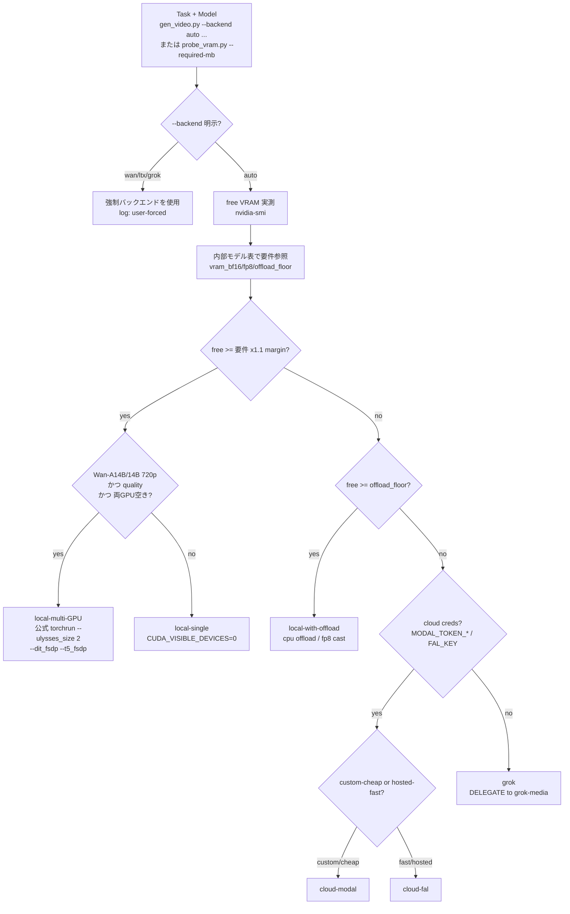

# video-media-studio

動画生成（t2v / i2v）・ローカル画像生成・ffmpeg による動画編集を一括で担うスキル。

**Core principle: LOCAL-GPU-FIRST, graceful fallback.** まずローカルの 2x RTX A6000（各48GB）で動かす。VRAM が足りない・GPU が塞がっている・認証が無い等で初めて、`local-single → local-offload → local-multi-GPU(Wan) → cloud(Modal/fal) → Grok` の順に降りる。**どのバックエンドを選んだか・なぜかは毎回ログに残す**。この 96GB リグでは実質ほぼ全モデルが local-single に収まるので、cloud/Grok は本当の最終手段。

> **REQUIRED SUB-SKILL: `grok-media`** — Grok 経路（最終フォールバック）は **すべて grok-media スキルに従う**。CLI 起動・auth gate・clean-dir・NL ツール命名・出力回収を本スキルで再実装しない。`scripts/grok_delegate.sh` は grok-media への 1 本のシームでしかない。

## 前提・環境（verified facts）

- GPU: 2x NVIDIA RTX A6000, **各48GB（実測 free ~48.6GB x2）**, ともにアイドル。Ampere（fp8 matmul は限定的、FA3 不可 → SDPA/xformers）。
- `uv` at `/home/kita/.local/bin/uv`（Python 環境はすべて uv。PEP723 インラインスクリプト）。`ffmpeg 6.1.1`。Disk 217GB free / RAM 251GB。
- **anaconda libtinfo.so.6 が LD を汚染している（既知。soffice を壊した実績あり）。** 必ず各呼び出しの前に `source scripts/env.sh` し、`"$UV" run ...` で実行する。**conda の python を絶対に使わない**。env.sh が `LD_LIBRARY_PATH` を掃除し `HF_HOME` / `PYTORCH_CUDA_ALLOC_CONF=expandable_segments:True` を設定する。

## 3つのタスク（どれをやるか先に判定）

| タスク | use when | 入口 |
|---|---|---|
| (1) 動画生成 t2v/i2v | テキスト/静止画から動画を作る、b-roll、静止画を動かす、連続クリップ | `gen_video.py`（probe 内蔵・Wan/LTX-Video）or `gen_video_ltx2.py`（LTX-2.3）|
| (2) 画像生成 | テキストから静止画、frame 素材、画中テキスト | `gen_image.py`（probe 内蔵）|
| (3) 動画編集 | 既存動画のトリム/連結/速度/字幕/音声/リサイズ/GIF 等 | `reference/ffmpeg-recipes.md` + `edit_video.py`（GPU/バックエンド判定不要・完全ローカル）|

## バックエンド自動選択（THE core decision）

**判定をモデル（LLM）の頭の中でやらない。** バックエンド選択は 2 経路で機械的に行う:
- `gen_video.py` / `gen_image.py` は **probe を内蔵**する。`--backend auto`（既定）で nvidia-smi の実 free VRAM と内部テーブルを突き合わせ、固定優先順位を降りて選ぶ。実行せず判定だけ見たいときは `--print-decision`（gen_video.py）。
- 単体で VRAM を測りたい / 任意の必要量に対する tier を知りたいときは `probe_vram.py --required-mb <MB> [--task ...]`（stdlib のみ・JSON 出力）。各モデルの `--required-mb` 目安は `reference/models.md`。

どちらも「選んだバックエンドと理由」を stderr ログに残す。



優先順位: **local-single > local-with-offload > local-multi-GPU(Wan only) > cloud-modal > cloud-fal > grok**。
要点:
- **96GB リグでは大半が local-single に収まる**（FLUX.1/SD3.5/Z-Image/Qwen-Image/Wan-1.3B/5B/Wan-A14B fp8/LTX-Video/LTX-2.3 bf16）。
- **1.1x の安全マージン**は text-encoder の VRAM スパイク（T5-XXL/Mistral-24B/Qwen2.5-VL/Gemma-3）が「収まる」モデルを OOM に倒すのを防ぐ。
- **multi-GPU は Wan の公式 torchrun（`--ulysses_size 2`）でのみ有効**。diffusers は単一クリップを 2 枚にシャードできない。スループットが目的なら「1GPU ジョブを 2 本並走」が既定。
- 詳細な根拠・degrade ポリシーは `reference/backend-selection.md`。

## Quick Reference（バックエンド × モデル）

| Backend | Model | Task | VRAM | A6000(48GB) | Fallback |
|---|---|---|---|---|---|
| local-single | wan2.1-t2v-1.3b | t2v | ~8-13GB bf16 | YES（高速反復） | offload |
| local-single | wan2.2-ti2v-5b | t2v/i2v 720p | ~24GB | YES | cloud-fal |
| local-single(fp8) | wan2.2-i2v/t2v-a14b | i2v/t2v | bf16~65-80 / fp8~40-50GB | YES（fp8 480p/720p） | local-multi → cloud |
| local-multi | wan2.2-*-a14b | t2v/i2v 720p full | bf16 across 2 GPU | YES（両空き=高速/高品質） | cloud |
| local-single | ltx-video-0.9.8 | t2v/i2v | ~24GB bf16 / ~10GB fp8+offload | YES（Apache-2.0, Gemma不要） | cloud-fal |
| local-single(fp8) | ltx-2.3（22B,+audio） | t2v/i2v/a2v | bf16~38-42 / fp8~18-20GB | YES（bf16 可・fp8 安全） | cloud-fal → grok |
| local-single | flux.1-dev | t2i | ~24-33GB bf16 | YES（品質既定・gated/非商用） | schnell / cloud |
| local-single | flux.1-schnell | t2i 1-4step | ~24GB/12GB fp8 | YES（Apache-2.0, guidance 0） | cloud-fal |
| local-single | z-image-turbo | t2i 8-9step | ~16GB/8GB fp8 | YES（高速・guidance 0・diffusers main） | flux.1-schnell |
| local-single | qwen-image | t2i 画中テキスト | ~40GB bf16 / 12-13GB 4bit | YES（bf16 tight or 4bit） | sd3.5-large |
| local-single | sd3.5-large | t2i | ~18-20GB bf16 | YES | cloud |
| local-single(fp8/4bit) | flux.2-dev | t2i 最新最高 | bf16>80 / fp8~32 / 4bit~20GB | YES（fp8/4bit） | flux.1-dev |
| cloud-modal | 上記いずれか | all | provider GPU | n/a | cloud-fal |
| cloud-fal | wan/ltx/flux hosted | all | hosted | n/a | grok |
| grok（delegate） | image_gen / image_to_video / reference_to_video | t2i,i2v,(t2v=2段) | none（subscription） | n/a | terminal |
| ffmpeg（local） | n/a | trim/concat/speed/subs/overlay/audio/resize/fps/frames/gif/thumb/reencode | CPU/GPU | YES | — |

各モデルの frame/dim ルール・install・最小 python・license は `reference/models.md` と各スクリプトの `--help` を参照。

## 動画生成フロー（t2v / i2v / chaining）

```bash
source scripts/env.sh
# 1.（任意）判定だけ先に確認: gen_video.py が VRAM を実測しバックエンドを選ぶ
"$UV" run scripts/gen_video.py --backend auto --task i2v --model wan2.2-i2v-a14b \
  --image input.jpg --prompt "..." --print-decision
# 2. 生成（--backend auto が probe→local/offload/cloud/grok を自動選択。Wan/LTX-Video は gen_video.py）
#    frame ルール: Wan = 4k+1（81=5s）; LTX = 8k+1（121/193）; dims は /32 or /64
"$UV" run scripts/gen_video.py --backend auto --task i2v --model wan2.2-i2v-a14b \
  --image input.jpg --prompt "..." --num-frames 81 --fps 16 --out out.mp4   # offload は auto 判定。手動なら --offload
# LTX-2.3 t2v（公式 ltx_pipelines・専用 venv）:
"$UV" run scripts/gen_video_ltx2.py --prompt "..." --num-frames 121 --quantization fp8-cast --out out.mp4
# LTX-2.3 i2v（diffusers の LTX2ImageToVideoPipeline・bf16・sequential offload ~24GB。最高品質ローカル i2v）:
"$UV" run scripts/gen_ltx23.py --image in.jpg --prompt "..." --num-frames 121 --fps 24 --out out.mp4
# LTX-2.3 i2v + LoRA スタック（コミュニティ LoRA を公式 base に重ねる。strength は --lora-scale）:
"$UV" run scripts/gen_ltx23_lora.py --image in.jpg --prompt "..." --nsfw-motion --lora-scale 0.7 --out out.mp4
```

> **コミュニティ "LTX-2.x モデル" の多くは実は LoRA**（`diffusion_model.*.lora_A/B` キーの単一 safetensors。例: `lynaNSFW/LTX2.3_NSFW_motion`, `lynaNSFW/LTX2BFN`, `oumoumad/...SPROUT`）。唯一のフル base は `Lightricks/LTX-2`（= diffusers の `diffusers/LTX-2.3-Diffusers`）。**HF の `base_model:` タグが別 LoRA を指していても、それは「重ねる LoRA の一枚」**であり差し替えるフル base ではない。よって設定の正解は常に「公式 base + `--lora` でスタック」。`gen_ltx23_lora.py` は diffusers の `LTX2LoraLoaderMixin`（`_convert_non_diffusers_ltx2_lora_to_diffusers`, `non_diffusers_prefix='diffusion_model'`）が `diffusion_model.` プレフィックスを自動変換するので、ComfyUI/wan2gp を使わず `load_lora_weights()` で直接ロードできる（rank64・audio_attn 含む全テンソル変換を実測確認）。`--lora <hf-id|path>` 複数指定可、`--lora-scale` で個別 strength（作者推奨 0.7）、`--nsfw-motion` は `lynaNSFW/LTX2.3_NSFW_motion` のショートカット。

- 長尺ジョブは **`run_in_background` で実行**し、完了後 `SendUserFile`（status=proactive）で納品。
- **Chaining（連続クリップ）**: `chain_video.py` が前クリップの最終フレームを `ffmpeg -sseof -0.1 -i prev.mp4 -frames:v 1 last.png` で抜き、次クリップの `--image` に渡す。resume-safe（既存出力をスキップ）、シーン別プロンプト JSON、**固定の negative-prompt でスタイルドリフト（5-10 連結で訓練データ風に流れる）を抑制**。
  ```bash
  "$UV" run scripts/chain_video.py --scenes-dir ./shots --prompts-file scenes.json \
    --first-clip s0.mp4 --model wan2.2-i2v-a14b --start 1 --end 8
  ```
- Grok での t2v が欲しい場合 → **grok-media**（image_gen → image_to_video の 2 段）。

## 画像生成フロー

**推奨の既定 3 本柱（実機評価ベース）= `z-image-turbo` / Codex(GPT Image) / Grok。**
フォトリアルな人物・日常スナップで実機検証した結果: **Z-Image-Turbo（ローカル）= 人物の可愛さ・透明感が最良**、**Grok = 生活感・シーンのリアルさが最良**、**Codex(GPT Image) = ナチュラル/構図忠実**。FLUX.1-dev は同用途では微妙だった（落ち着きすぎ）。特に指定が無ければこの 3 本で出して見比べる。

```bash
source scripts/env.sh
# ① Z-Image-Turbo（ローカル・既定の主力。9step・guidance0・高速・高品質・Apache-2.0）
"$UV" run scripts/gen_image.py --backend z-image-turbo --prompt "..." --size 832x1216 --seed 7 --out z.png

# ② Codex(GPT Image / gpt-image-2)。出力は ~/.codex/generated_images/<sid>/ig_*.png（cwd には出ない）
codex exec --skip-git-repo-check --sandbox workspace-write \
  "Use your image_gen tool to generate one image from this Japanese prompt. Prompt: ..."
#   回収: ls -dt ~/.codex/generated_images/*/ | head -1 の中の ig_*.png をコピー
#   ⚠ ログが image_gen 発火前で途切れ exit 0 でも、画像は ~/.codex/generated_images/<sid>/ に出ていることがある。
#     成否はログでなく generated_images/<その session id>/ の中身で判定する。
#   体型リファレンス付き（男性）は `-i reference/assets/male-body-reference.jpg` + プロンプト stdin（後述「男性人物の体型・構図リファレンス」）。

# ③ Grok（grok-media に委譲。出力は ~/.grok/sessions/<enc-cwd>/<sid>/images/N.jpg）
"$HOME/.grok/bin/grok" -p 'Use your image_gen tool to create an image: ...'
```

`gen_image.py` のローカル実装（`--backend`）: **z-image-turbo（推奨主力）/ flux / sdxl / qwen-image（画中テキスト）/ flux.2-dev（4bit量子化）**。
- **turbo（z-image-turbo, flux --fast）は guidance≈0・少ステップ**（高 CFG は破綻）。
- 大型（qwen-image=offload強制 / flux.2-dev=4bit必須）は `gen_image.py` が自動処理。
- License: 商用可= Z-Image / FLUX.1-schnell / SDXL / Qwen-Image。gated+非商用= FLUX.1/2-dev。
- **ポリシー差（重要）**: Codex(OpenAI) は身体表現に厳格で「巨乳」「Fカップ+色っぽい+妖艶」等の複合を `sexualized content` で拒否することがある（婉曲表現で通る場合あり）。**そういう表現は Grok かローカル（Z-Image/FLUX）が確実**。Grok・ローカルは制限が緩い。
- さらに上の品質が要るとき → `reference/models.md` のモデル表（Qwen-Image 20B 等）。cloud は `cloud_modal.py` / `cloud_fal.py`。

### 人物生成の固定ルール：入れ墨を入れない（必読・全モデル）

人物（特に肌の露出があるシーン）を生成すると、**頼んでいないのに入れ墨（タトゥー）が描かれることがある**（実機で発生：男性の脇腹に漢字タトゥー）。ユーザー要望により**入れ墨・タトゥーは常に入れない**。モデルにより効かせ方が違うので両面で抑える:
- **ネガティブで効くモデル（z-image-turbo / sdxl / qwen-image）**: `--negative-prompt` に **`tattoo, tattoos, body ink, lettering on skin`** を必ず含める（既存の `deformed hands, extra fingers, watermark, text, ...` に追記）。
- **ネガティブが効かないモデル（FLUX.1/.2-dev は negative_prompt を無視）/ Grok / Codex**: **ポジティブ側に明示**する。日本語なら「**入れ墨・タトゥーなし、肌に文字や模様なし、きれいな素肌**」、英語なら `no tattoos, clean bare skin, no ink or lettering on the body`。Grok は日本語のまま渡す（翻訳禁止＝言語ポリシー参照）。
- **i2v 動画（gen_ltx23_lora.py 等）**: 入力画像に入れ墨が無ければ動画にもまず出ないが、negative-prompt に `tattoo` を足しておくと安全。入力画像側に既にタトゥーがある場合は、画像段階で消す（再生成 or 編集）。

### 男性人物の体型・構図リファレンス（必読・固定）

**男性（man / male）を生成するときは、必ず `reference/assets/male-body-reference.jpg` を「この人物の体型・ポーズ・肌感」の参照として使う。** 正立済み（630×1639 縦長）の、上半身裸＋黒ショーツで**スマホを顔の前に構えて顔を隠した**ミラーセルフィ。30代前半・黒髪ショート・細マッチョ（適度な筋肉・引き締まった腹・健康的な小麦寄りの肌）の日本人男性。**この画像は顔がスマホで隠れているため顔リファレンスではない**——体型・身長感・自撮りポーズ・素肌の質感を寄せる用途。指定がなくても男性が登場するシーンはこの体型・ポーズに寄せる。

参照のかけ方はバックエンドごとに異なる（実機検証済み）:
- **Codex(GPT Image)** — 参照画像で体型・構図を最も忠実に再現。`codex exec --skip-git-repo-check -i reference/assets/male-body-reference.jpg < prompt.txt`（**`-i` で画像添付・プロンプトは stdin リダイレクトで渡す**。`-i` と位置引数プロンプトの併用は `No prompt provided via stdin` で落ちるので不可）。プロンプト本文で「the attached photo is the reference for the man's body type and pose — slim athletic build, same posture, smartphone held in front of the face」と明示する。
- **ローカル（z-image-turbo / flux / sdxl）** — `gen_image.py` は **text-to-image のみで参照画像入力に非対応**。よって体型・ポーズを**文章で記述**してプロンプトに織り込む（slim athletic build / lean toned abs / early 30s / short black hair / holding a smartphone in front of his face / healthy slightly tanned skin）。同一体型に寄せるレベル。
- **Grok** — 2つの別問題を区別する（実機検証 2026-06-23）。(a) **`image_gen` はプロンプトを日本語のまま渡せば NSFW 人物でも生成成功**。英訳すると `busty`/`shirtless` 等がフィルタに当たり**無言で空終了**（画像が出ない）→ 翻訳禁止、詳細は `grok-media` Step 1 の言語ポリシー。(b) **参照画像を使う `image_edit` はヘッドレス `-p` 実行では発火しない**（無害シーンでも無応答・実機で複数回再現）。よって Grok で「画像を参照して合成」はできない。Grok で人物を出すなら **image_gen + 体型・ポーズを日本語で記述**（同一画像にはならない）。参照画像を厳密に効かせたいなら Codex `-i`、上半身裸等の指定は日本語 image_gen かローカルが確実。

注意: スマホで撮った縦長写真は **EXIF で 90° 横倒し**で保存されていることがある。参照に使う前に `ffmpeg -noautorotate -i src.jpg -vf transpose=2 -map_metadata -1 up.jpg`（反時計回り）で正立を確認する（`reference/assets/male-body-reference.jpg` は補正済み）。

## 動画編集フロー（ffmpeg）

編集は完全ローカル（GPU/cloud 判定不要）。重いレシピは `reference/ffmpeg-recipes.md`（14 セクション・全コマンド付き）を参照し、SKILL.md には載せない。`edit_video.py` は安全既定（`-pix_fmt yuv420p` / 偶数寸法 `scale=-2` / `-movflags +faststart` / `-shortest` / `setsar=1`）でラップする。

14 操作の索引: trim / concat / speed / subtitle / overlay(watermark) / audio-replace / audio-mix / duck / resize-crop-pad / fps / frames / gif / thumb / reencode。

```bash
source scripts/env.sh
"$UV" run scripts/edit_video.py trim --in in.mp4 --ss 00:00:30 --to 00:01:45 --out cut.mp4
"$UV" run scripts/edit_video.py concat --inputs a.mp4 b.mp4 --out joined.mp4
"$UV" run scripts/edit_video.py gif --in in.mp4 --fps 15 --width 480 --out out.gif
```

**常に確認する gotcha**: 再エンコード時は `yuv420p` / 偶数寸法 / web は `+faststart` / 異尺ストリーム結合は `-shortest` / scale・pad の後は `setsar=1`。例外的操作は ffmpeg-recipes.md に委譲。

## クラウド / Grok フォールバックの使い分け

ローカルが不足したときの一行判断:
- **cloud-modal** — 自前 diffusers パイプライン・特定 revision・LoRA・最安 GPU/秒。コードは自分で保守。`MODAL_TOKEN_ID/SECRET`。
- **cloud-fal** — Wan/LTX/FLUX がホスト済みなら最速・ゼロインフラ・出力秒課金。`FAL_KEY`。
- **grok** — subscription quota・メータリング無し・t2v は 2 段。**最終手段**。

```bash
"$UV" run scripts/cloud_modal.py --model wan2.2-i2v-a14b --task i2v --image in.jpg --out out.mp4
"$UV" run scripts/cloud_fal.py   --model wan2.2-i2v-a14b --task i2v --image in.jpg --out out.mp4
bash scripts/grok_delegate.sh    # grok-media の契約を表示して委譲（再実装しない）
```

> **REQUIRED SUB-SKILL marker:** Grok 経路はすべて **grok-media** に従う（CLI 起動・auth gate `grok models`・`mktemp -d` clean-dir・NL ツール命名 image_gen/image_edit/image_to_video/reference_to_video・`~/.grok/sessions/.../{images,videos}/` からの出力回収・`grok -r` 復元）。本スキルでは binary path/flags/session paths を一切再定義しない。

## OpenRouter（明示指定のみ — auto には入れない）

**ユーザーが「OpenRouter で」と言ったときだけ使う。** Grok と同じ「指名されたら使う経路」で、`--backend auto` の VRAM 階段（local→modal→fal→grok）には **意図的に混ぜていない**（`probe_backend.py` の auto 解決も変更しない）。OpenRouter は LLM・画像・動画を 1 つの API キー / 課金レイヤーで使える。

- **キー**: `~/.config/openrouter.key`（1 行・`chmod 600`）。無ければ `$OPENROUTER_API_KEY`。`~/.config/` は公開リポ `~/.claude` の外なので commit に載らない（`gmail-smtp.pass` と同じ流儀）。発行は https://openrouter.ai/keys（`sk-or-v1-...`）。
  ```bash
  umask 077 && printf '%s' 'sk-or-v1-...' > ~/.config/openrouter.key && chmod 600 ~/.config/openrouter.key
  ```
- **エントリ**: `scripts/cloud_openrouter.py`（`requests` のみ）。3 サブコマンド `llm` / `image` / `video` と `models`（id 探索）。
  ```bash
  "$UV" run scripts/cloud_openrouter.py llm   --model anthropic/claude-opus-4-8 --prompt "..."
  "$UV" run scripts/cloud_openrouter.py image --model google/gemini-2.5-flash-image-preview --prompt "..." --out a.png
  "$UV" run scripts/cloud_openrouter.py video --model google/veo-3.1 --task t2v --prompt "..." --out a.mp4
  "$UV" run scripts/cloud_openrouter.py models --modality video    # 利用可能 id を列挙
  ```
- **gen_image.py / gen_video.py 経由でも呼べる**（モデルは `--or-model` で指定。auto には影響しない）:
  ```bash
  "$UV" run scripts/gen_image.py --backend openrouter --or-model google/gemini-2.5-flash-image-preview --prompt "..." --out a.png
  "$UV" run scripts/gen_video.py --backend openrouter --or-model google/veo-3.1 --task t2v --prompt "..." --out a.mp4
  ```
- **要点**: 画像は `chat/completions` + `modalities:["image","text"]`（結果は base64 data-URL を自動デコード保存）。動画は**非同期**（`POST /videos` → polling → DL）で、ポーリングは wall-clock 期限と試行回数の二重ガードで必ず打ち切る。動画 model 例: `google/veo-3.1`, `alibaba/wan-2.7`, `kwaivgi/kling-v3.0-std`。画像 model 例: `google/gemini-2.5-flash-image-preview`, `black-forest-labs/flux.2-pro`。**id は変動するので確証が要るときは `models` サブコマンドで確認**。

## Common Mistakes

- **conda の python で実行 → 依存が壊れる / libtinfo 汚染**。必ず `source scripts/env.sh` → `"$UV" run`。
- **frame ルールの取り違え**: Wan は 4k+1（81）、LTX は 8k+1（121/193）、dims は /32 or /64。外すとハードエラー。
- **VAE を bf16 にする → Wan/LTX のデコードが目に見えて劣化**。VAE は fp32 固定。
- **turbo モデルに高 guidance / 多ステップ** → 破綻・洗い流し。schnell/z-image-turbo/distilled は guidance≈0。
- **VRAM OOM**: probe の 1.1x マージンを超えたら local-offload に降りる。それでも落ちる場合は cloud にフォールバック（offload と manual multi-GPU を同時指定しない — `enable_model_cpu_offload()` は単一デバイス固定）。
- **LTX-2 t2v を diffusers で読もうとする** → 未対応。t2v は `gen_video_ltx2.py`（公式 ltx_pipelines, torch 2.7, gated Gemma-3）。**i2v は diffusers の `LTX2ImageToVideoPipeline` が対応**（`gen_ltx23.py` / LoRA は `gen_ltx23_lora.py`）。
- **コミュニティ "LTX-2.x モデル" をフル base と思い込む** → 多くは単一 safetensors の LoRA（`diffusion_model.*.lora_A/B`）。`base_model:` タグが別 LoRA を指すチェーンになっていても、フル base は `Lightricks/LTX-2` のみ。**差し替えずに公式 base へ `--lora` でスタック**する（`gen_ltx23_lora.py`、`--lora-scale` で strength）。
- **FLUX.2 / Z-Image を stable diffusers で読む** → `Flux2Pipeline/ZImagePipeline` が無いと失敗。diffusers git main が必要。
- **diffusers で単一クリップ multi-GPU** → 不可。Wan 公式 torchrun のみ。
- **Grok の空応答を失敗と誤認** → ファイルは生成済みのことが多い。grok-media の出力回収（session dir glob / `grok -r`）に従う。

## Setup（初回のみ）

- 各スクリプトは PEP723 で依存を宣言、`uv run` が自動解決する（`gen_video_ltx2.py` は専用 venv 想定）。
- HF token + gated ライセンス受諾: FLUX.1/2-dev、LTX-2 の Gemma-3（`google/gemma-3-12b-it-qat-q4_0-unquantized`）。
- LTX-2.3 は ~100GB の disk（217GB 空きで OK）。Modal/fal の鍵は cloud 経路を使うときだけ。
- 詳細（クリーン env レシピ、Wan 公式 repo clone、disk 予算、anaconda LD gotcha）は `reference/setup.md`。

## 関連スキル

- **REQUIRED: grok-media** — Grok フォールバック経路の正本。
- 隣接: slide-making / infographic（生成メディアを取り込む）、codex-consult（行き詰まり時の相談）。
