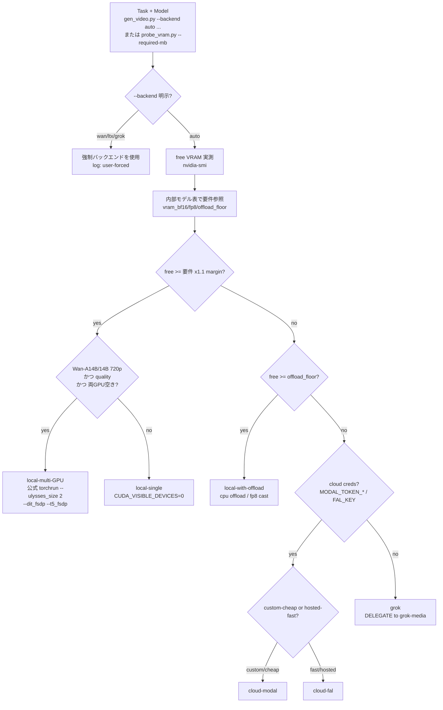

# video-media-studio

動画生成（t2v / i2v）・ローカル画像生成・ffmpeg による動画編集を一括で担うスキル。

**Core principle: LOCAL-GPU-FIRST, graceful fallback.** まずローカルの 2x RTX A6000（各48GB）で動かす。VRAM が足りない・GPU が塞がっている・認証が無い等で初めて、`local-single → local-offload → local-multi-GPU(Wan) → cloud(Modal/fal) → Grok` の順に降りる。**どのバックエンドを選んだか・なぜかは毎回ログに残す**。この 96GB リグでは実質ほぼ全モデルが local-single に収まるので、cloud/Grok は本当の最終手段。

> **REQUIRED SUB-SKILL: `grok-media`** — Grok 経路（最終フォールバック）は **すべて grok-media スキルに従う**。CLI 起動・auth gate・clean-dir・NL ツール命名・出力回収を本スキルで再実装しない。`scripts/grok_delegate.sh` は grok-media への 1 本のシームでしかない。

## 前提・環境（verified facts）

- GPU: 2x NVIDIA RTX A6000, **各48GB（実測 free ~48.6GB x2）**, ともにアイドル。Ampere（fp8 matmul は限定的、FA3 不可 → SDPA/xformers）。
- `uv` at `/home/kita/.local/bin/uv`（Python 環境はすべて uv。PEP723 インラインスクリプト）。`ffmpeg 6.1.1`。Disk 217GB free / RAM 251GB。
- **anaconda libtinfo.so.6 が LD を汚染している（既知。soffice を壊した実績あり）。** 必ず各呼び出しの前に `source scripts/env.sh` し、`"$UV" run ...` で実行する。**conda の python を絶対に使わない**。env.sh が `LD_LIBRARY_PATH` を掃除し `HF_HOME` / `PYTORCH_CUDA_ALLOC_CONF=expandable_segments:True` を設定する。

## 3つのタスク（どれをやるか先に判定）

| タスク | use when | 入口 |
|---|---|---|
| (1) 動画生成 t2v/i2v | テキスト/静止画から動画を作る、b-roll、静止画を動かす、連続クリップ | `gen_video.py`（probe 内蔵・Wan/LTX-Video）or `gen_video_ltx2.py`（LTX-2.3）|
| (2) 画像生成 | テキストから静止画、frame 素材、画中テキスト | `gen_image.py`（probe 内蔵）|
| (3) 動画編集 | 既存動画のトリム/連結/速度/字幕/音声/リサイズ/GIF 等 | `reference/ffmpeg-recipes.md` + `edit_video.py`（GPU/バックエンド判定不要・完全ローカル）|
| (4) 動画スタイル変換 v2v | **既存動画**を別スタイルに変換（リアル↔アニメ等）し、**同じ人物を固定**したまま動きを保つ。NSFW 可 | **★NSFW リアル動画→アニメ動画は `gen_v2v_qwen.py`（Qwen-Image-Edit + アニメ LoRA・実機実証の本命）が第一選択**。汎用スタイル変換や動きの強い拘束が要る場合のみ `gen_v2v_style.py`（SDXL img2img + ControlNet + IP-Adapter）。下の「動画スタイル変換フロー」参照 |
| (5) r2v（参照→任意シーン動画） | **参照人物 1 枚 + テキスト**で、その人物を**全く別のシチュ**（例: 浴室でシャワー）の動画にする。**モーション元動画は不要**。NSFW 可 | **`gen_hunyuan_custom.py`（HunyuanCustom・headless ComfyUI）**。VACE r2v（`gen_wan_vace.py`）は別人モーション動画を骨格転写する方式で任意シーンは作れない＝**テキストだけで任意シーンにするなら HunyuanCustom**。下の「r2v フロー」参照 |

## バックエンド自動選択（THE core decision）

**判定をモデル（LLM）の頭の中でやらない。** バックエンド選択は 2 経路で機械的に行う:
- `gen_video.py` / `gen_image.py` は **probe を内蔵**する。`--backend auto`（既定）で nvidia-smi の実 free VRAM と内部テーブルを突き合わせ、固定優先順位を降りて選ぶ。実行せず判定だけ見たいときは `--print-decision`（gen_video.py）。
- 単体で VRAM を測りたい / 任意の必要量に対する tier を知りたいときは `probe_vram.py --required-mb <MB> [--task ...]`（stdlib のみ・JSON 出力）。各モデルの `--required-mb` 目安は `reference/models.md`。

どちらも「選んだバックエンドと理由」を stderr ログに残す。



優先順位: **local-single > local-with-offload > local-multi-GPU(Wan only) > cloud-modal > cloud-fal > grok**。
要点:
- **96GB リグでは大半が local-single に収まる**（FLUX.1/SD3.5/Z-Image/Qwen-Image/Wan-1.3B/5B/Wan-A14B fp8/LTX-Video/LTX-2.3 bf16）。
- **1.1x の安全マージン**は text-encoder の VRAM スパイク（T5-XXL/Mistral-24B/Qwen2.5-VL/Gemma-3）が「収まる」モデルを OOM に倒すのを防ぐ。
- **multi-GPU は Wan の公式 torchrun（`--ulysses_size 2`）でのみ有効**。diffusers は単一クリップを 2 枚にシャードできない。スループットが目的なら「1GPU ジョブを 2 本並走」が既定。
- 詳細な根拠・degrade ポリシーは `reference/backend-selection.md`。

## Quick Reference（バックエンド × モデル）

| Backend | Model | Task | VRAM | A6000(48GB) | Fallback |
|---|---|---|---|---|---|
| local-single | wan2.1-t2v-1.3b | t2v | ~8-13GB bf16 | YES（高速反復） | offload |
| local-single | wan2.2-ti2v-5b | t2v/i2v 720p | ~24GB | YES | cloud-fal |
| local-single(fp8) | wan2.2-i2v/t2v-a14b | i2v/t2v | bf16~65-80 / fp8~40-50GB | YES（fp8 480p/720p） | local-multi → cloud |
| local-multi | wan2.2-*-a14b | t2v/i2v 720p full | bf16 across 2 GPU | YES（両空き=高速/高品質） | cloud |
| local-single | ltx-video-0.9.8 | t2v/i2v | ~24GB bf16 / ~10GB fp8+offload | YES（Apache-2.0, Gemma不要） | cloud-fal |
| local-single(fp8) | ltx-2.3（22B,+audio） | t2v/i2v/a2v | bf16~38-42 / fp8~18-20GB | YES（bf16 可・fp8 安全） | cloud-fal → grok |
| local-single | flux.1-dev | t2i | ~24-33GB bf16 | YES（品質既定・gated/非商用） | schnell / cloud |
| local-single | flux.1-schnell | t2i 1-4step | ~24GB/12GB fp8 | YES（Apache-2.0, guidance 0） | cloud-fal |
| local-single | z-image-turbo | t2i 8-9step | ~16GB/8GB fp8 | YES（高速・guidance 0・diffusers main） | flux.1-schnell |
| local-single | qwen-image | t2i 画中テキスト | ~40GB bf16 / 12-13GB 4bit | YES（bf16 tight or 4bit） | sd3.5-large |
| local-single | sd3.5-large | t2i | ~18-20GB bf16 | YES | cloud |
| local-single(fp8/4bit) | flux.2-dev | t2i 最新最高 | bf16>80 / fp8~32 / 4bit~20GB | YES（fp8/4bit） | flux.1-dev |
| cloud-modal | 上記いずれか | all | provider GPU | n/a | cloud-fal |
| cloud-fal | wan/ltx/flux hosted | all | hosted | n/a | grok |
| grok（delegate） | image_gen / image_to_video / reference_to_video | t2i,i2v,(t2v=2段) | none（subscription） | n/a | terminal |
| ffmpeg（local） | n/a | trim/concat/speed/subs/overlay/audio/resize/fps/frames/gif/thumb/reencode | CPU/GPU | YES | — |
| local-single(offload) | **Qwen-Image-Edit-2511 + アニメ LoRA** | **★NSFW リアル動画→アニメ v2v（本命・同一人物保持）** | bf16 ~40GB（`--offload model`） | YES（`gen_v2v_qwen.py`・`--gpu N`・両GPU並列で時短） | — |
| local-single(fp16) | SDXL base + xinsir ControlNet + IP-Adapter Plus-Face | v2v style transfer（汎用・動き強拘束。リアル→アニメは別人化するので非推奨） | ~12-16GB fp16 | YES（`gen_v2v_style.py`・`--gpu N`） | offload → cloud |

各モデルの frame/dim ルール・install・最小 python・license は `reference/models.md` と各スクリプトの `--help` を参照。

## 動画生成フロー（t2v / i2v / chaining）

### ★動画生成の前に必ず 3×3 ストーリーボードを作り、承認を得る（例外なし）
**動画（t2v / i2v / r2v / v2v いずれも）を生成する前に、必ず次を行う。** これは「素早い1本」「テスト」でも省略しない。

1. **3×3（9コマ）のストーリーボードを"1枚の画像"として作る**（`storyboard_*.png`）。各コマ＝ショットの時系列キーフレーム。
2. **各コマの担当時間範囲を txt に紐づける**（同 basename の `storyboard_*.txt`。例 `panel5: 1.7-2.3s / 内容 / カメラ / 時間方向`）。
3. **ユーザーに提示して承認を得る。承認前に動画を生成しない**（静止画＝ストーリーボード素材の生成は続けてよい。ask-before-video は動画のみを止める）。
4. 承認後、**ストーリーボードに沿って i2v の「開始画像」と「終了画像」を指定して生成**する（Kling `image-to-video` は `image`＋`end_image` を持つ。隣接コマを start/end に割り当てて区間を i2v で繋ぐ）。

**Red flags（どれも「STOP・先にストーリーボードを作れ」）**: 「テストだから1本だけ」「プロンプトから直接t2v」「start/end無しでi2v」「承認をあとで取る」。
関連プロジェクトのゲート（例: 75Gravity `.claude-memory/ask-before-video-generation.md`）とも整合させる。

```bash
source scripts/env.sh
# 1.（任意）判定だけ先に確認: gen_video.py が VRAM を実測しバックエンドを選ぶ
"$UV" run scripts/gen_video.py --backend auto --task i2v --model wan2.2-i2v-a14b \
  --image input.jpg --prompt "..." --print-decision
# 2. 生成（--backend auto が probe→local/offload/cloud/grok を自動選択。Wan/LTX-Video は gen_video.py）
#    frame ルール: Wan = 4k+1（81=5s）; LTX = 8k+1（121/193）; dims は /32 or /64
"$UV" run scripts/gen_video.py --backend auto --task i2v --model wan2.2-i2v-a14b \
  --image input.jpg --prompt "..." --num-frames 81 --fps 16 --out out.mp4   # offload は auto 判定。手動なら --offload
# LTX-2.3 t2v（公式 ltx_pipelines・専用 venv）:
"$UV" run scripts/gen_video_ltx2.py --prompt "..." --num-frames 121 --quantization fp8-cast --out out.mp4
# LTX-2.3 i2v（diffusers の LTX2ImageToVideoPipeline・bf16・sequential offload ~24GB。最高品質ローカル i2v）:
"$UV" run scripts/gen_ltx23.py --image in.jpg --prompt "..." --num-frames 121 --fps 24 --out out.mp4
# LTX-2.3 i2v + LoRA スタック（コミュニティ LoRA を公式 base に重ねる。strength は --lora-scale）:
"$UV" run scripts/gen_ltx23_lora.py --image in.jpg --prompt "..." --nsfw-motion --lora-scale 0.7 --out out.mp4
```

> **コミュニティ "LTX-2.x モデル" の多くは実は LoRA**（`diffusion_model.*.lora_A/B` キーの単一 safetensors。例: `lynaNSFW/LTX2.3_NSFW_motion`, `lynaNSFW/LTX2BFN`, `oumoumad/...SPROUT`）。唯一のフル base は `Lightricks/LTX-2`（= diffusers の `diffusers/LTX-2.3-Diffusers`）。**HF の `base_model:` タグが別 LoRA を指していても、それは「重ねる LoRA の一枚」**であり差し替えるフル base ではない。よって設定の正解は常に「公式 base + `--lora` でスタック」。`gen_ltx23_lora.py` は diffusers の `LTX2LoraLoaderMixin`（`_convert_non_diffusers_ltx2_lora_to_diffusers`, `non_diffusers_prefix='diffusion_model'`）が `diffusion_model.` プレフィックスを自動変換するので、ComfyUI/wan2gp を使わず `load_lora_weights()` で直接ロードできる（rank64・audio_attn 含む全テンソル変換を実測確認）。`--lora <hf-id|path>` 複数指定可、`--lora-scale` で個別 strength（作者推奨 0.7）、`--nsfw-motion` は `lynaNSFW/LTX2.3_NSFW_motion` のショートカット。

- 長尺ジョブは **`run_in_background` で実行**し、完了後 `SendUserFile`（status=proactive）で納品。
- **Chaining（連続クリップ）**: `chain_video.py` が前クリップの最終フレームを `ffmpeg -sseof -0.1 -i prev.mp4 -frames:v 1 last.png` で抜き、次クリップの `--image` に渡す。resume-safe（既存出力をスキップ）、シーン別プロンプト JSON、**固定の negative-prompt でスタイルドリフト（5-10 連結で訓練データ風に流れる）を抑制**。
  ```bash
  "$UV" run scripts/chain_video.py --scenes-dir ./shots --prompts-file scenes.json \
    --first-clip s0.mp4 --model wan2.2-i2v-a14b --start 1 --end 8
  ```
- Grok での t2v が欲しい場合 → **grok-media**（image_gen → image_to_video の 2 段）。
- **カメラワークを指定したい**（dolly / pan / tilt / zoom / orbit / crane / drone / tracking / whip pan / crash zoom / FPV 等）ときは `reference/camera-movements.md` を参照。46技法×7カテゴリの**再現プロンプト全文**（`Camera: … Movement: … Speed: … Framing: … End: …` の平叙文フル記述で Wan/LTX に効く。出典 aicameramovements.com 原文）＋適用の指針（1クリップ1動き・i2v の可否・NSFWパイプラインでは控えめな動き）。

## r2v フロー（参照人物 1 枚 + テキスト → 任意シーン動画）= `gen_hunyuan_custom.py`

**参照人物 1 枚と文章だけで、その人物を全く別のシチュ（例: 浴室でシャワー）の動画にする。モーション元動画は不要。** VACE r2v（`gen_wan_vace.py`）は別人のモーション動画を OpenPose 骨格化して転写する方式なので、**シャワー等の任意シーンはモーション元が無ければ作れない**。テキストだけで任意シーンを作るなら **HunyuanCustom（`gen_hunyuan_custom.py`）** を使う。NSFW（全裸）ローカル可・検閲なし。

```bash
source scripts/env.sh
# 参照 ref.png の人物を「浴室でシャワー」の動画に(512x896/129f=5s/steps30/cfg7.5)
"$UV" run scripts/gen_hunyuan_custom.py \
  --ref /path/to/person.png \
  --prompt "A nude Japanese woman taking a shower in a bathroom, wet tile walls, warm steam, water running down her body, soft window light, photorealistic, full body" \
  --out shower.mp4 \
  --width 512 --height 896 --num-frames 129 --steps 30 --guidance 7.5 --flow-shift 13.0 --seed 42 --fps 24 --offload 20 --gpu 1
# gen_video.py --task r2v からも同じ経路へ defer される(専用入口・VRAM階段には混ぜない)
```

**仕組み・実装（初回セットアップと詳細は `reference/models.md` の「r2v」節）**:
- **別ランタイム**: diffusers ではなく **headless ComfyUI サーバ**（Kijai HunyuanVideoWrapper）で動く。ComfyUI は `/data/kita/ComfyUI`（専用 uv venv・anaconda 非依存）。`gen_hunyuan_custom.py` は薄いラッパー（サーバを spawn/接続 → 参照画像 upload → API workflow POST → poll → mp4 回収）。torch は自プロセスに入れない（LTX-2.3 委譲型と同じ）。
- **identity の核**: 参照画像の顔・体型は **CLIP-Vision（`llava_llama3_vision`）** 経由で全フレームに注入。pose 骨格ではない。
- **★fp8_scaled は LoRA 非対応**（Kijai 明言）→ 初版は LoRA なし（無検閲ベース + プロンプトで全裸可）。モーション LoRA が要る時のみ bf16 経路（未実装）。
- **VRAM/速度**（A6000 1 枚実測）: fp8+block-swap 20+text-enc fp8 で 512×896/129f が通る。**~70 s/step → 129f/30step で ~36 分**。2 枚目は別ポート+`--gpu` で並列。
- **設定**: 512×896（低 VRAM）or 720×1280、`--num-frames` は 4k+1（129≈5s）、steps 30、cfg 7.5、flow_shift 13.0。frame ルールを外すとエラー。
- **顔忠実度の A/B**: `compare_face_sim.py`（ArcFace/insightface buffalo_l の Face-Sim）。★**両動画とも正面顔のときだけ数値が公平**（HunyuanCustom の動作ショット＝横向き/俯きは同一人物でも ArcFace が下がる）。必ずタイル+動画を目視で最終判断。
- **★左右は画像でなく被写体基準で判定する**: 「右手/左手」「右を向く」等を指摘・QC するとき、**画像の左右と人物（被写体）の左右は反転する**（正面向きの人物の"右手"は画像では左側）。必ず生成物の構図を実際に見て被写体基準で判断してから言う。鏡像（自撮り/カメラ目線）にも注意。マット/合成で欠損した四肢を指摘する際も同じ。
- **プロンプト規約**: 人物生成の 6 要素・入れ墨禁止（DEFAULT_NEG に tattoo 系込み）・スタイル既定リアルは他フローと同じ。シーン（背景・光・動作）は文章で明示。

## ★NSFW リアル動画 → アニメ動画（本命・実機実証 2026-06-30）= `gen_v2v_qwen.py`

**リアルな人物動画をフレームごとにアニメ化し、同じ人物を保ったまま 1 本の動画にする用途は、これが第一選択。** `gen_v2v_qwen.py`（Qwen-Image-Edit + アニメ LoRA、フレーム別、ComfyUI 不要、完全ローカル＝NSFW 可）。

```bash
source scripts/env.sh
# 入力動画を 24fps でアニメ化（同一人物保持）。両GPU空きなら --gpu で分担並列。
"$UV" run scripts/gen_v2v_qwen.py \
  --in real.mp4 --out anime.mp4 \
  --repo "Qwen/Qwen-Image-Edit-2511" --lora "prithivMLmods/Qwen-Image-Edit-2511-Anime" --lora-scale 1.0 \
  --prompt "Transform into anime." --fps 24 \
  --steps 8 --guidance 1.0 --seed 12345 --max-side 1280 --offload model --gpu 1
# 長尺で時短: フレーム範囲を2分割し別GPUで並走（--work-dir を共有、--start/--end で分担）→ 最後に全フレームを手動で concat 結合
```

**なぜ Qwen-Edit でフレーム間の人物が統一できるのか（核心・実証済み）**:
- **Qwen-Image-Edit は「編集」モデル**＝入力画像そのものを条件に「この画像をアニメに」と*変換*する。各フレームが元の実写フレームを土台にするので、**顔・髪・体型が入力から直接受け継がれ、同一人物が保たれる**。
- 対照的に **SDXL+IP-Adapter（gen_v2v_style.py）は「新規生成＋顔を薄くヒント」**なので、毎フレーム別の顔を描いて**別人化・量産アニメ顔**になる（2026-06-30 に実機で確認：Pony+IP-Adapter は前髪が消え面長の別人になった）。**だから NSFW リアル→アニメは必ず Qwen 経路を使う。**
- 補強: ①元動画が連続（隣フレームがほぼ同じ→出力も連続）②全フレームで seed・prompt・model・LoRA を固定（ランダム揺れ排除）。

**設定（実証値・既定）**:
- **ベース `--repo Qwen/Qwen-Image-Edit-2511`**（2509 比で image drift 軽減・キャラ一貫性向上。`gen_qwen_edit.py`/`gen_v2v_qwen.py` 既定）。
- **アニメ LoRA `prithivMLmods/Qwen-Image-Edit-2511-Anime`**（トリガー `"Transform into anime."`、4-8 step の lightning、cfg≈1.0。**「元のポーズ・プロポーション・視点を保持」と設計**＝フレーム単位に最適）。NSFW 表現が要るショットは `ScottzillaSystems/qwen-image-edit-plus-nsfw-lora` を 2 枚目に重ねる（`--lora` 複数指定可）。
- **★アニメ LoRA は必須**: 入れないと（2509 単体）アニメにはなるが**入力の表情・ポーズを勝手に作り変える**（A/B で実証）。LoRA ありで入力に忠実になる。
- `--steps 8 --guidance 1.0`（lightning LoRA は低 step・低 cfg）。`--seed` は全フレーム固定。`--max-side 1280`（~1MP）。
- **`--offload model` 必須級**: Qwen 20B+LoRA は `--offload none`（フルロード）だと 1280px で 48GB OOM（実機確認）。offload で 1 枚 ~30-40 秒。
- **fps の決め方**: 元 60fps を全部変換は非現実的（554 枚で両 GPU 並列でも ~3h）。**24fps が画質・滑らかさ・時間のバランス良。8-12fps はリミテッドアニメ調で更に速い**。出力は元の尺に合わせて再結合（フレーム間引いても尺は縮まない）。
- **後処理ブレンドはしない**: `minterpolate=blend` 等の補間は輪郭が二重にボケて**画質が落ちる**（ユーザー確定 2026-06-30、raw>smoothed）。**生成フレームを無加工で結合（raw）が最高画質**。ちらつきは seed/prompt/model 固定で抑え、補間に頼らない。

**残る限界（正直に）**: フレーム別編集なので**わずかなちらつき**（髪・陰影の揺れ）は残る＝フレーム単位画像編集の宿命。fps を上げる（24fps）と目立ちにくい。**元動画に画面録画 UI 等のオーバーレイがあるとアニメ化されて写り込む**ので、必要なら該当フレームをトリム/クロップ。

**手順（実務）**: ①入力動画を確認（縦長スマホ動画等は `--max-side` で ~1MP に縮小される）②`gen_v2v_qwen.py` で 24fps 生成（長尺は 2 分割並列）③全フレーム揃ったら無加工で 24fps 結合 ④目視で全編の同一性を確認してから納品（フレーム数点の顔タイルで一貫性チェック）。NSFW は完全ローカルで外部送信しない。

> 関連スクリプト: `gen_qwen_edit.py`（1 枚の参照編集・`--repo`/`--lora` 対応済み、A/B 比較用）、`gen_v2v_qwen.py`（動画全フレーム・モデル 1 回ロードで連続処理）。**逆方向（アニメ→実写 NSFW）**も同じ枠組みで、アニメ LoRA を `Hyperccino/Qwen-Edit-2511-Anime-to-Photoreal-v1.1`（or `WarmBloodAban/Anything_to_Real_Characters_2511`）＋ NSFW LoRA に差し替えれば可（準実写まで・同一性 moderate・NSFW はローカル一択／編集 API は全て NSFW 拒否）。

## 動画スタイル変換フロー（SDXL 経路・汎用 / 動きの強拘束用）

> ⚠️ **NSFW リアル動画→アニメは上の Qwen 経路（`gen_v2v_qwen.py`）を使う。** この SDXL 経路は別人化しやすいので、汎用スタイル変換や ControlNet で動きを強く拘束したい用途に限る。

**既存動画を別スタイル（リアル↔アニメ等）に変換し、同じ人物を固定したまま動きを保つ。** ComfyUI ガイドの「アプローチA（フレーム別 img2img + 強力リファレンス制御）」を **ComfyUI 非依存の diffusers 直書き**に移植したもの。入口は `gen_v2v_style.py`。

**何が何に対応するか**（ComfyUI ノード → このスキル）:

| ガイド（ComfyUI） | このスキルの実装 | なぜ |
|---|---|---|
| アニメ側ベース（Pony / Illustrious） | `--style-model pony / noobai-xl / noobai-xl-vpred / manga-vision-il` | 既存の SDXL レジストリを再利用。SDXL ControlNet/IP-Adapter はアーキ共通でそのまま載る |
| リアル側ベース（AbsoluteReality 等） | `--style-model sdxl`（or `--style-repo <実写SDXLチェックポイント>`） | 実写寄り SDXL に差し替え可 |
| ControlNet OpenPose + Depth（動き保持） | `xinsir/controlnet-{openpose,depth}-sdxl-1.0` + `controlnet_aux`（OpenposeDetector/MidasDetector） | xinsir が現行最良の SDXL ControlNet。`--controlnet openpose,depth`（canny も可） |
| IP-Adapter FaceID + Reference Only（顔固定） | `ip-adapter-plus-face_sdxl_vit-h.bin`（CLIP ViT-H・`--face-ref`） | **insightface 不要**で `pipe.load_ip_adapter()` に直接載る。FaceID/InstantID は insightface(antelopev2) 必須でビルドが詰まるので**意図的に外した**（顔固定は Plus-Face + ControlNet で代替） |
| VHS 分解 / 再合成 | ffmpeg 抽出（ロスレス PNG）+ `export`/`libx264` 再合成 | 完全ローカル |
| 顔の破綻防止（ADetailer 相当） | `--max-side` 1024 以上 + `--face-ref-crop auto`（顔だけクロップ）+ `--face-refine auto`（顔 hires-fix 二段）| **顔崩壊の主因は解像度**。小顔は検出→高解像で顔だけ再生成→合成 |
| シームレス接続 / RIFE | seed/model/style/negative 固定 + ControlNet(pose+depth) | ちらつき抑制の中心策。`--blend-prev` は劣化累積するので既定 OFF |

**コマンド例**:
```bash
source scripts/env.sh
# 0.（任意）GPU/バックエンド判定だけ見る（torch ロードしない）
"$UV" run scripts/gen_v2v_style.py --in real.mp4 --out anime.mp4 --prompt "..." --print-decision

# 1. リアル動画 → アニメ（Pony）。pose+depth で動き拘束、顔参照で人物固定、GPU 1 に固定
"$UV" run scripts/gen_v2v_style.py --in real.mp4 --out anime.mp4 \
  --style-model pony --gpu 1 \
  --face-ref char_face.png --face-scale 0.7 \
  --controlnet openpose,depth --strength 0.72 \
  --prompt "score_9, score_8_up, score_7_up, source_anime, 1girl, anime style, detailed face, beautiful eyes, white t-shirt, jeans, bright room"
```

**重要な設定（ガイドの「重要な設定ポイント」に対応）**:
- **★顔崩壊の主因＝解像度（実機確認）**: フレーム別 img2img で**顔が「のっぺり溶けたお化け」になる最大の原因は出力解像度が低いこと**。SDXL の潜在はピクセルの 1/8 なので、顔が画面の 10% 程度（出力で 60〜80px）しか占めないと潜在上 8〜10px しか割けず目鼻口を符号化できない。**`--max-side` は 1024 以上を既定にし（768 だと顔が崩れる）**、それでも顔が小さい立ち構図では下記 ①顔参照クロップ ②顔 hires-fix で底上げする。**解像度 768→1024 にしただけで顔崩壊は解消した**（実証済み）。
- **①顔参照は自動で顔だけクロップ（`--face-ref-crop auto`・既定）**: IP-Adapter **Plus-Face は「クロップした顔画像」を条件にする設計**。全身画像をそのまま渡すと同一性が落ちる。`gen_v2v_style.py` は OpenCV/YuNet 系で `--face-ref` から顔を検出して正方形クロップし IP-Adapter に渡す（検出失敗時は上半身フォールバック）。`--face-ref-crop-pad`（既定 2.4）でクロップ余白。
- **②顔 hires-fix 二段処理（`--face-refine auto`・既定）**: ADetailer 相当。顔を検出→正方形 crop→`--face-refine-size`(既定 512) に拡大→**顔だけを ControlNet 無効（scale 0）で img2img 再生成**→フェザー合成で貼り戻す。`auto` は**小さい顔（`--min-face-px`×1.35 未満）でのみ発動**。`--face-refine-strength`(既定 0.5)。1024 出力で顔が十分大きければ発動せず素通りする（=主因は解像度という裏付け）。
- **③小顔保護リサイズ（`--min-face-px 96`・既定）**: 検出顔が 96px を下回るほど縮小されそうなとき、`--max-side` を無視して顔が 96px 以上残る倍率に引き上げる。`--no-face-safe-resize` で無効化。
- **`--strength`（denoise）= 既定 0.72**: 実写→アニメ顔は **0.65〜0.8 が安全**（低すぎると元の実写顔が半分残って崩れる）。元のテクスチャを残したいときは 0.35〜0.55。
- **`--face-scale`（IP-Adapter 重み）= 0.5〜0.9**: 高いほど顔の同一性が強い。既定 0.7。
- **`--cn-scale`（ControlNet 重み）**: 既定は pose=1.0 / depth・canny=0.6。`--controlnet` と同じ並び・同じ個数でカンマ列挙。OpenPose の**顔キーポイントは既定で無効**（`openpose_include_face: false`。顔再生成と干渉するため。同一性は IP-Adapter 側で担保）。
- **★`--blend-prev` は既定 0（OFF）＝触らないのが安全**: 前フレーム出力を次の init に混ぜる実験機能だが、**劣化が累積する**（各フレームが自分の少し劣化した出力を食い続け、クリップ後半で顔崩壊＋背景の虹ノイズが雪だるま式に増幅。実機で `0.25` にしたら後半 4 フレームが崩壊、`0` で全フレーム健全になった）。**ちらつき抑制は seed 固定＋同一 prompt/model/negative＋ControlNet で行い、`--blend-prev` には頼らない**。ごく短いクリップで試すなら ~0.1 まで、必ず末尾フレームを目視する。
- **scheduler**: Pony は EulerDiscrete 強制、NoobAI v-pred は v_prediction+zero-SNR（gen_image.py と同じ分岐を移植）。長プロンプト（Pony score タグ＋人物固定ブロック）は **compel==2.0.3** で 77 トークン超を全部使う。固定 negative は chain_video.py の `DEFAULT_NEGATIVE`（color drift / flicker / morphing / warping 禁止）。

**長尺・resume**: フレーム PNG は `<out>.frames/` に出力し、**既存 PNG と既存 `--out` をスキップ**（resume-safe）。`--start`/`--end` でフレーム範囲を区切れる。長尺は 5〜8 秒単位に `edit_video.py trim` で割ってから各セグメントを変換し `edit_video.py concat` で結合（ガイドの「長尺は分割→結合」に対応）。

**初回 DL（数 GB）**: xinsir ControlNet（openpose ~5GB + depth）、IP-Adapter Plus-Face + ViT-H エンコーダ、`madebyollin/sdxl-vae-fp16-fix`、`lllyasviel/Annotators`（OpenPose/MiDaS）、スタイルベース（Pony 等。多くは既存キャッシュにある）。2 回目以降はキャッシュ。

**バックエンド**: local-single（A6000 1 枚・fp16）。GPU 0 が学習等で塞がっているときは **`--gpu 1`** で空き GPU に固定する（`gen_v2v_style.py` は既定で nvidia-smi の最空き GPU を選ぶ）。VRAM が厳しければ `--offload`。

## 画像生成フロー

> ★**Seed は必ずランダム化する（恒久ルール・ローカルもAPIも）**。画像/動画生成で seed を設定できる場合は、**再現目的で明示的に固定したい時を除き、必ず毎回ランダムなseedにする**。固定 seed ＋ 似たプロンプトは「別ペルソナのはずが同じ顔・同じ動画」を生む（2026-07-10 に実際に発生：z-image の seed をパイプラインが `8` に固定していたため、名前・職業だけ違う別ペルソナが前回と同一人物・同一動画になった）。
> - **`gen_image.py` / `gen_qwen_edit.py` は `--seed` 未指定なら自動でランダム seed を引き、引いた値をログに残す**（＝毎回ランダム かつ 再現可能）。**呼び出し側でハードコードした seed を渡さない**（バッチ量産で同一人物にしたい等の明確な理由がある時だけ固定）。旧 `gen_qwen_edit.py` は default=0 固定だったのを修正済み。
> - **クラウド（`cloud_atlascloud.py` / `cloud_openrouter.py`）は `--seed` 未指定なら送信せずプロバイダ側でランダム**になる。特定 seed を記録したいならラン毎に乱数を生成して `--seed` で渡す。
> - **同一人物を意図的に量産する時**（キャラの別カット等）は、人物ブロック（プロンプト）を固定し、seed も固定 or 明示管理する——この時だけ固定でよい。「別人・別バリエーションが欲しい」局面での固定 seed は事故。

> **参照画像を iPhone で選ぶ（メール通知 + Tinder風スワイプ選択システム）**: 毎朝の nsfw-auto パイプラインが生成する参照候補18枚を、メールで届くリンクから iPhone で ○/✕ スワイプして選ぶ常駐 Web アプリ（Tailscale 限定・PIN不要・セッション非依存）。「アプリが空になる／DONE済みを選び直す（status を戻し `swipe_state.json` を削除）／到達できない」等の**操作・再アーム手順・設計判断（なぜTelegramでなくメール+Tailscaleか）**は `reference/tinder-swipe-selection.md` を参照。

> ★**人物・実写生成では画像内に文字を書かせない（z-image-turbo / Qwen-Image-Edit）**。人物やシーンを作るとき、**看板・ロゴ・字幕・透かし・服やスマホ画面の文字などの「画中テキスト」は入れさせない**。理由: 実機では**偶発的な文字（特に日本語・小さい/背景の文字）が崩れて（誤字・文字化け）実写感を壊す**。運用: ①**positive プロンプトに文字要素を書かない**、②negative に `text, letters, words, watermark, caption, subtitle, logo, signage, gibberish text` を必ず入れる（`gen_qwen_edit.py` の DEFAULT_NEG・リアル化既定ネガに既に入っている＝**外さない**）。z-image-turbo は guidance≈0 で negative が効きにくいので、**positive に文字を書かないこと自体が主対策**。
> - 例外（画中に読める文字を"わざと"出したいとき）: 長く正確な文字は **`gen_image.py --backend qwen-image`（t2i の Qwen-Image 本体＝画中テキスト最強格）** を使う。z-image-turbo は短い英字ブランド語程度なら可（数枚出して綴りの正しい1枚を選ぶ）。**Qwen-Image-Edit は特に日本語の画中テキストが弱い**ので、編集で読める日本語を足すのは避け、必要なら後段で ffmpeg/画像編集でオーバーレイする。

**推奨の既定 3 本柱（実機評価ベース）= `z-image-turbo` / Codex(GPT Image) / Grok。**
フォトリアルな人物・日常スナップで実機検証した結果: **Z-Image-Turbo（ローカル）= 人物の可愛さ・透明感が最良**、**Grok = 生活感・シーンのリアルさが最良**、**Codex(GPT Image) = ナチュラル/構図忠実**。FLUX.1-dev は同用途では微妙だった（落ち着きすぎ）。特に指定が無ければこの 3 本で出して見比べる。

```bash
source scripts/env.sh
# ① Z-Image-Turbo（ローカル・既定の主力。9step・guidance0・高速・高品質・Apache-2.0）
"$UV" run scripts/gen_image.py --backend z-image-turbo --prompt "..." --size 832x1216 --seed 7 --out z.png

# ② Codex(GPT Image / gpt-image-2)。出力は ~/.codex/generated_images/<sid>/ig_*.png（cwd には出ない）
codex exec --skip-git-repo-check --sandbox workspace-write \
  "Use your image_gen tool to generate one image from this Japanese prompt. Prompt: ..."
#   回収: ls -dt ~/.codex/generated_images/*/ | head -1 の中の ig_*.png をコピー
#   ⚠ ログが image_gen 発火前で途切れ exit 0 でも、画像は ~/.codex/generated_images/<sid>/ に出ていることがある。
#     成否はログでなく generated_images/<その session id>/ の中身で判定する。
#   体型リファレンス付き（男性）は `-i reference/assets/male-body-reference.jpg` + プロンプト stdin（後述「男性人物の体型・構図リファレンス」）。

# ③ Grok（grok-media に委譲。出力は ~/.grok/sessions/<enc-cwd>/<sid>/images/N.jpg）
"$HOME/.grok/bin/grok" -p 'Use your image_gen tool to create an image: ...'
```

`gen_image.py` のローカル実装（`--backend`）: **z-image-turbo（推奨主力）/ flux / sdxl / qwen-image（画中テキスト）/ flux.2-dev（4bit量子化）**。
- **turbo（z-image-turbo, flux --fast）は guidance≈0・少ステップ**（高 CFG は破綻）。
- 大型（qwen-image=offload強制 / flux.2-dev=4bit必須）は `gen_image.py` が自動処理。
- License: 商用可= Z-Image / FLUX.1-schnell / SDXL / Qwen-Image。gated+非商用= FLUX.1/2-dev。
- **ポリシー差（重要）**: Codex(OpenAI) は身体表現に厳格で「巨乳」「Fカップ+色っぽい+妖艶」等の複合を `sexualized content` で拒否することがある（婉曲表現で通る場合あり）。**そういう表現は Grok かローカル（Z-Image/FLUX）が確実**。Grok・ローカルは制限が緩い。
- さらに上の品質が要るとき → `reference/models.md` のモデル表（Qwen-Image 20B 等）。cloud は `cloud_modal.py` / `cloud_fal.py`。

### NSFW 画像のモデル使い分け（実機検証ベース・必読）

NSFW 人物のフォトリアル/絵画生成は**ローカル一択**（Codex/Grok とも盗撮+裸+実写偽装の複合 NSFW を明示拒否し、画像が出ない／無言空終了）。用途別の最適は実機で割れる:

| 用途 | 推奨モデル | コマンド | 備考 |
|---|---|---|---|
| **★非リアル系 NSFW（アニメ/漫画/絵画調・露骨な行為込み）の既定セット** | **Chroma(manga, paint) ＋ Pony V6XL(anime, manga) の4本** | `gen_image.py --backend chroma` / `--backend pony` | **2026-06-30 9枚グリッド実機比較でユーザー確定。非リアル系 NSFW を出すときはこの4組み合わせを既定で出す**（NoobAI は同条件で見劣りしたため不採用）。配分: 油彩＝Chroma paint（厚塗り写実・破綻なし）、白黒漫画＝Chroma manga（きれいなペン画＋トーン）と Pony manga（濃いトーン・俯瞰）、カラーアニメ＝Pony anime（厚塗りアニメ）。Pony は `score_9, score_8_up, score_7_up, score_6_up,` + **`source_anime`（`source_pony` は furry 化するので禁止）**＋ furry ネガ。詳細は記憶 [nonreal-nsfw-default-set] |
| **絵画/イラスト調 NSFW（露骨な行為込み）** | **★Chroma（油彩は現状これが最良）** | `gen_image.py --backend chroma` | 2026-06-30 実証。**絵画露骨 NSFW で破綻せず描けるのは現状 Chroma だけ**。Z-Image / Klein は同条件で破綻 or 行為を描かない（下記）。`painting/oil painting/visible brush strokes` をポジティブ、`photo/photorealistic` をネガティブに。フォトリアル指定だと逆に絵画調へ倒れる癖があるので、絵画用途に限定して使う |
| フォトリアル NSFW（盗撮構図・写実） | ★Klein True-V3 | `scripts/gen_klein.py` | 盗撮構図+写実を両立できる唯一格。ただし**露骨な性的動作には保守的**（着衣に留め行為を描かないことがある）。導入詳細は記憶 flux2-klein-truev3-setup |
| 白黒漫画 NSFW | **Chroma(manga) / Pony(manga)**（上の既定セット）/ NoobAI-XL(vpred) / Manga Vision IL | `gen_image.py --backend chroma / pony / noobai-xl-vpred / manga-vision-il` | モノクロ・トーン・コマ。**2026-06-30 比較で Chroma manga と Pony manga が NoobAI より良かった**ので白黒漫画も既定はこの2本。NoobAI/Manga Vision IL は予備 |

要点: **非リアル系（アニメ/漫画/絵画調）NSFW は Chroma(manga,paint)＋Pony(anime,manga) の4本を既定で出す**（NoobAI 不採用＝2026-06-30 ユーザー判定）。**絵画の露骨 NSFW は油彩なら現状 Chroma だけが実用**（Z-Image-Turbo は同じ絵画露骨プロンプトで手の構造等が破綻、Klein True-V3 は画力最良だが行為自体を描かず着衣に留める）。フォトリアルで構図重視のソフト NSFW は Klein。長い日本語プロンプトは英語主体に直すと人物が安定（chroma/klein とも日本語長文で人物消失・別シーン化の事故あり）。入れ墨除去は z-image/sdxl/chroma/pony はネガティブ `tattoo, tattoos, body ink, lettering on skin`、klein/FLUX 系はポジティブに明示（negative 非対応）。

> **SDXL系（Pony/NoobAI/Manga-Vision/SDXL）の長プロンプト（77トークン超）対応＝compel 自動適用（2026-06-30 実装）**: CLIP は 77 トークンで打ち切るため、Pony 流の「score タグ＋人物固定ブロック＋衣装＋ポーズ＋背景＋光」を並べると後半（衣装/ポーズ/背景）が**無言で切り捨てられ**、指定が効かない（実機事故: 白T＋デニム指定が着物風に化け、バストアップ指定が座り全身に化けた）。`gen_image.py` は SDXL 系のとき **compel==2.0.3** で `prompt_embeds`/`pooled_prompt_embeds`（負も同様）を作って 77 トークン超を全部使う（`compel long-prompt embeddings (no 77-token truncation)` とログ）。ログに出る `(160 > 77)` は内部 tokenizer の情報行で、compel が 77 窓に分割して結合するので**切り捨てではない**。**同一人物を狙う量産はこれが前提**: 人物記述ブロックを全枚で一字一句共通にし、seed と 構図/角度/衣装タグだけ振る（compel が無いと共通ブロックの末尾が消えて同一性も崩れる）。compel 未導入や失敗時は truncated prompt にフォールバック（ログ `compel unavailable`）。FLUX/Qwen/Z-Image/Chroma は native の prompt 経路のまま（長プロンプト対応の拡張は必要時に pipeline 別 builder で）。

> **絵画 NSFW モデルの deep research 結論（2026-06-30）**: Chroma を「明確に上回る」絵画 NSFW 新 base は確認できず。今後の方向は2軸 — ①**アニメ/イラスト調の露骨 = SDXL系（NoobAI-XL 手元 / Illustrious-XL / Pony V6XL）＋ 油彩/厚塗りスタイル LoRA** が業界主流（新 base を待つより手元 NoobAI に画風 LoRA を足すのが費用対効果最大）、②**油彩/写実寄りの絵画 = Chroma**。新アーキ実験枠に **Anima**(`circlestone-labs/Anima`, Cosmos-2B, painterly特化, 4タグNSFW)があるが推論10倍遅・手破綻・非商用で現状置き換え不可。詳細は記憶 nsfw-painterly-models-research。

### 人物画像のプロンプト構成テンプレート（必読・固定）

**人物画像を生成するときは、プロンプトを必ず次の6要素の順で構成する**（ユーザー要望）。1枚絵でも複数バリエーションでも同じ枠組みで書く。

【人物属性】+【衣装の具体】+【構図のバリエーション列挙】+【シーン固定】+【光】+【枚数指定】

- **人物属性**: 国籍・性別・年齢感・体型など（例: 日本人女性のナース）。男性が登場するときは「男性人物の体型・構図リファレンス」も併用する。
- **衣装の具体**: アスペクト比＋服の具体（例: 3:4 ミニ丈のナース服。白衣ワンピース）。
- **構図のバリエーション列挙**: 撮る角度・ズーム・ポーズを複数列挙（振り向き／見下ろし／見上げ／屈む、前から／後ろから、寄り／引き、上半身ズーム／下半身ズーム、カルテを持つ／聴診器を手にする 等）。
- **シーン固定**: 撮影場所を1つに固定（例: 病院の診察室や廊下）。
- **光**: 照明を指定（例: 明るい蛍光灯の光）。
- **枚数指定**: 何パターン作るか明示（例: スタイルを変えて8パターン作成）。

参考例:
> 日本人女性のナースの画像。3:4 ミニ丈のナース服。白衣ワンピース。白い脚。上半身や下半身のズーム。振り向き、見下ろし、見上げ、屈むなど、様々な構図。前からの構図や後ろからの構図。寄りや引きの構図。カルテを持つ、聴診器を手にする、点滴をチェックするなど、様々なポーズ。病院の診察室や廊下で撮影。明るい蛍光灯の光。スタイルを変えて8パターン作成

**6要素のどれかがユーザー指示に欠けている場合は、勝手に補完せず必ずユーザーに確認する**（特に「シーン固定」「光」「枚数」は抜けやすい）。確認なしに AI が設定を足さない。**「枚数指定」が N パターンの場合は、構図/ポーズ/角度を変えて N 枚生成する**（同じ構図の量産にしない）。

**★スタイル既定＝リアル（フォトリアル）**（2026-07-07 ユーザー指示・固定）: ユーザーがスタイル（実写／イラスト／アニメ等）を指定していない人物・シート画像は、**常にフォトリアル（実写風）で生成する**。イラスト調・アニメ調は明示指定があったときのみ。「キャラクターシート」「モデルシート」等の語からイラスト調を推測して勝手に決めない（実機事故 2026-07-07: シート＝イラスト調と解釈して手戻り。リアルのシートは**モデルコンポジット／キャスティングシート**形式＝全身3面＋バストアップ＋表情差分を実写グリッドで組む）。スタイルの認識が曖昧なら 6 要素と同様に着手前へユーザーへ確認する。フォトリアルで作るときは下の「リアル写真の自然化プロンプト」を仕上げ層に足す。

### リアル写真の自然化プロンプト（AIっぽさを消す・★実写は既定で自動適用）

**ユーザーがリアル/実写風/フォトリアル画像を求めたとき、または「AIっぽい」「肌がツルツルすぎ」「照明が作り物っぽい」「背景が浮く」「SNSでバレたくない」と言ったときは、`reference/realism-naturalization-prompts.md` の自然化プロンプト（全30個・6カテゴリ）から該当するものを選んで足す。** 人物の肌・手・表情、照明の整合性、全体のリアル感が大きく向上する実証済みの知見（出典は同ファイル）。

- **★既定で自動適用（2026-07-09 ユーザー確定）**: **スタイルを指定していない実写/フォトリアル画像は、提案を待たずスターター3個を既定で仕上げ層に足す**（＝「何も言われなければリアル画像を作るスキルを既定で使う」）。以前の『提案して OK をもらってから足す』は撤回。実機事故: Nano Banana 2 でリアル化を足さず素のプロンプトだけで出したら CG・3Dレンダー臭のツルツル肌になった（2026-07-09）。**外すのはユーザーが明示的にイラスト/アニメ等を指定した時、またはリアル化不要と言った時だけ**。
- **既定のスターター3個**: ①「SNSに実在しそうな自然な写真にしてください」②「過度な加工感・つるつるした肌をなくし、毛穴や肌の細かい質感を残してください」③「CG・3Dレンダーっぽさをなくし、実際のカメラで撮った写真にしてください」。症状が具体的なら同ファイルの「症状→カテゴリ対応表」で 2〜3 個追加。30個の一括投入はしない（薄まる）。
- **6要素・動画の無断追記禁止ルールとは別物**: リアル化は「品質層」なので自動適用の対象。一方、**衣装/シーン/光/構図/枚数の6要素、動画のシーン・動作は従来どおり勝手に足さず確認する**（内容＝ユーザーの領域、品質＝既定で底上げ、と切り分ける）。キャラシート等の資料形式では、肌質感・自然光・no-CG の naturalization は足すが、SNS 的な生活感背景など**レイアウトと矛盾する自然化項目は入れない**。
- **渡し方はバックエンドで違う**: Codex/Grok/OpenRouter 画像/Qwen-Edit（指示追従系）は日本語自然文のまま追記（Grok は翻訳禁止）。**ローカル diffusion（z-image-turbo/FLUX/SDXL/Chroma/Klein）には自然文の命令形は効かない**ので、同ファイルのキーワード変換表でポジ/ネガに変換して渡す（既定のタトゥー禁止ネガとは併存）。

### 人物生成の固定ルール：入れ墨を入れない（必読・全モデル）

人物（特に肌の露出があるシーン）を生成すると、**頼んでいないのに入れ墨（タトゥー）が描かれることがある**（実機で発生：男性の脇腹に漢字タトゥー）。ユーザー要望により**入れ墨・タトゥーは常に入れない**。モデルにより効かせ方が違うので両面で抑える:
- **ネガティブで効くモデル（z-image-turbo / sdxl / qwen-image）**: `--negative-prompt` に **`tattoo, tattoos, body ink, lettering on skin`** を必ず含める（既存の `deformed hands, extra fingers, watermark, text, ...` に追記）。
- **ネガティブが効かないモデル（FLUX.1/.2-dev は negative_prompt を無視）/ Grok / Codex**: **ポジティブ側に明示**する。日本語なら「**入れ墨・タトゥーなし、肌に文字や模様なし、きれいな素肌**」、英語なら `no tattoos, clean bare skin, no ink or lettering on the body`。Grok は日本語のまま渡す（翻訳禁止＝言語ポリシー参照）。
- **i2v 動画（gen_ltx23_lora.py 等）**: 入力画像に入れ墨が無ければ動画にもまず出ないが、negative-prompt に `tattoo` を足しておくと安全。入力画像側に既にタトゥーがある場合は、画像段階で消す（再生成 or 編集）。

### 男性人物の体型・構図リファレンス（必読・固定）

**男性（man / male）を生成するときは、必ず `reference/assets/male-body-reference.jpg` を「この人物の体型・ポーズ・肌感」の参照として使う。** 正立済み（630×1639 縦長）の、上半身裸＋黒ショーツで**スマホを顔の前に構えて顔を隠した**ミラーセルフィ。30代前半・黒髪ショート・細マッチョ（適度な筋肉・引き締まった腹・健康的な小麦寄りの肌）の日本人男性。**この画像は顔がスマホで隠れているため顔リファレンスではない**——体型・身長感・自撮りポーズ・素肌の質感を寄せる用途。指定がなくても男性が登場するシーンはこの体型・ポーズに寄せる。

参照のかけ方はバックエンドごとに異なる（実機検証済み）:
- **Codex(GPT Image)** — 参照画像で体型・構図を最も忠実に再現。`codex exec --skip-git-repo-check -i reference/assets/male-body-reference.jpg < prompt.txt`（**`-i` で画像添付・プロンプトは stdin リダイレクトで渡す**。`-i` と位置引数プロンプトの併用は `No prompt provided via stdin` で落ちるので不可）。プロンプト本文で「the attached photo is the reference for the man's body type and pose — slim athletic build, same posture, smartphone held in front of the face」と明示する。
- **ローカル（z-image-turbo / flux / sdxl）** — `gen_image.py` は **text-to-image のみで参照画像入力に非対応**。よって体型・ポーズを**文章で記述**してプロンプトに織り込む（slim athletic build / lean toned abs / early 30s / short black hair / holding a smartphone in front of his face / healthy slightly tanned skin）。同一体型に寄せるレベル。
- **Grok** — 2つの別問題を区別する（実機検証 2026-06-23）。(a) **`image_gen` はプロンプトを日本語のまま渡せば NSFW 人物でも生成成功**。英訳すると `busty`/`shirtless` 等がフィルタに当たり**無言で空終了**（画像が出ない）→ 翻訳禁止、詳細は `grok-media` Step 1 の言語ポリシー。(b) **参照画像を使う `image_edit` はヘッドレス `-p` 実行では発火しない**（無害シーンでも無応答・実機で複数回再現）。よって Grok で「画像を参照して合成」はできない。Grok で人物を出すなら **image_gen + 体型・ポーズを日本語で記述**（同一画像にはならない）。参照画像を厳密に効かせたいなら Codex `-i`、上半身裸等の指定は日本語 image_gen かローカルが確実。

注意: スマホで撮った縦長写真は **EXIF で 90° 横倒し**で保存されていることがある。参照に使う前に `ffmpeg -noautorotate -i src.jpg -vf transpose=2 -map_metadata -1 up.jpg`（反時計回り）で正立を確認する（`reference/assets/male-body-reference.jpg` は補正済み）。

### キャラクターシート（リファレンスシート）作成（SFW新規 → NSFW派生の2段パイプライン）

**ユーザーが「キャラクターシート」「リファレンスシート」「キャラ設定画」「三面図」「表情集」を求めたら `reference/character-sheet-template.md`（正本）を読む。入口は3つ**（三面図＋顔アップ＋表情＋顔パーツ＋髪詳細＋別角度の 16:9 一枚絵・プロフィール文なし・日本語短ラベルのみ、は共通）:

- **(A) ペルソナ新規 SFW シート = 参照画像なし（t2i）**: 「新しいSFWのキャラシートを作って」はこれ。**ペルソナ固定ルール（年齢25〜35歳・顔75点・胸Gカップ）以外の特徴は自動設定してよい**（確認不要・6要素フローの明示的例外。2026-07-08ユーザー確定）。実写調既定・フル構成（表情込み）。**胸はプロンプト3箇所で反復強調＋体のラインが出る服＋ペルソナ細部は画像プロンプトに入れない**（希釈防止。詳細はテンプレート正本）。Codex text-only 第一（**カップ指定は拒否されうる→婉曲→Grok CLI 日本語**の順）。毎朝9時の無人生成は `~/media-out/sheet-factory/`（systemd --user タイマー）が担う。
- **(B) SFWシート→NSFWシート派生 = 参照あり**: (A) の完成シートを参照に**ローカル Qwen-Image-Edit のみ**（Codex/Grok は NSFW 拒否）。汎用テンプレートを**定型3改変**して使う: ①服装節を NSFW 指定に差し替え ②**ネガティブから「性的な衣装、下着、水着」を削除**（消し忘れると自己妨害）③ローカルNSFW構成調整（表情行削除・顔アップ/顔パーツ維持・全身各1）。SFWシートの顔と目視比較で同一性検証。
- **(C) 既存画像からのシート化 = 参照あり**: 任意の実写/イラスト画像1枚から。**絵柄ロックが最重要**（実写→実写調、アニメ→その絵柄。勝手に実写化/イラスト化しない）。Codex `-i` 第一→拒否時 Qwen-Edit。EXIF 正立確認→汎用テンプレート原文→検証。

共通ルール: テンプレートは原文（+規定の定型改変）で使い、それ以外の改変・パネル削減だけ事前確認。生成後は**全パネルの同一人物性・絵柄維持・日本語ラベル文字化け・顔重複を目視してから納品**。完成シートは以後の**マスターリファレンス**（Codex `-i` / Qwen-Edit / v2v `--face-ref` / i2v `--image` の参照元）として `~/media-out` に保存（image-cache は揮発）。入れ墨ルール・16:9 近似はテンプレート側の補足ルールに従う。

## 動画編集フロー（ffmpeg）

編集は完全ローカル（GPU/cloud 判定不要）。重いレシピは `reference/ffmpeg-recipes.md`（14 セクション・全コマンド付き）を参照し、SKILL.md には載せない。`edit_video.py` は安全既定（`-pix_fmt yuv420p` / 偶数寸法 `scale=-2` / `-movflags +faststart` / `-shortest` / `setsar=1`）でラップする。

14 操作の索引: trim / concat / speed / subtitle / overlay(watermark) / audio-replace / audio-mix / duck / resize-crop-pad / fps / frames / gif / thumb / reencode。

```bash
source scripts/env.sh
"$UV" run scripts/edit_video.py trim --in in.mp4 --ss 00:00:30 --to 00:01:45 --out cut.mp4
"$UV" run scripts/edit_video.py concat --inputs a.mp4 b.mp4 --out joined.mp4
"$UV" run scripts/edit_video.py gif --in in.mp4 --fps 15 --width 480 --out out.gif
```

**常に確認する gotcha**: 再エンコード時は `yuv420p` / 偶数寸法 / web は `+faststart` / 異尺ストリーム結合は `-shortest` / scale・pad の後は `setsar=1`。例外的操作は ffmpeg-recipes.md に委譲。

## クラウド / Grok フォールバックの使い分け

ローカルが不足したときの一行判断:
- **cloud-modal** — 自前 diffusers パイプライン・特定 revision・LoRA・最安 GPU/秒。コードは自分で保守。`MODAL_TOKEN_ID/SECRET`。
- **cloud-fal** — Wan/LTX/FLUX がホスト済みなら最速・ゼロインフラ・出力秒課金。`FAL_KEY`。
- **grok** — subscription quota・メータリング無し・t2v は 2 段。**最終手段**。

```bash
"$UV" run scripts/cloud_modal.py --model wan2.2-i2v-a14b --task i2v --image in.jpg --out out.mp4
"$UV" run scripts/cloud_fal.py   --model wan2.2-i2v-a14b --task i2v --image in.jpg --out out.mp4
bash scripts/grok_delegate.sh    # grok-media の契約を表示して委譲（再実装しない）
```

> **REQUIRED SUB-SKILL marker:** Grok 経路はすべて **grok-media** に従う（CLI 起動・auth gate `grok models`・`mktemp -d` clean-dir・NL ツール命名 image_gen/image_edit/image_to_video/reference_to_video・`~/.grok/sessions/.../{images,videos}/` からの出力回収・`grok -r` 復元）。本スキルでは binary path/flags/session paths を一切再定義しない。

## OpenRouter（明示指定のみ — auto には入れない）

**ユーザーが「OpenRouter で」と言ったときだけ使う。** Grok と同じ「指名されたら使う経路」で、`--backend auto` の VRAM 階段（local→modal→fal→grok）には **意図的に混ぜていない**（`probe_backend.py` の auto 解決も変更しない）。OpenRouter は LLM・画像・動画を 1 つの API キー / 課金レイヤーで使える。

- **キー**: `~/.config/openrouter.key`（1 行・`chmod 600`）。無ければ `$OPENROUTER_API_KEY`。`~/.config/` は公開リポ `~/.claude` の外なので commit に載らない（`gmail-smtp.pass` と同じ流儀）。発行は https://openrouter.ai/keys（`sk-or-v1-...`）。
  ```bash
  umask 077 && printf '%s' 'sk-or-v1-...' > ~/.config/openrouter.key && chmod 600 ~/.config/openrouter.key
  ```
- **エントリ**: `scripts/cloud_openrouter.py`（`requests` のみ）。3 サブコマンド `llm` / `image` / `video` と `models`（id 探索）。
  ```bash
  "$UV" run scripts/cloud_openrouter.py llm   --model anthropic/claude-opus-4-8 --prompt "..."
  "$UV" run scripts/cloud_openrouter.py image --model google/gemini-2.5-flash-image-preview --prompt "..." --out a.png
  "$UV" run scripts/cloud_openrouter.py video --model google/veo-3.1 --task t2v --prompt "..." --out a.mp4
  "$UV" run scripts/cloud_openrouter.py models --modality video    # 利用可能 id を列挙
  ```
- **gen_image.py / gen_video.py 経由でも呼べる**（モデルは `--or-model` で指定。auto には影響しない）:
  ```bash
  "$UV" run scripts/gen_image.py --backend openrouter --or-model google/gemini-2.5-flash-image-preview --prompt "..." --out a.png
  "$UV" run scripts/gen_video.py --backend openrouter --or-model google/veo-3.1 --task t2v --prompt "..." --out a.mp4
  ```
- **要点**: 画像は `chat/completions` + `modalities:["image","text"]`（結果は base64 data-URL を自動デコード保存）。動画は**非同期**（`POST /videos` → polling → DL）で、ポーリングは wall-clock 期限と試行回数の二重ガードで必ず打ち切る。動画 model 例: `google/veo-3.1`, `alibaba/wan-2.7`, `kwaivgi/kling-v3.0-std`。画像 model 例: `google/gemini-2.5-flash-image-preview`, `black-forest-labs/flux.2-pro`。**id は変動するので確証が要るときは `models` サブコマンドで確認**。

## AtlasCloud（OpenRouter を使い切ったときの二次バックエンド — auto には入れない）

**OpenRouter が残高切れ（HTTP 402）等で使えないときの二次フォールバック。** OpenRouter と同じ「指名されたら使う経路」で、`--backend auto` の VRAM 階段（local→modal→fal→grok）には **入れない**（`probe_backend.py` の auto 解決も変更しない）。LLM・画像・動画を 1 つのキー / 課金レイヤーで使える点は OpenRouter と同じだが、**API の形が違う**（下記）。

- **キー**: `~/.config/atlascloud.key`（1 行・末尾改行なし・`chmod 600`）。無ければ `$ATLASCLOUD_API_KEY`。読み出したら必ず `.strip()`。**キーの中身は出力・ログ・エラーに出さない**。
- **エントリ**: `scripts/cloud_atlascloud.py`（`requests` のみ）。5 サブコマンド `llm` / `image` / `video` / `models`（id 探索）/ `schema`（モデル固有フィールド確認）。
  ```bash
  "$UV" run scripts/cloud_atlascloud.py llm    --model deepseek-ai/DeepSeek-V3.1 --prompt "..."
  "$UV" run scripts/cloud_atlascloud.py image  --model z-image/turbo --prompt "..." --size 1024*1024 --out a.png
  "$UV" run scripts/cloud_atlascloud.py video  --model alibaba/wan-2.7/image-to-video --image URL --prompt "..." --out a.mp4
  "$UV" run scripts/cloud_atlascloud.py models --type Video --grep spicy   # id を type で絞って列挙
  "$UV" run scripts/cloud_atlascloud.py schema --model z-image/turbo        # そのモデルのリクエストフィールドを確認
  ```
- **★LLM とメディアで base が違う**: LLM は **`/v1`**（`chat/completions`・**同期**・OpenAI 互換で `choices[0].message.content`）。画像/動画は **`/api/v1`**（`generateImage` / `generateVideo` の**非同期** submit→poll→DL）。混同すると 404。
- **画像/動画は非同期**: submit の `data.urls.get` をそのままポーリング（自分で URL を組み立てない）。`data.status` の**終端は `completed` / `failed` のみ**、それ以外は全て処理中扱い → wall-clock 期限と試行回数の二重ガードで必ず打ち切る。完了時は `data.outputs[0]` が成果物の直 URL（認証不要 GET でDL）。
- **`size` は `"1024*1024"` 形式**（アスタリスク区切り、`"1024x1024"` ではない、512〜2048）。動画のタスクはパラメータでなく **model id** で選ぶ（`.../text-to-video` `.../image-to-video` `.../reference-to-video`）。i2v の入力画像は `--image`（単一 URL/Base64）、reference は `--images`（1〜3）。
- **★モデル毎にフィールドが違う → `schema` サブコマンドが正本**（内部で `/api/v1/models` の各要素の `schema` URL＝OpenAPI ドキュメントを引き、`components.schemas.Input.properties` を出す）。
- **★落とし穴（実測）**:
  - **エラー封筒は OpenAI 形式ではない** → `{"code":404,"msg":"..."}` の `{code,msg}`（`{"error":{...}}` を仮定するコードは壊れる）。
  - **不正キーは 401 でなく HTTP 404**（body `{"code":404,"msg":"not found"}`）。不正 model 名は HTTP 400。**404 を「エンドポイントが無い」と即断せず、認証失敗の可能性もメッセージに含める**。
  - **`/v1/models` の `output_modalities` は当てにならない**（画像モデルが `["text"]` と申告する）。modality 判定は **`/api/v1/models` の `type`**（`Text` / `Image` / `Video`）を見る。このカタログの封筒は `code` が**文字列 `"200"`**。
  - **NSFW 動画候補あり**: `atlascloud/wan-2.2-turbo-spicy/image-to-video`, `alibaba/wan-2.2-spicy/image-to-video` 等（存在は確認、生成は未実測）。動画生成・`uploadMedia`（ローカル→一時 URL）は構造のみ文書化で**未実測**。

## Common Mistakes

- **conda の python で実行 → 依存が壊れる / libtinfo 汚染**。必ず `source scripts/env.sh` → `"$UV" run`。
- **★r2v(HunyuanCustom)の ComfyUI venv が anaconda python を拾う** → `uv venv --python 3.11` は PATH 上の anaconda を掴むことがある。**`--python-preference only-managed`** で uv 管理 CPython を使う（`.venv/bin/python` の symlink 先が anaconda3 でないことを確認）。拾うと libtinfo 汚染 + ライブラリ競合で ComfyUI が起動しない。
- **r2v で ComfyUI が `ModuleNotFoundError: torchaudio`** → 最新 ComfyUI は Lightricks audio VAE で torchaudio 必須。torch/torchvision と**同じ cu121 index で torchaudio==2.5.1 も入れる**（+ triton 用に setuptools）。
- **★r2v の出力が「参照画像と生成が左右に並ぶ」** → Kijai サンプル `hyvideo_custom_testing_01.json` は `ImageConcatMulti` で参照と生成を横連結する *testing 用可視化*。本番テンプレでは**それをバイパスして HyVideoDecode を直接 VHS へ**繋ぐ（`reference/hunyuan_custom_api_template.json` は対応済み）。
- **★r2v の顔忠実度を Face-Sim だけで判断** → ArcFace は**正面顔同士でしか公平でない**。HunyuanCustom の動作ショット（シャワー等で横向き/俯き）は同一人物でも数値が激落ちする。`compare_face_sim.py` は VACE と比べるなら**両方を正面立ちシーンで生成**して測る＋タイル/動画を目視。数値だけで乗り換え判断しない。
- **r2v の UI→API 変換でノード input がずれる** → `ui_to_api.py` は `/object_info` から widget 順序を取る。widget 判定で **`"COMBO"` 文字列型もウィジェット**扱い（新 ComfyUI は combo を文字列型で返す）、**リンク接続された input は widgets_values に値が残っても link を優先**、**リンク参照の from_node は文字列 id**（整数だと `/prompt` が KeyError）。この3点を外すと全 widget が1つずつずれる。
- **frame ルールの取り違え**: Wan は 4k+1（81）、LTX は 8k+1（121/193）、dims は /32 or /64。外すとハードエラー。
- **VAE を bf16 にする → Wan/LTX のデコードが目に見えて劣化**。VAE は fp32 固定。
- **turbo モデルに高 guidance / 多ステップ** → 破綻・洗い流し。schnell/z-image-turbo/distilled は guidance≈0。
- **VRAM OOM**: probe の 1.1x マージンを超えたら local-offload に降りる。それでも落ちる場合は cloud にフォールバック（offload と manual multi-GPU を同時指定しない — `enable_model_cpu_offload()` は単一デバイス固定）。
- **LTX-2 t2v を diffusers で読もうとする** → 未対応。t2v は `gen_video_ltx2.py`（公式 ltx_pipelines, torch 2.7, gated Gemma-3）。**i2v は diffusers の `LTX2ImageToVideoPipeline` が対応**（`gen_ltx23.py` / LoRA は `gen_ltx23_lora.py`）。
- **コミュニティ "LTX-2.x モデル" をフル base と思い込む** → 多くは単一 safetensors の LoRA（`diffusion_model.*.lora_A/B`）。`base_model:` タグが別 LoRA を指すチェーンになっていても、フル base は `Lightricks/LTX-2` のみ。**差し替えずに公式 base へ `--lora` でスタック**する（`gen_ltx23_lora.py`、`--lora-scale` で strength）。
- **FLUX.2 / Z-Image を stable diffusers で読む** → `Flux2Pipeline/ZImagePipeline` が無いと失敗。diffusers git main が必要。
- **diffusers で単一クリップ multi-GPU** → 不可。Wan 公式 torchrun のみ。
- **Grok の空応答を失敗と誤認** → ファイルは生成済みのことが多い。grok-media の出力回収（session dir glob / `grok -r`）に従う。
- **v2v スタイル変換で IP-Adapter の image_encoder フォルダを取り違える** → Plus-Face（`ip-adapter-plus-face_sdxl_vit-h.bin`）は **ViT-H**（subfolder `models/image_encoder`）。`ip-adapter_sdxl.bin` の ViT-bigG（`sdxl_models/image_encoder`）と混同すると config.json not found 等で落ちる。`gen_v2v_style.py` は ViT-H を明示ロード済み。
- **v2v でキャラ固定に FaceID/InstantID を使おうとする** → insightface(antelopev2) のビルドが詰まりやすく重い。`gen_v2v_style.py` は **insightface 不要の Plus-Face + ControlNet** で人物固定する方針（顔の同一性が足りない時だけ重い代替として FaceID/InstantID を検討）。
- **v2v で Pony/NoobAI を base にして真っ黒/虹色ノイズ** → Pony は EulerDiscrete 強制、NoobAI v-pred は v_prediction+zero-SNR が要る（gen_image.py と同じ。`gen_v2v_style.py` の `--style-model` 選択で自動適用）。
- **★v2v で顔だけ「のっぺりお化け」になる** → 主因は**出力解像度が低く顔が潜在上 8〜10px しかない**こと（SDXL 潜在=1/8）。**`--max-side` を 1024 以上**にし、立ち構図の小顔は `--face-ref-crop auto`（顔だけクロップして IP-Adapter へ）と `--face-refine auto`（顔 hires-fix 二段＝ADetailer 相当）で底上げする。`gen_v2v_style.py` は既定で全部 ON。768 解像度で顔が崩れた実機事故あり。
- **★v2v 後半フレームで顔崩壊＋背景の虹ノイズが進行** → `--blend-prev`（前フレーム→次 init 混合）の**劣化累積**。各フレームが自分の劣化出力を食い続け雪だるま式に悪化する。**既定 0（OFF）にしてある。ちらつきは seed/model/negative 固定＋ControlNet で抑え、`--blend-prev` には頼らない**（実機で 0.25→後半崩壊、0→全フレーム健全を確認）。
- **v2v を塞がっている GPU で走らせる** → 学習中の GPU と取り合うと OOM/激遅。`gen_v2v_style.py --gpu N` で空き GPU に固定（既定は最空き GPU を自動選択）。
- **★NSFW リアル動画→アニメに SDXL 経路（`gen_v2v_style.py`）を使う** → **別人化する**。SDXL+IP-Adapter は「新規生成＋顔を薄くヒント」なので毎フレーム別の顔を描き、前髪が消え面長の量産アニメ顔になる（2026-06-30 実機）。**リアル→アニメは必ず `gen_v2v_qwen.py`（Qwen-Image-Edit が入力画像を*編集*するので同一人物が保たれる）を使う。**
- **Qwen v2v を `--offload none` で回す** → Qwen 20B+LoRA は 1280px で 48GB OOM（実機）。**`--offload model` 必須**（1 枚 ~30-40 秒）。
- **アニメ LoRA を付けずに Qwen-Edit でアニメ化** → アニメにはなるが**入力の表情・ポーズを勝手に作り変える**（A/B 実証）。`prithivMLmods/Qwen-Image-Edit-2511-Anime`（トリガー `"Transform into anime."`）を必ず重ねる＝入力に忠実になる。
- **v2v 出力に `minterpolate=blend` 等の補間ブレンドをかける** → 輪郭が二重にボケて**画質が落ちる**（ユーザー確定: raw>smoothed）。**生成フレームは無加工で結合（raw）が最高画質**。fps を上げて滑らかさを稼ぐ方が良い。

## Setup（初回のみ）

- 各スクリプトは PEP723 で依存を宣言、`uv run` が自動解決する（`gen_video_ltx2.py` は専用 venv 想定）。
- HF token + gated ライセンス受諾: FLUX.1/2-dev、LTX-2 の Gemma-3（`google/gemma-3-12b-it-qat-q4_0-unquantized`）。
- LTX-2.3 は ~100GB の disk（217GB 空きで OK）。Modal/fal の鍵は cloud 経路を使うときだけ。
- 詳細（クリーン env レシピ、Wan 公式 repo clone、disk 予算、anaconda LD gotcha）は `reference/setup.md`。

## 関連スキル

- **REQUIRED: grok-media** — Grok フォールバック経路の正本。
- 隣接: slide-making / infographic（生成メディアを取り込む）、codex-consult（行き詰まり時の相談）。
